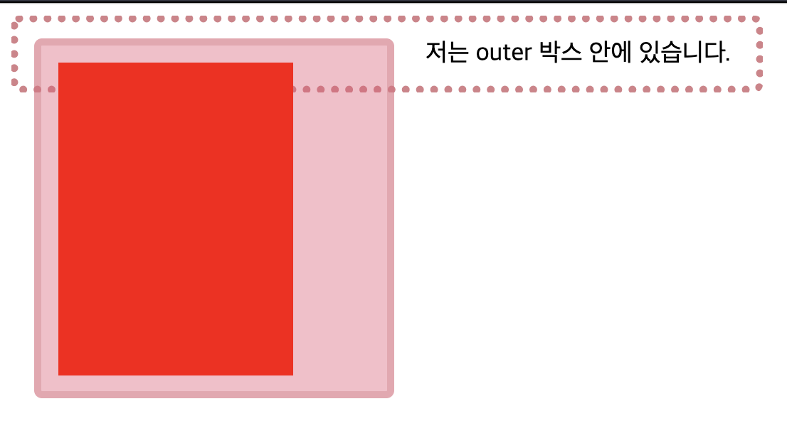
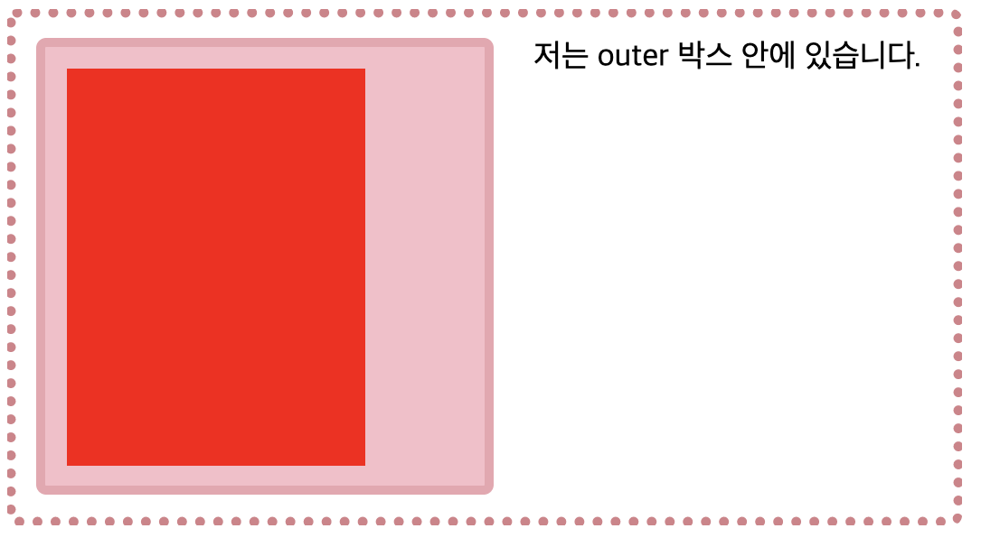
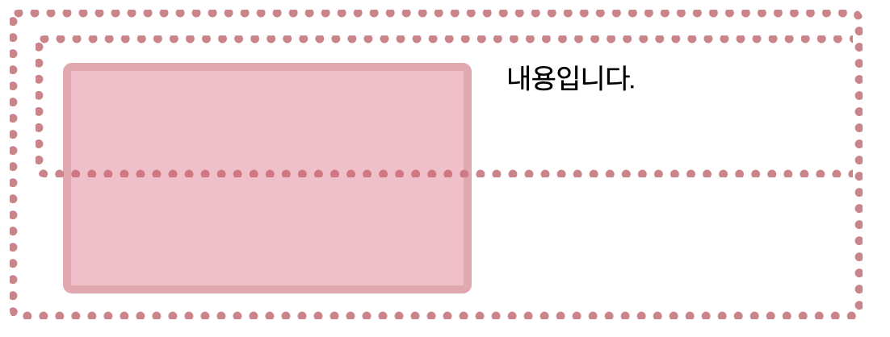

# Block Formatting Context(BFC)

## BFC란 무엇일까?

BFC의 동작을 이해하기 위해서 간단한 float 예제를 확인해보자.

```html
<div class="outer">
  <div class="float">저는 floated 요소입니다.</div>
  저는 outer 박스 안에 있는 텍스트입니다. 만약 충분한 길이의 텍스트가 존재한다면
  텍스트는 floated 요소에 의해 감싸질 것이고 outer의 border도 이 텍스트를 감쌀
  것입니다.
</div>
```

```css
.outer {
  border: 5px dotted rgb(214, 129, 137);
  border-radius: 5px;
  width: 450px;
  padding: 10px;
  margin-bottom: 40px;
}

.float {
  padding: 10px;
  border: 5px solid rgba(214, 129, 137, 0.4);
  border-radius: 5px;
  background-color: rgba(233, 89, 119, 0.4);
  color: #fff;
  float: left;
  width: 200px;
  margin: 0 20px 0 0;
}
```


하지만 위의 예제에서 텍스트 중 일부를 제거하면 다음과 같이 출력된다.


따라서 위의 예제에서 `float`의 요소가 `outer`의 크기에 영향을 주지 못한다는 것을 확인할 수 있다. 즉, `outer`가 `float`를 포함하지 못하고 있는 상황인 것이다.

그렇다면 `outer`에 `overflow: hidden // or auto`를 넣어보자.


이제는 `outer`에 `BFC(Block Formatting Context)`가 생성되어 `float`가 `outer`의 높이에 영향을 주는 것을 확인할 수 있다. 물론 `clearfix`를 이용하여 동일한 작업을 처리할 수 있지만 불필요한 요소로 추가로 삽입되어야 하기 때문에 효율적이라고는 할 수 없다.

그렇다면 BFC는 언제 생성되는 것일까?

[MDN](https://developer.mozilla.org/en-US/docs/Web/Guide/CSS/Block_formatting_context)에 따르면 다음과 같다.

- `<html>` (`<body>` 태그는 생성 X)
- `float: none`을 제외한 다른 `float` 속성
- `position: fixed, absolute`
- `display: inline-block, table, table-cell, table-caption`
- `overflow: visible`을 제외한 다른 속성
- `display: flex, inline-flex, grid, inline-grid, flow-root`(단,`flow-root`는 일부 브라우저에서만 동작한다)

BFC 내부의 모든 요소는 BFC 안에 속하며 위의 예에서는 `outer`에 `overflow: hidden` 속성을 부여함으로써 `outer`를 BFC로 만들어 `outer`의 내부에 있는 모든 요소를 `outer`로 포함시킨 것이다(`float`라 하더라도).

## BFC의 특징

### `float:!none` 속성은 BFC를 생성한다

`float`는 BFC를 생성한다고 앞서 살펴보았다. `outer`에 `overflow` 속성을 주기 전까지는 `float`가 개별적인 BFC인 것이다. `outer`에 `overflow` 속성을 제공함으로써 `outer`라는 BFC에 `float`가 포함되었다고 이해하면 된다.



`outer`에서 `overflow` 속성을 제거하면, `float`의 높이는 `outer`와 무관하게 된다.하지만 `float` 속성은 BFC를 생성하므로 `float`가 BFC가 되어 내부에 포함된 `inner`의 높이가 `float`의 높이에 영향을 준다(포함된다).



### BFC의 자식의 자식은 어떻게 될까?

BFC 안에 non-BFC를 넣고 그 안에 `float`를 배치해보자. 확인을 위해 non-BFC의 요소의 크기는 50px로 제한하도록 하자.

```css
.BFC {
  overflow: hidden;
}
.non-BFC {
  height: 50px;
}
```

```html
<div class="outer BFC">
  <div class="outer non-BFC">
    <div class="float"></div>
    내용입니다.
  </div>
</div>
```



non-BFC는 말 그대로 BFC가 아니기 때문에 내부의 `float` 요소를 포함하지 않는다. 하지만 최상위의 BFC 요소는 내부의 모든 요소를 포함하기 때문에 non-BFC의 크기에 `float` 요소의 크기가 영향을 미치게 되는 것이다.

그렇다면 non-BFC를 BFC로 변경해보자.

```css
.non-BFC {
  overflow: hidden;
  height: 50px;
}
```


BFC는 내부의 모든 요소를 포함한다 하였으므로 non-BFC가 `float`를 포함하게 되어 설정된 높이인 50px 만큼의 높이만 가지게 된다.

## Reference

- https://www.smashingmagazine.com/2017/12/understanding-css-layout-block-formatting-context/

- https://blueshw.github.io/2020/05/17/know-css-block-formatting-context/
