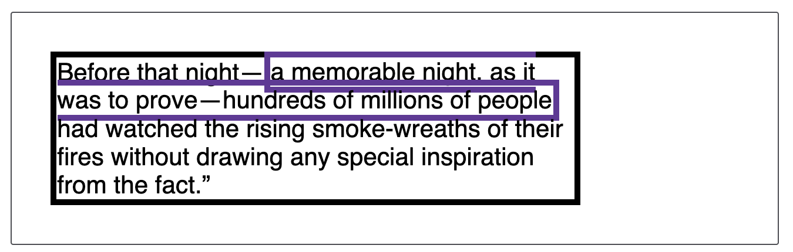
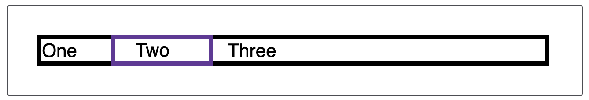
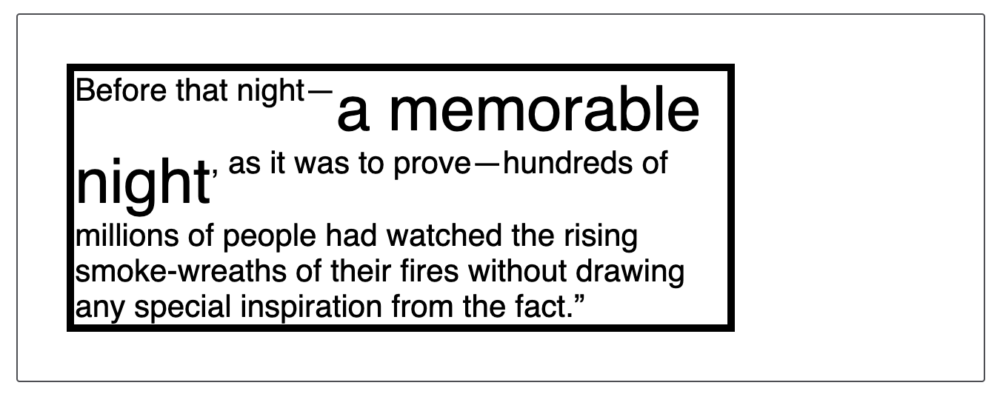
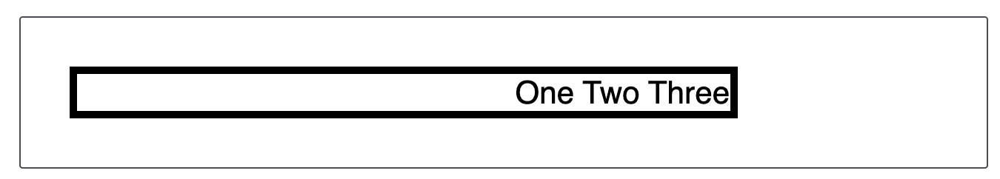
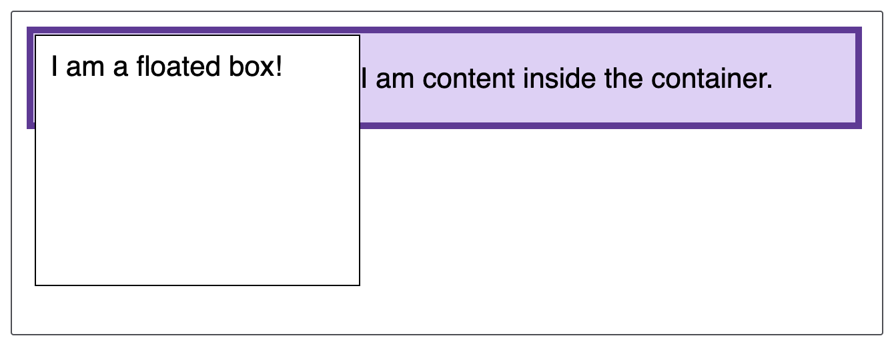

# Inline Formatting Context(IFC)

## 핵심 개념

inline 요소에 대해서는 line box라 불리는 사각형 영역에 포함된다.만약 inline direction에 inline 요소를 담을만한 충분한 영역이 존재하지 않는다면 새로운 line box가 생성된다.

만약 첫 번째 line box에 공간이 충분치 않아서 두 번째 line box가 생성되고 inline 요소가 나뉘어지면 margin, border, padding은 더 이상 제 역할을 하지 못한다.

```css
span {
  border: 5px solid rebeccapurple;
}
```

```html
<div class="example">
  Before that night—
  <span>a memorable night, as it was to prove—hundreds of millions of people<span>
  had watched the rising smoke-wreaths of their fires without drawing any
  special inspiration from the fact.”
</div>
```



inline 요소인 `<span>`을 첫 번째 line box에 모두 담을 수 없게 되자, 두 번째 line box로 이동하는 줄바꿈이 일어난 것을 확인할 수 있다. 그러나 줄이 바뀌는 부분의 border는 렌더링되지 않는 것을 확인할 수 있다.

또한 수평 방향(inline direction)의 margin,border,padding은 시각적으로 렌더링될 뿐만 아니라 공간을 점유한다.

```css
span {
  border: 5px solid rebeccapurple;
  padding-left: 20px;
  padding-right: 40px;
  margin-left: 30px;
  margin-right: 10px;
}
```

```html
<div>One <span>Two</span> Three</div>
```



## 수직 방향(block direction) 정렬

`vertical-align` 속성을 사용하면 inline 요소들을 수직 방향에 대해서 정렬할 수 있다.

다음 예제에서는 `<span>`의 글자 크기를 키움으로써 해당 요소가 배치된 line box의 크기를 키운다. `<span>` 요소에만 CSS를 적용했음에도 불구하고, 해당 요소와 같은 줄에 있는 텍스트들이 정렬되는 것처럼 보인다. 즉, 같은 line box에 있는 요소들에 대해 수직 정렬 방향을 결정하는 것이다.

```css
span {
  font-size: 200%;
  vertical-align: top;
}
```

```html
<div>
  Before that night—<span>a memorable night</span>, as it was to prove—hundreds
  of millions of people had watched the rising smoke-wreaths of their fires
  without drawing any special inspiration from the fact.”
</div>
```



## 수평 방향(inline direction) 정렬

수평 방향에 충분한 공간이 있다면, `text-align` 속성을 사용하여 block 요소 내부의 inline 요소를 inline 요소가 속한 line box 위에서 수평 방향 정렬시킬 수 있다.

```css
div {
  text-align: end;
}
```

```html
<div>One Tow Three</div>
```



!> `vertical-align`은 inline 요소에게 부여하며, 자신이 속한 line box 내에서 수직 방향으로 어떻게 정렬할지를 결정하고, `text-align`은 block 요소에게 부여하며 내부에 있는 inline 요소들이 각각의 line box에서 수평 방향의 어느 위치에 정렬될 지를 결정하는 것이다.

## floats?

line box는 일반적으로 수평 방향(inline direction)과 동일한 너비를 가지지만, 만약 동일한 BFC에 `float`된 요소가 존재한다면 line box의 길이를 짧게 만들게 된다.

```css
.box {
  background-color: rgb(224, 206, 247);
  border: 5px solid rebeccapurple;
}
```

```html
<div class="box">
  <div class="float">I am a floated box!</div>
  <p>I am content inside the container.</p>
</div>
```


