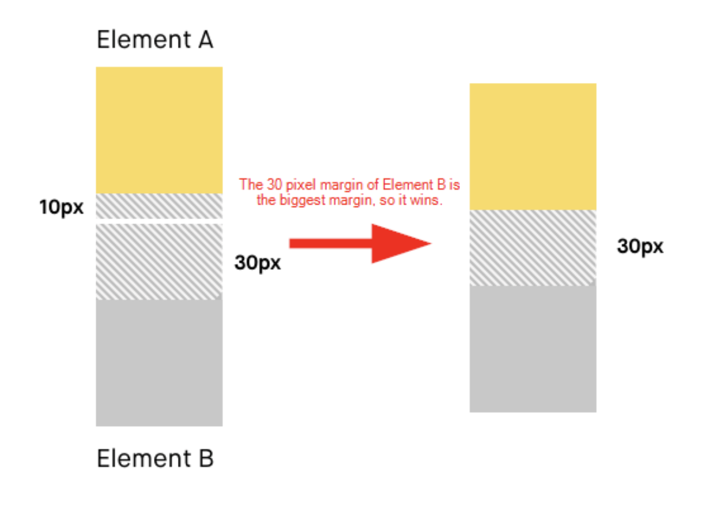
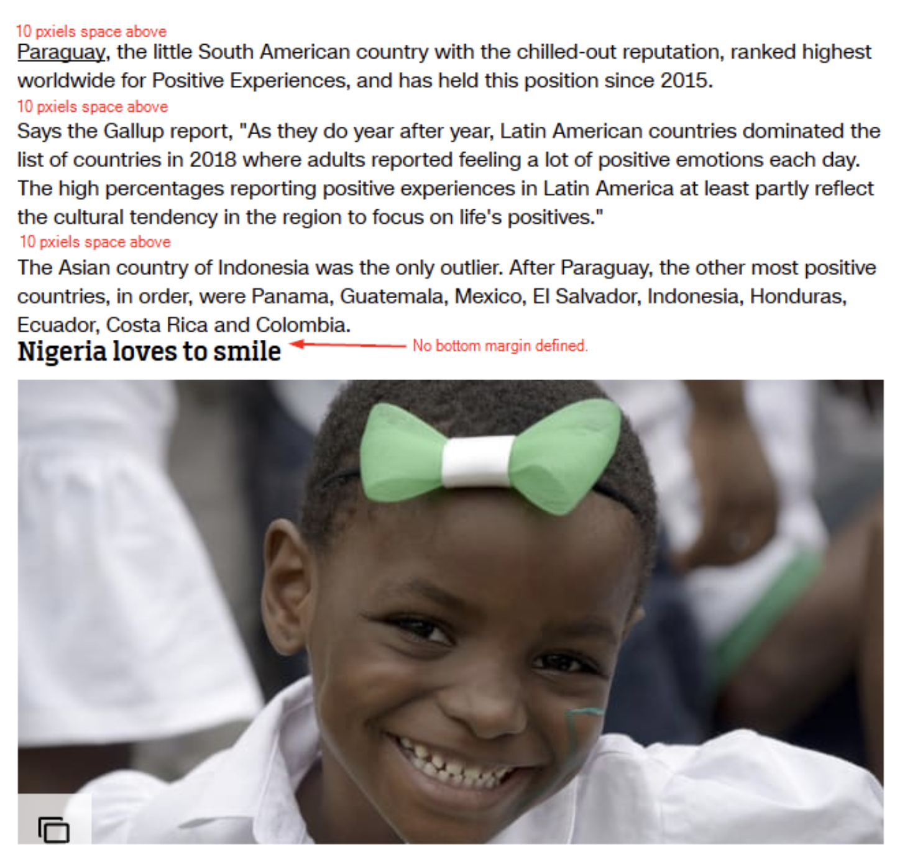
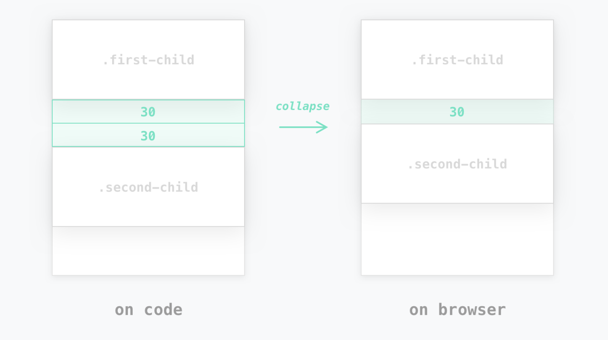
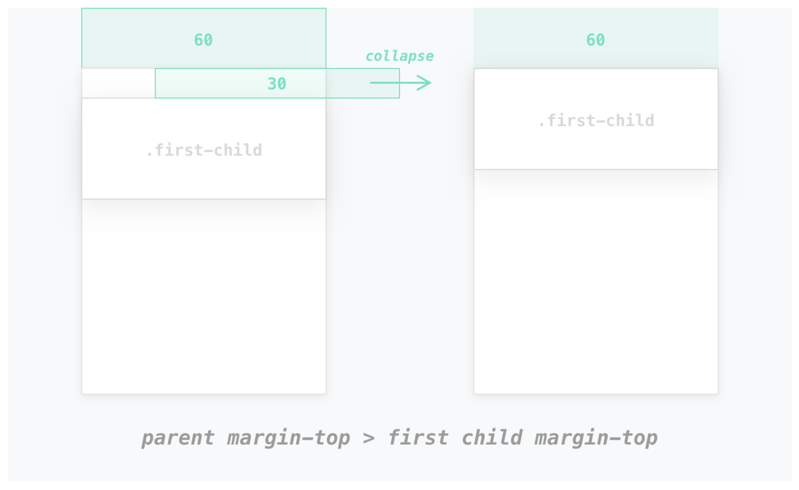
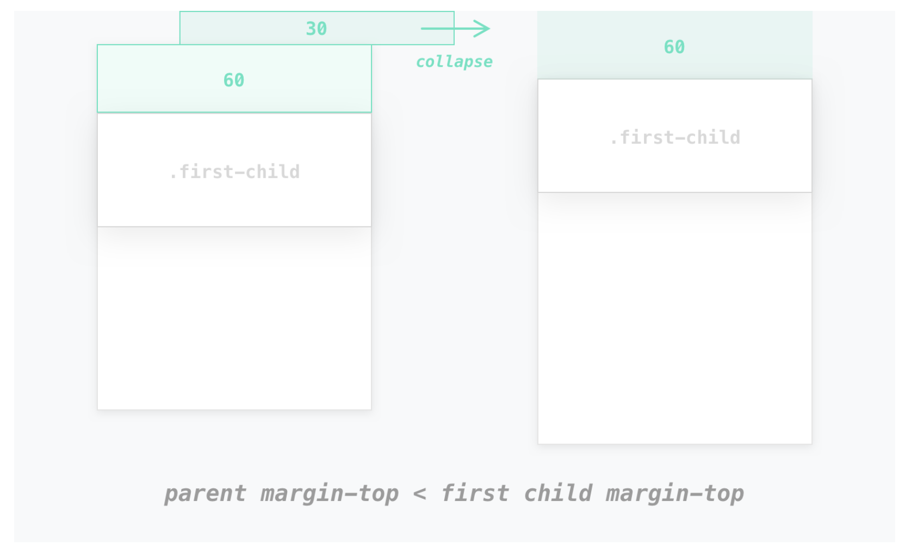
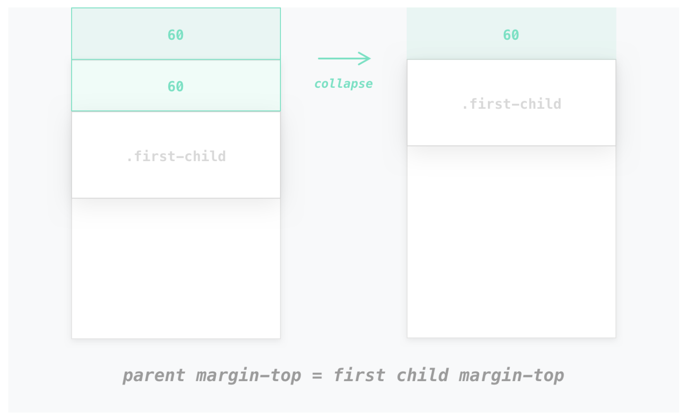
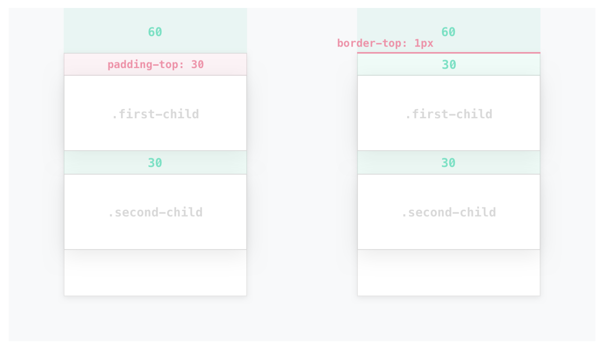

# Margin collapse

Margin collapse는 오직 한 가지 유형의 margin에 대해서만 발생한다. 바로 Vertical (top and bottom)이다. Margin collapse는 Horizontal (left and rigt) margin에 대해서는 발생하지 않는다.

그렇다면 "collapse"란 정확히 무엇을 의미하는 것일까? 단순하게 정의하면 "승자가 모든 것을 쟁취한다."라는 의미로 생각할 수 있다.



Element A는 `margin-bottom`을 10px을 갖고 있고, Element B는 `margin-top`을 30px만큼 갖고 있는 상태이다. 30px이 더 큰 margin이기 때문에 A와 B 사이의 margin은 30px이 된다. (_Note_: A와 B의 같은 margin을 갖고 있다하더라도 결과는 30px이 된다).

## 도대체 Margin collapse는 왜 발생하는 것인가?

단순하게 생각하면 Margin collapse는 발생하지 않는 것이 더 자연스러워 보인다. 그럼에도 불구하고 Margin collapse가 발생하는 것은 나름의 "이유"가 존재한다.

다음 예시를 살펴보도록 하자.

우선, 블로그 포스트와 같이 많은 양의 단락으로 구성된 문서를 갖고 있다고 생각해보자. 블로그 포스트는 단순 텍스트뿐만 아니라 이미지,테이블 등 많은 요소를 포함하고 있을 것이다. 포스트의 가독성을 높이기 위해서는 각각의 요소들이 일관된(consistent) 여백을 갖도록 하는 것이 필요할 것이다.

그 중에서도 단락 간의 여백을 동일하게 유지하기 위해 간단한 CSS를 정의해보도록 하자.

```css
p {
  margin-top: 10px;
}
```

이제는 각각의 단락이 다른 단락과 구분되는 10px의 공간을 갖게 될 것이다.그러나 `margin-top`만 설정하였기 때문에 마지막에 위치한 단락에는 그 다음에 올 요소와 구분할 margin이 존재하지 않는다.



만약 마지막 단락이 10px의 `margin-bottom`을 갖도록 하기 위해서는 마지막 단락을 찾아 `margin-bottom` 속성을 부여해주는 방법을 찾아야 할 것이다.

단순하게 모든 단락에 `margin-top`과 `margin-bottom`을 10px씩 부여하면 각각의 단락 간에는 20px의 margin이 생기게 될 것이다.

하지만 Margin collapse를 이용하면 각각의 단락이 동일한 margin을 갖도록 하면서 마지막 단락에도 다른 요소와도 구분할 `margin-bottom`을 부여할 수 있다.

```css
p {
  margin-top: 10px;
  margin-bottom: 10px;
}
```


## Margin collapse가 발생하는 상황

### 기본 규칙

- Margin collapse는 `margin-top`과 `margin-bottom`에 대해서만 발생한다(Vertical) 이때 `margin`이 0이라 하더라도 적용된다.
- block-level element(`inline-block`은 제외)에 대해서만 발생한다.
- `padding`,`border`,`line boxes` 등에 의해 구분되지 않고 두 개의 요소가 직접 맞닿는 경우에만 발생한다.

### 예외

- `position: absolute`된 상태
- `float: left/right`된 상태(단, clear 되지 않았을 경우)
- `display: flex/grid`일 때 내부 item
- 이 경우들에 대해서는 별도의 BFC를 생성하므로 Margin collapse가 발생하지 않는다.

> **인접해 있는 형제 block-level element 간의 아래·위 마진이 겹칠 때**



> **빈 요소(empty element)의 위·아래 마진이 겹칠 때**

**빈 요소**란 `height`,`min-height`,`padding`,`border` 등 높이(height)에 영향을 주는 속성이 부여되지 않거나, 내부에 inline element를 포함하고 있지 않아 높이가 0인 상태인 block-level element를 뜻한다.

높이가 0이라는 것은 위·아래를 구분할 경계가 존재하지 않으므로 본인의 `margin-bottom`과 `margin-top`을 비교하여 더 큰 마진으로 설정하고,동일한 크기의 마진이라 하더라도 한 개 요소의 마진만을 렌더링하게 된다. 빈 요소와 인접한 block-level elements 간에 Margin collapse가 발생하는 구조에서는 여러 번 발생하기도 한다.


> **부모와 첫 번째(혹은 마지막) 자식의 위(또는 아래) 마진이 겹칠 때**

브라우저는 부모와 첫 번째(또는 마지막) 자식 간의 경계를 둘 사이에 border 혹은 padding이 존재하거나 내부에 inline 요소가 존재하는 지 여부로 판단하게 된다.

따라서 부모와 첫 번째(또는 마지막) 자식 사이에 inline 요소가 존재하지 않거나, 상단(또는 하단)에 명시적으로 padding이나 border를 설정해주지 않았다면 마진이 겹치게 된다.

!> **이때 부모와 자식 중에 어느 요소의 마진이 더 큰지에 상관없이 부모의 바깥 쪽으로 결정된 마진이 렌더링 된다.**







따라서 부모의 위(또는 아래)에 padding이나 border를 설정하여 경계를 구분지어 주는 것이 Margin collapse를 발생시키지 않고 의도대로 배치할 수 있다.



## Reference

- [[Margin collapse in CSS:What,Why,and How]](https://medium.com/@joseph0crick/margin-collapse-in-css-what-why-and-how-328c10e37ca0)
- [[CSS 마진 상쇄(Margin-collapsing) 원리 완벽 이해]](https://velog.io/@raram2/CSS-%EB%A7%88%EC%A7%84-%EC%83%81%EC%87%84Margin-collapsing-%EC%9B%90%EB%A6%AC-%EC%99%84%EB%B2%BD-%EC%9D%B4%ED%95%B4)
