# CSS Rendering System

## Graphics System

고전 그래픽 시스템은 특정 위치([x,y], bit)를 변화시키면서 표현하는 방식이었다.

하지만 Fixed Number로 모든 것을 표현하기에는 Screen size, Chrome size, Hierachy 등 범용적으로 사용하기에는 분명한 한계가 존재하였다.

따라서 Abstract Calculator를 이용하여 함수를 통해 화면에 그려질 때 환경을 인식하여 Fixed Number로 변환되는 방식을 사용하게 되었다.

> %, left, block, inline, float ...

위와 같이 추상화되어 있는 계산 방식을 통해 Reactive하게 표현할 수 있는 시스템으로 발전하게 된다.

Abstract Graphics 시스템 하에서 공통되는 부분을 묶는 단위를 컴포넌트(Components)라 하고, 이러한 컴포넌트들이 일정한 규칙과 사용법을 준수해야 하는 형태로 구현되어 있다면 프레임워크(Framework)가 되는 것이다.

대표적으로 HTML 자체를 하나의 프레임워크로 본다면, 각각의 태그가 컴포넌트가 될 것이고, Bootstrap을 하나의 프레임워크의 기준으로 삼는다면 각각의 요소 하나가 컴포넌트가 될 것이다.

## Rendering System

> Geometry Caclulate

구획을 우선적으로 나눈다. 구획 별 크기, 위치 등이 계산된다 → `reflow`

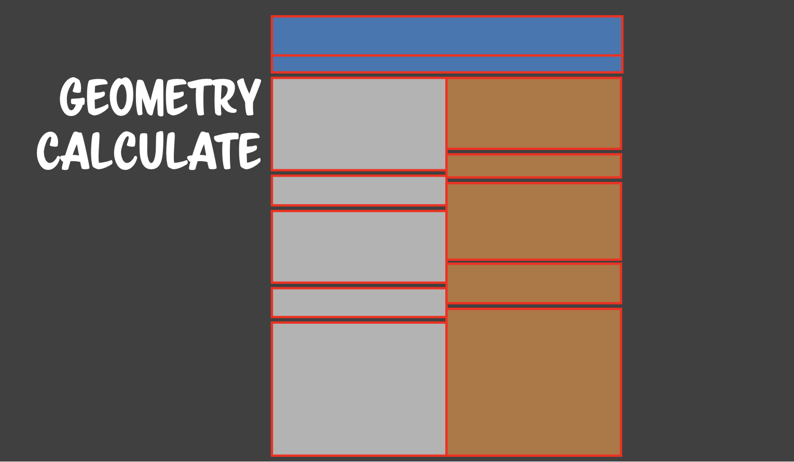

> Fragment Fill

Geometry Calculate에서 나뉘어진 구획을 칠하는 과정 → `repaint`

따라서 `reflow`가 발생할 때마다 바뀐 형태에 맞춰 다시 `repaint`가 발생하게 된다.

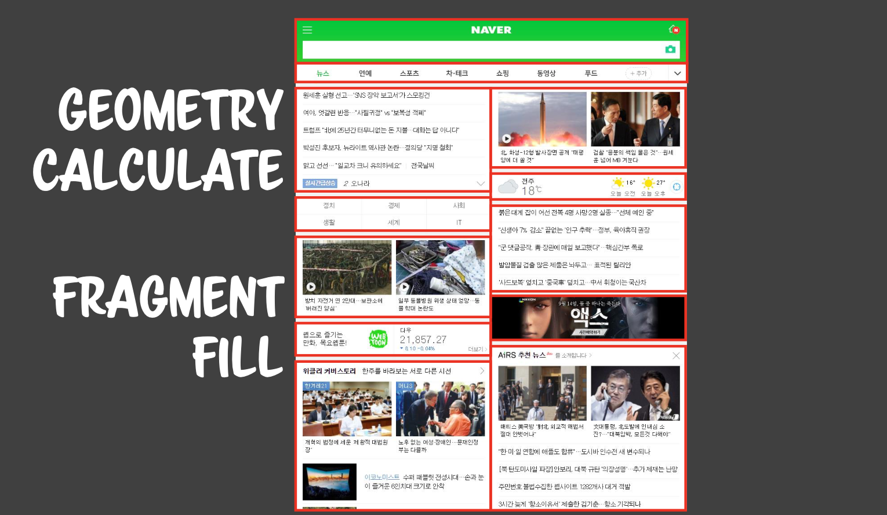

## Normal flow

Normal flow는 다음과 같은 3가지의 Visual Formatting Model의 기준에 따라 렌더링된다.

> Position

- `static` | `relative` | `absolute` | `fixed` | `inherit`
- `static`, `relative`만 Normal flow를 따른다.

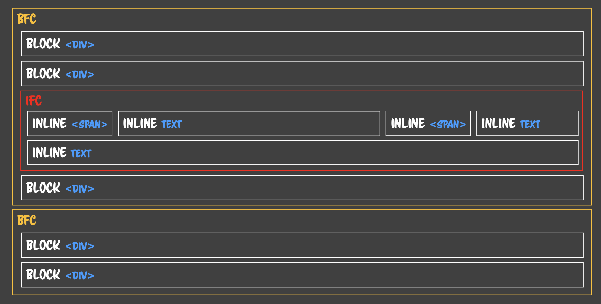

> Block Formatting Context (BFC)

```html
<div style="width: 500px; background: red;">&nbsp;</div>
<div style="background: blue;">&nbsp;</div>
```

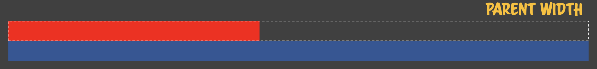

BFC는 block 요소에 대해 적용되며, 부모의 가로 길이를 모두 차지한다(`width: 100%`). 이때 상위 블록 요소의 `height`가 시작하는 지점이 된다. 다만 위의 그림에서 빨간색 사각형이 가로 전체를 차지하지 않는 것처럼 보이더라도(`background`가 `width: 100%`를 차지하지 않더라도) Geometry 계산 시 전체 너비는 모두 계산되고 Fragment fill만 실제 너비만큼만 칠해지는 것이다.

> Inline Formatting Context (IFC)

inline 요소에 적용되며 자신의 컨텐츠 크기만큼만의 width와 height를 가진다 → width, height를 설정하는 것이 불가능하다. 또한 inline 요소들의 width의 합이 부모의 width를 넘어가게 되면 다음 행으로 넘어가게 된다. 그때 inline 요소들 중에 `line-height`가 가장 큰 값을 기준으로 다음 행으로 넘어가게 된다.

```html
<div style="width:200px">aaaaa...</div>
```

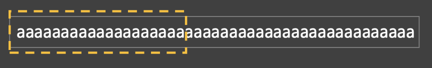

공백 문자가 없는 텍스트는 하나의 inline 요소로 취급하기 때문에 위의 예시에서는 부모의 width를 넘어가게 되는 것이다.

```html
<div style="width:200px">
  aaaaaaaaaaaaaaaaaaaaa aaaaaaaaaaaaaaaaaaaaa aaaaaaaaaaa
</div>
```

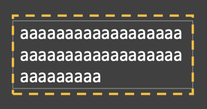

위의 예시에서는 공백 문자 자체를 또 다른 inline 요소로 취급하기 때문에 `<span>` 태그가 적용된 것처럼 인식되어 렌더링 되기 때문에 줄바꿈이 발생하는 것이다.

이때 `word-break: break-all`로 지정하면 각각의 요소를 별개의 inline 요소로 식별하여 공백 문자를 주지 않아도 `<div>` 영역을 벗어나면 줄바꿈이 일어나지만 Geometry Calculate가 급증하게 되므로 성능 저하가 발생할 수 있다. `word-break: normal`은 기본값인데 앞서 살펴본 예시와 동일하게 공백 문자를 기준으로 inline 요소를 분리한다. 또 하나의 inline 요소는 부모 영역을 넘어가도 줄바꿈이 발생하지 않는다.

> BFC + IFC

```html
<div style="width: 500px;">
  **
  <span>
    HELLO
    <span
      >WORLD
      <div style="background:red;">&nbsp;</div>
    </span>
    !!
    <div style="background:blue;">&nbsp;</div>
  </span>
  **
</div>
```

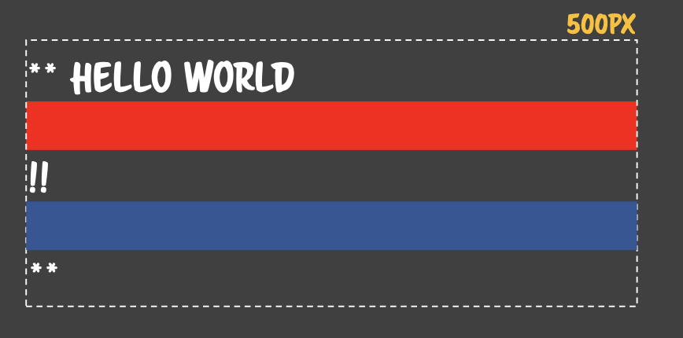

1. BFC가 시작된다.
2. inline 요소인 '\*\*','HELLO','WORLD'에 대해 IFC가 적용된다.
3. block(div) 요소를 만나면서 IFC는 종료되고, BFC가 활성화되며 빨간색 상자가 그려진다.
4. inline 요소인 '!!'를 만나면서 IFC가 활성화된다.
5. block(div) 요소를 만나면서 IFC가 종료되고, BFC가 활성화되면서 파란색 상자가 그려진다.
6. inline 요소인 '\*\*'를 만나서 IFC가 활성화된다.

> Relative Positioning (RP)

`static`으로 그려진 다음에 `relative`로 선언된 요소는 해당 위치로 이동한다. 즉, Normal flow에 따라 먼저 렌더링 된 후, `position: relative`인 요소만 `z-index`가 올라가고, 옮겨진 위치에 칠해지는 것이다. 이때 별도의 Geometry Caculate는 이루어지지 않는다.

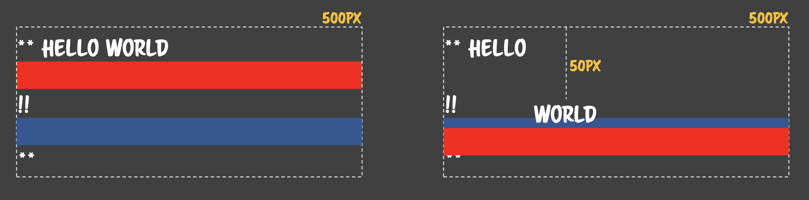

## Float

> left | right | none | inherit

### 특징

- 새로운 BFC를 생성한다.
- Normal flow를 벗어나 Line box를 따라 그려지게 된다.
- text나 inline 요소의 Guard 역할을 한다.

```html
<div style="width:500px">
  <div style="height:50px;background:red;"></div>
  <div style="width:200px;height:150px;float:left;background:green;"></div>
  <div style="height:50px;background:skyblue"></div>
</div>
```

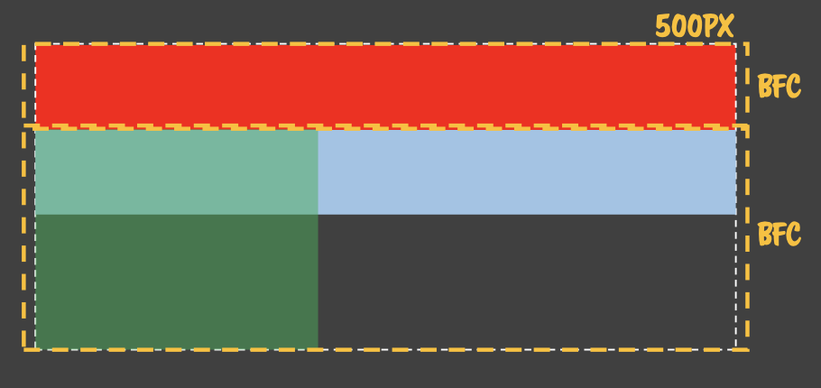

초록색 `<div>`에서 `float:left;`를 설정하는 순간 기존의 BFC를 벗어나 **새로운 BFC를 생성한다.**

`float`된 요소에 별도의 BFC가 생성되었으므로 기존의 Normal flow를 따라 하늘색의 `<div>`가 아래에 위치하게 된다.

```html
<div style="width:100%">
  <div style="height:50px; background:red;"></div>
  <div style="width:50%; height:150px; float:left; background:green"></div>
  Hello
  <div style="height:50px; background:skyblue">WORLD</div>
  !!
</div>
```

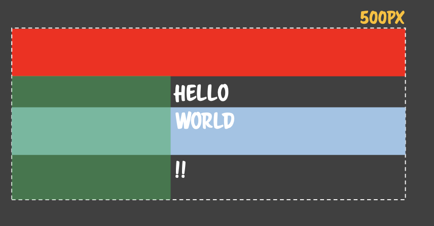

`float` 되는 순간 새로운 BFC가 생성되었고, `Hello`는 inline 요소이다. 하지만 녹색 `<div>`가 line box를 점유하고 있으므로, inline 요소의 Guard 역할을 하여 `Hello`는 Guard를 뚫지 못하고 바깥으로 밀려난 것이다.

!> DOM 구조에 관계없이 inline 요소는 Guard에 영향을 받고 block 요소는 Guard에 영향을 받지 않아 하늘색 `<div>`는 기존과 동일하게 `width:100%`로 그려진다.

```html
<style>
  .left {
    float: left;
  }
  .right {
    float: right;
  }
</style>
<div style="width:500px">
  <div class="left" style="width:200px;height:150px">1</div>
  <div class="right" style="width:50px;height:150px">2</div>
  <div class="right" style="width:50px;height:100px">3</div>
  <div class="left" style="width:150px;height:50px">4</div>
  <div class="right" style="width:150px;height:70px">5</div>
  <div class="left" style="width:150px;height:50px">6</div>
  <div class="left" style="width:150px;height:50px">7</div>
  <div style="height:30px;background:red">
    ABC1 ABC2 ABC3 ABC4 ABC5 ABC6 ABC7 ABC8
  </div>
</div>
```

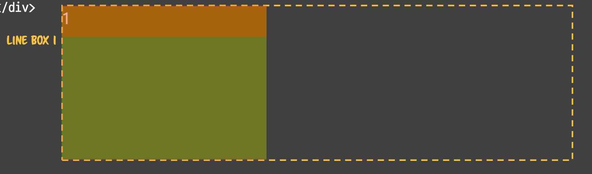

동일한 BFC 내에 float 요소가 있는지 확인하며 현재 float 요소가 존재하지 않으므로 BFC의 width 전체를 line box로 설정하고 line box의 왼쪽에 요소를 배치한다.

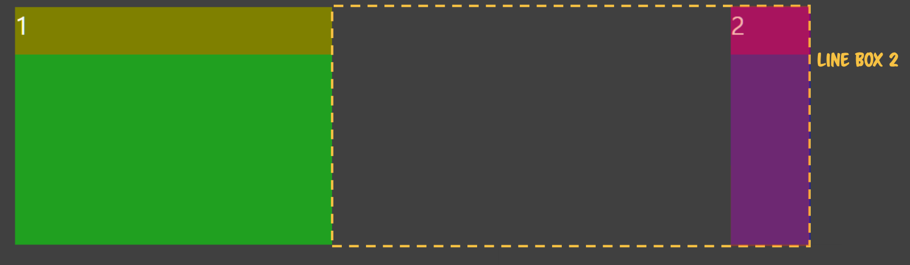

float된 요소가 이미 존재한다면 해당 영역을 제외한 부분을 line box로 설정하고, 그 안에 요소가 배치될 수 있는지 확인하고 가능한 상태이므로 오른쪽에 배치한다.

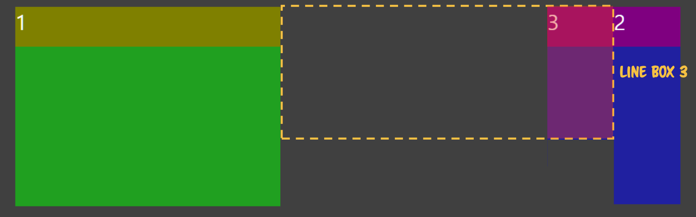

float 요소가 배치되지 않은 영역을 line box로 설정하고, 배치가 가능하므로 오른쪽에 배치한다.

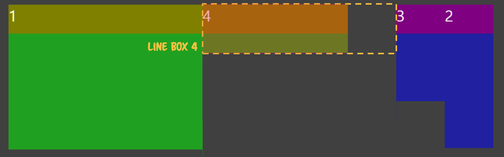
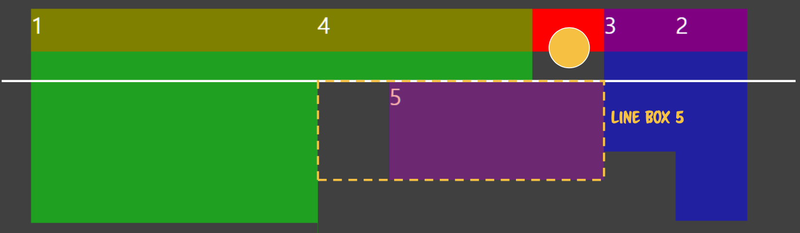

float 된 요소가 없는 영역에 line box를 설정하였으나, 배치할 요소가 들어갈만큼 충분한 width가 제공되지 않으므로 가장 높은 baseline을 기준으로 새롭게 line box를 설정한 뒤 요소를 배치한다.

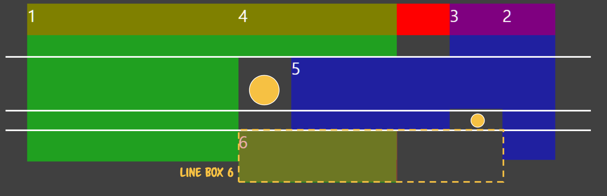
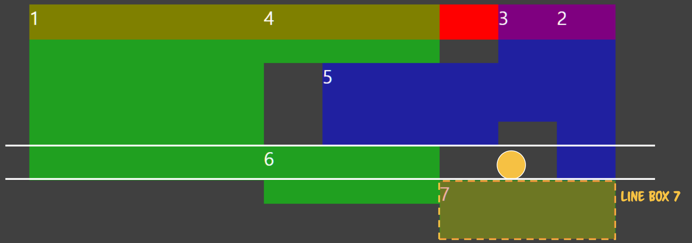
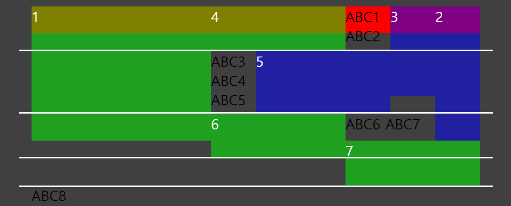

맨 마지막의 빨간색 `<div>`는 Normal flow를 따라 그려지므로 맨 윗줄에 그려지지만, 그 안에 있는 text는 Guard에 막혀 밀려나게 된다. 다만 `ABC8`이 맨 아랫줄 왼쪽에 위치하는 이유는 7번째 `<div>`가 `float: left`로 선언되어 있는데, 왼쪽 영역이 비어있는 것처럼 보인다 하더라도 가용 가능한 line box의 가장 왼쪽을 점유한 상태이므로 새로운 줄로 밀려나게 되는 것이다.

## overflow

> visible | hidden | scroll | auto | initial | inherit

`hidden`,`scroll` 속성을 가질 때 새로운 BFC를 즉시 생성한다.

```html
<div style="width:500px">
  <div class="left" style="width:200px;height:150px">1</div>
  <div class="right" style="width:50px;height:150px">2</div>
  <div class="right" style="width:50px;height:100px">3</div>
  <div class="left" style="width:150px;height:50px">4</div>
  <div class="right" style="width:150px;height:70px">5</div>
  <div class="left" style="width:150px;height:50px">6</div>
  <div class="left" style="width:150px;height:50px">7</div>

  <div class="hidden" style="height:30px;background:red">A</div>
  <div class="hidden" style="height:15px;background:orange">B</div>
  <div style="height:30px;background:black"></div>
  <div class="hidden" style="height:30px;background:red">C</div>
  <div class="hidden" style="height:20px;background:orange">D</div>
  <div style="height:30px;background:black"></div>
  <div class="hidden" style="background:red">E</div>
  <div style="height:30px;background:black"></div>
</div>
```

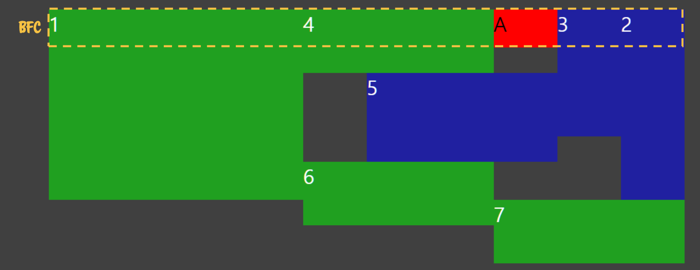

우선적으로 배치 가능한 line box에 위치하게 된다. 따라서 `overflow: hidden`이 주어지지 않았을 때와 달리 실제 width가 줄어들게 된다.

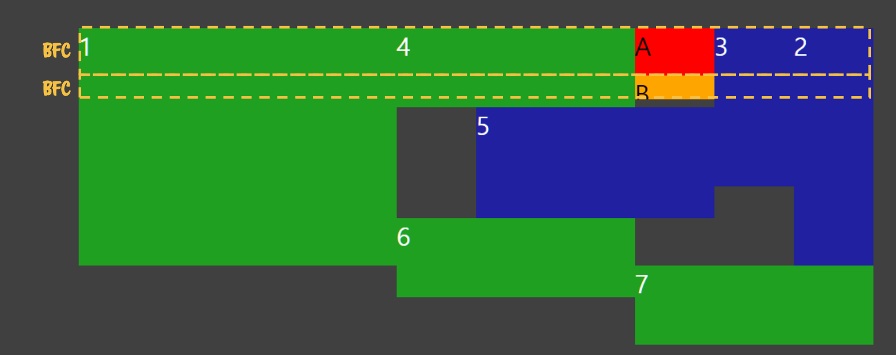
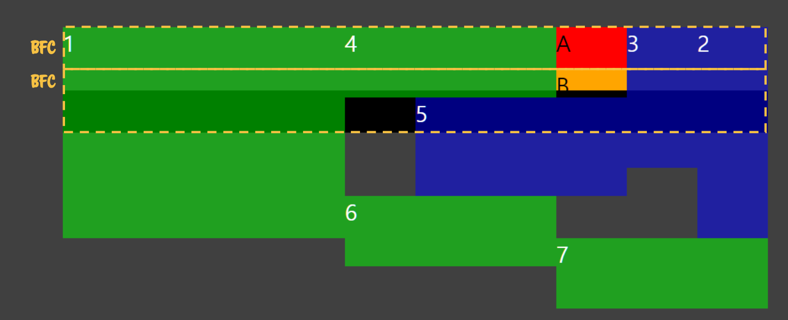
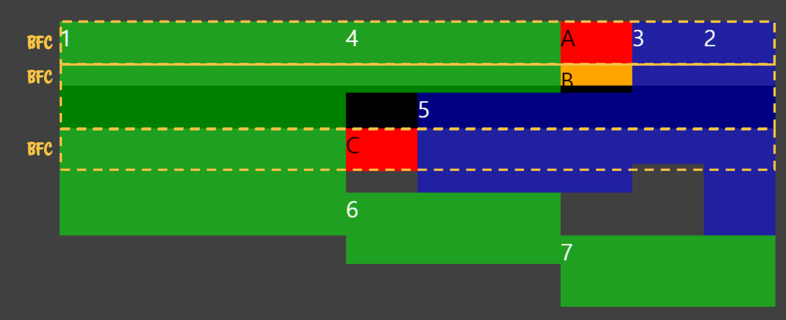
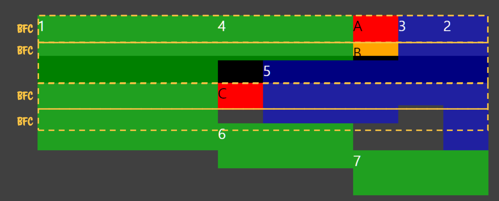
D의 경우 line box 내에 요소를 배치할 만큼 높이가 충분한 위치가 존재하지 않아 표시되지 않는다(width가 0이 된다). 하지만 height는 차지하고 있음에 주의해야 한다.
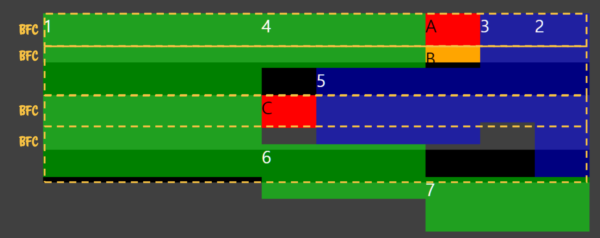
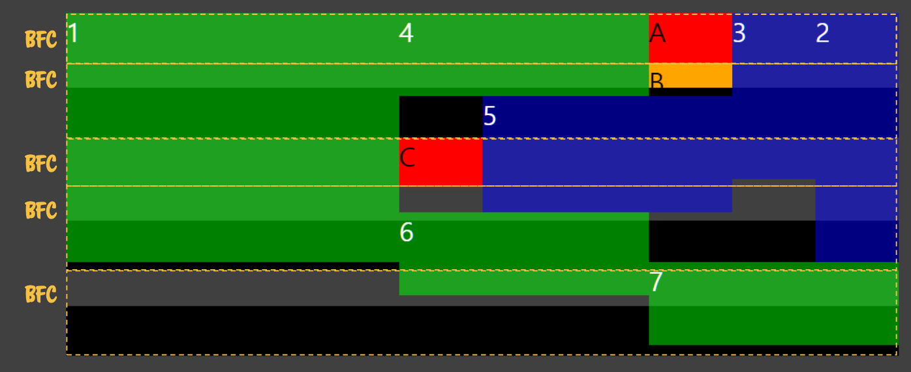
E의 경우에도 D와 마찬가지로 line box 내에 배치할만한 충분한 높이를 가진 공간이 존재하지 않아 width가 0이 되었지만,height는 차지하고 있게 된다.
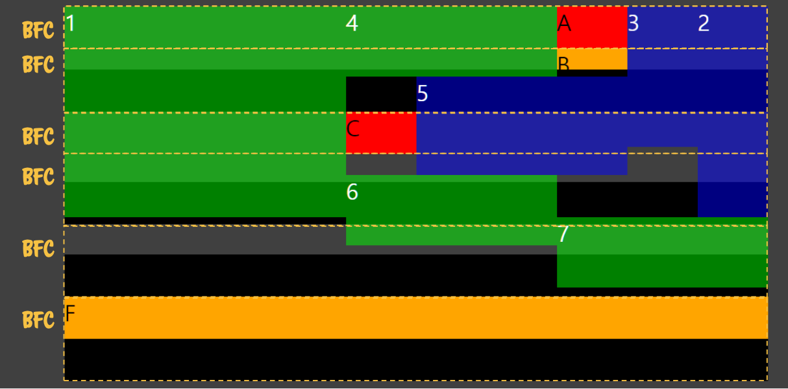

!> 따라서 `overflow: hidden`이 부여된 요소 각각에 대해 새로운 BFC가 생성되고, 또 width가 존재하지 않는 요소라 하더라도 height를 점유하고 있게 되므로 reflow를 발생시키게 되고 성능 저하로까지 이어질 수 있다.

## Box Model

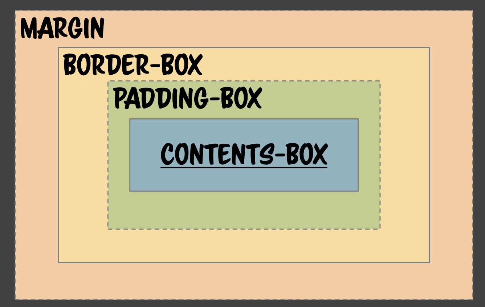

한 개의 Element는 총 4개의 Box를 갖고 있다.

- `margin`: `border` 바깥의 영역으로 투명하지만 영역을 점유하고 있는 공간이다.
- `border`: 외곽선이지만,두께를 늘리는 등 영역을 차지할 수 있는 요소이기 때문에 하나의 프로퍼티라 볼 수 있다.
- `padding`: `border`와 `contents` 간의 사이 공간을 의미한다.

## Box Sizing

> content-box | border-box

요소의 크기를 `border`를 기준으로 설정할 것인지 `content`를 기준으로 설정할 것인지 정할 수 있다.

```html
<style>
  div {
    width: 100px;
    height: 100px;
    padding: 10px;
    border: 10px solid #000;
    display: inline-block;
  }
</style>
<div style="background:red;"></div>
<div style="background:blue;box-sizing:border-box"></div>
```

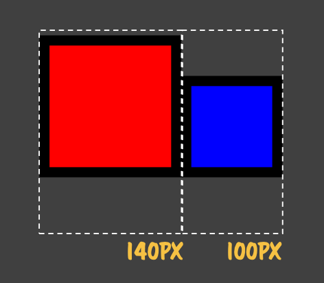

분명 같은 크기를 설정하였지만 `box-sizing`에 따라 전체 크기가 달라지는 것을 확인할 수 있다.

```html
<style>
  div {
    width: 100px;
    height: 100px;
    padding: 10px;
    border: 10px dashed #000;
    display: inline-block;
  }
</style>
<div style="background:red;"></div>
<div style="background:blue;box-sizing:border-box"></div>
```

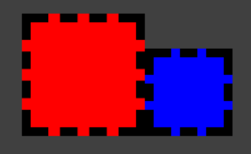

기존과 달리 `border`의 속성을 `dashed`로 지정했을 때 `border` 영역에도 background 색상이 적용된 것을 확인할 수 있다. 따라서 `border-box` 영역은 완전히 분리되어 있는 영역이 아니라 겹쳐서 존재하는 것이다. 따라서 `border`를 그리기 위해서는 먼저 `contents + padding` 영역을 모두 그리고 외곽의 위치를 찾아서 다시 `border`를 그리므로 Geometry Calculate가 필요하다.

```html
<style>
  div {
    width: 100px;
    height: 100px;
    padding: 10px;
    border: 10px dashed #000;
    display: inline-block;
  }
</style>
<div style="background:red;"></div>
<div style="background:blue;box-shadow:0 0 0 10px #aa0"></div>
```

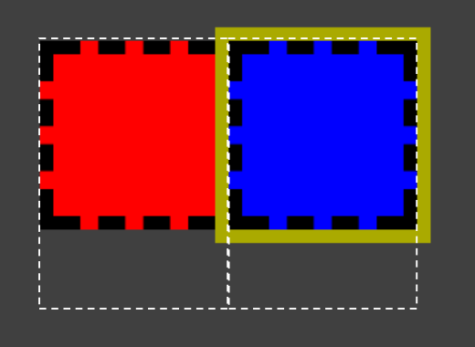

위의 예제는 `box-shadow`를 이용하여 또 다른 `border`로 활용한 것이다. 파란 박스의 경우 `box-shadow`는 레이아웃(Geometry)에는 전혀 영향을 주지 않고 색상만 칠해져있다(Repaint).

```html
<style>
  div {
    width: 100px;
    height: 100px;
    padding: 10px;
    border: 10px dashed #000;
    display: inline-block;
  }
</style>
<div style="background:red;position:relative;"></div>
<div style="background:blue;box-shadow:0 0 0 10px #aa0"></div>
```

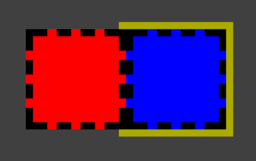

`position: relative`가 부여되면 Normal flow를 따라 그려지고 `z-index`가 상승한 것처럼 새로 그려지는 방식이었다(Only repaint). 따라서 바로 전의 예제와는 다르게 빨간색 상자가 `box-shadow`와 파란색 상자의 `border`를 모두 가리게 되는 것이다.

## Position

> static | absolute | fixed | relative

- `static`: 기본 값으로 Normal flow를 따라 배치된다.
- `relative`: Normal flow에 배치된 위치를 기준으로 좌표를 지정한다. Normal flow에 따라 그리고 난 뒤 해당 수치만큼 `z-index`가 상승해서 이동한다.
- `absolute`: top/left 등이 지정되면 offset parent를 기준으로 이동하고, top/left 등이 명시되지 않으면 DOM 구조 상 parent를 기준으로 삼는다.
- `fixed`: 스크롤과 관계 없이 viewport의 좌측 상단을 기준으로 설정한다.

> Offset

Geometry Calculate가 완료되어 정확한 수치로 계산된 것을 의미한다. 이때 브라우저는 효율성을 위해 Geometry Calculate를 Box 크기를 조정할 때마다 개별적으로 계산하는 것이 아니라 한 번에 해결하려고 한다. 이때 계산되는 단위를 프레임(frame)이라 한다.

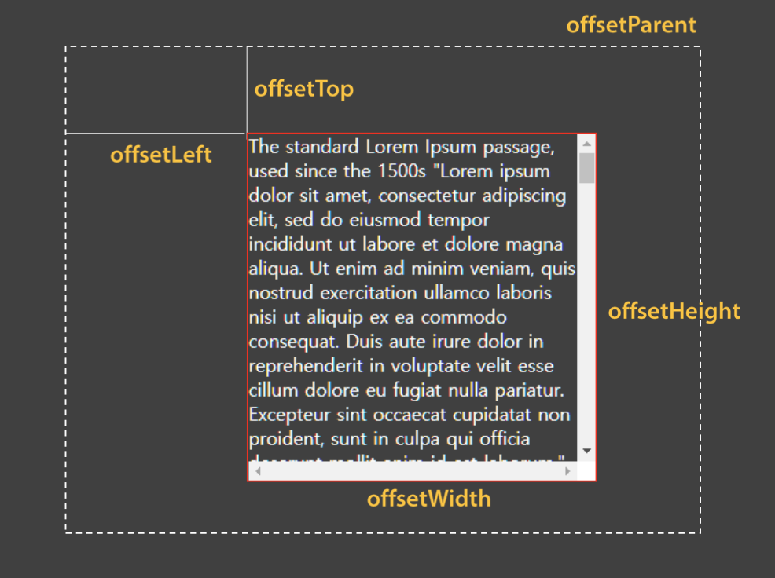

이때 offset을 계산할 기준으로 삼는 것이 offset parent이며, 이는 DOM 구조와는 별개이므로 주의해야 한다.

- offset parent → null

  - root, HTML, body
  - position: fixed
  - out of DOM tree

- Recursive search
  - 재귀적으로 탐색하면서 parent 중에서 position: absolute 혹은 relative인 요소를 offset parent로 삼고, 만약 부모 중에 존재하지 않는다면 body를 offset parent로 삼는다.

```html
<div style="width:300px;height:300px;background:yellow;margin:100px">
  <div style="width:100px;height:100px;position:absolute;background:red"></div>
  <div
    style="width:100px;height:100px;position:absolute;left:0;background:blue"
  ></div>
</div>
```

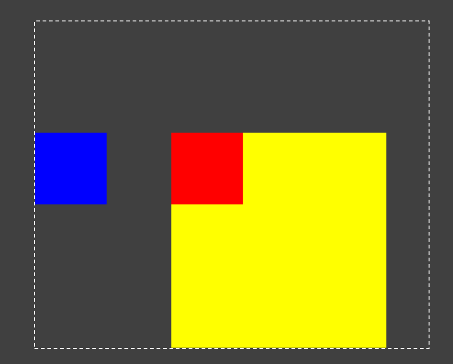

위의 예제에서 파란색 박스는 left가 지정되었으므로 offset parent의 좌측에 배치된 것이다. 재귀적으로 탐색하면서 parent 중에 position: absolute나 relatvie로 선언된 요소를 찾았으나 발견하지 못해서 body를 offset parent로 설정하였다.

빨간색 박스의 경우에는 별도의 offset을 지정해주지 않았으므로 Normal flow로 배치되었을 때의 위치에 자리하게 된다.

```html
<div
  style="position:absolute;left:50px;top:50px;background:pink;width:600px;height:600px"
>
  <div style="width:300px;height:300px;background:yellow;margin:100px">
    <div
      style="width:100px;height:100px;position:absolute;background:red"
    ></div>
    <div
      style="width:100px;height:100px;position:absolute;left:10px;top:10px;background:blue"
    ></div>
  </div>
</div>
```

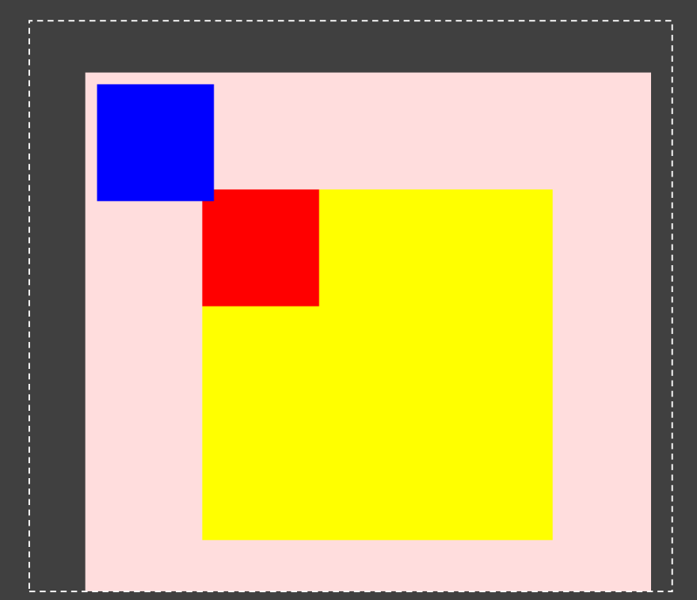

위의 예제에서 분홍색 상자는 offset parent가 body로 설정되어 offset 만큼 body를 기준으로 움직인 것을 확인할 수 있다.

그러나 이전 예제와는 달리 파란색 상자는 position: absolute로 설정된 분홍색 상자를 기준으로 offset 만큼 이동한 것을 확인할 수 있다.

```html
<style>
  .in {
    display: inline-block;
    width: 100px;
    height: 100px;
    border: 1px solid #fff;
  }
  .abs {
    width: 50px;
    height: 50px;
    position: absolute;
    left: 10px;
    top: 10px;
    background: #00f;
  }
</style>
<div class="in"></div>
<div class="in"></div>
<div class="in"></div>
<div class="in" style="position:relative">
  <div class="abs"></div>
</div>
<div class="in"></div>
<div class="in"></div>
<div class="in"></div>
<div class="in"></div>
<div class="in" style="position:relative">
  <div class="abs"></div>
</div>
<div class="in"></div>
```

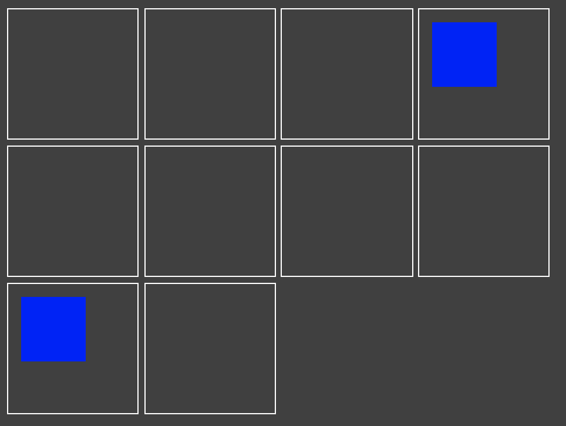

위의 예제에서 `.in`은 inline-block이므로 수평 방향으로 쌓이게 되고, `.abs`는 모두 absolute로 설정되어 offset을 가지고 있게 된다. 이때 부모 요소 중에 position: relative 또는 absolute로 설정된 요소를 기준으로 offset 만큼 떨어져서 배치된 것을 확인할 수 있다.

## Reference

- [코드스피츠76 - CSS Rendering](https://www.youtube.com/watch?v=_o1zsrBkZyg)
