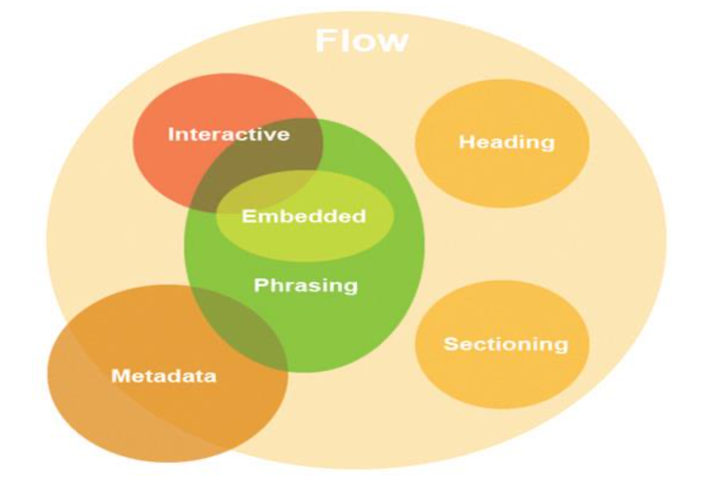
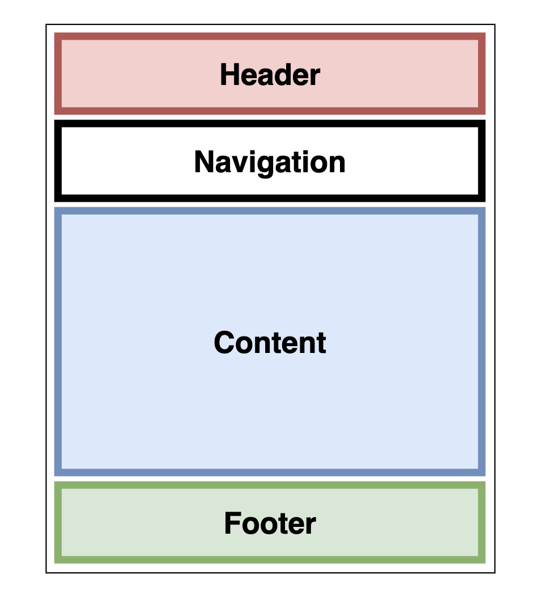
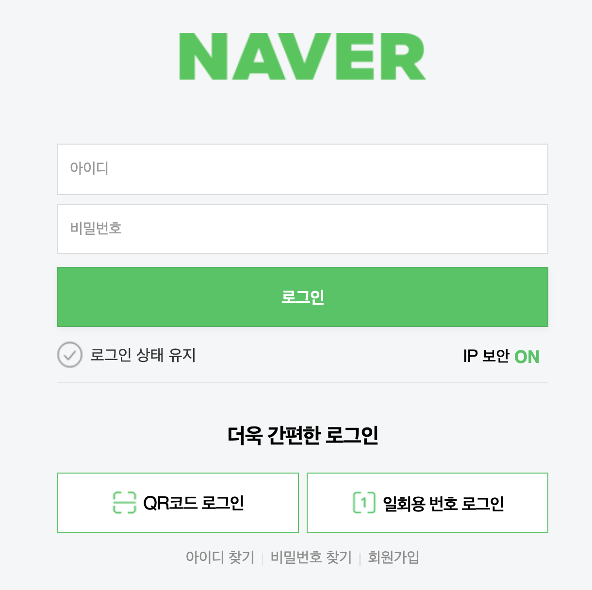
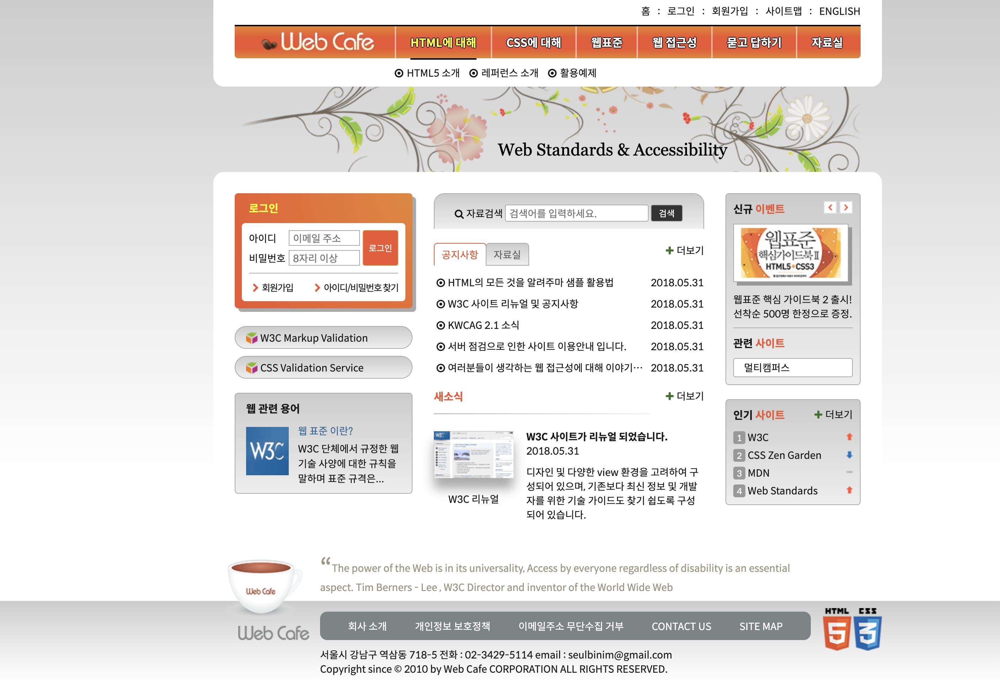
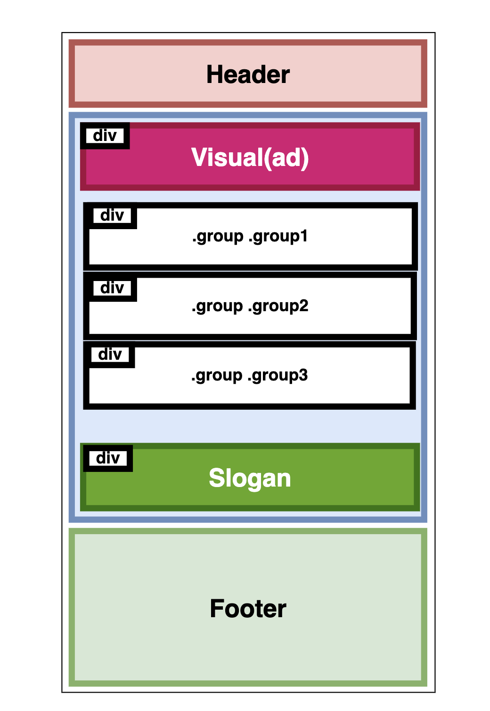

# [20-10-19] TIL

## HTML 4.01, XHTML 1.0과 HTML5의 차이점

### 새롭게 등장한 콘텐츠 모델(Content Models)

- 명확한 정보 구조 설계 및 구성을 위해 카테고리를 정의하여 각 요소 별로 비슷한 성격을 가지고 있는 것끼리 그룹화한 것을 HTML5의 콘텐츠 모델(Content Models)이라고 함.



## 아웃라인 알고리즘(Outline Algorithm)

- HTML5에서는 정보 구조를 명확히 할 수 있도록 '아웃라인 알고리즘(Outline Algorithm)'이라는 개념이 도입되었다.
- 아웃라인 알고리즘은 웹 페이지의 정보 구조를 판별할 수 있는 개념으로, 책의 목차와 유사하다.
- HTML5에서 추가된 많은 요소들은 대부분 아웃라인 알고리즘과 관련 있으며,그 중에서도 직접적으로 아웃라인을 구성하는 요소에는 헤딩 콘텐츠,섹셔닝 콘텐츠 그리고 섹셔닝 루트 요소 등이 있다.

## 페이지 구성 시 고려 요소

### 레이아웃 구조

#### 3단 레이아웃 구조


#### 4단 레이아웃 구조



### 논리적인 순서

- HTML을 디자인을 기준으로 배치하는 것이 아니라, 논리적인 순서를 기준으로 배치하는 것



- 네이버 로그인 페이지를 예로 살펴보면 아이디와 비밀번호 그 다음 로그인 상태 유지를 선택한 후 로그인 버튼을 클릭하는 것이 더 논리적으로 타당해보인다.
- 그러나 실제 구현은 디자인 기준으로 HTML이 배치되어 있어 올바르게 구현되었다고는 할 수 없다.
- 따라서 **논리적인 순서에 맞춰 HTML을 구성하고 HTML의 배치는 CSS로만 조작한다.**

### 시맨틱 마크업

```html
① 

②
<h1>
  <a href="#"></a>
</h1>
```

- 위의 코드에서 ①보다는 ②가 더 의미를 강조하는 설계이다.

```html
<div>title</div>
<div>description</div>
```

- 사람의 경우 위의 코드에서 title이 글의 제목이고, description이 설명일 것이라는 맥락을 이해할 수 있지만 기계의 경우에는 그저 `<div></div>`태그의 나열일 뿐이기 때문이다.

### 네이밍

#### CSS 방법론

- SMCSS
- OOCSS
- **BEM**
  
  - `__`: 상위 요소에 포함되는 요소
  - `--`: 해당 요소의 상태를 나타낸다.
  - `-`: K.C로 단어를 연결할 때 사용한다.

## Web Cafe Clone

- 기본적으로 고려해야 할 사항
  - SEO에 영향을 미치는 요소 파악하기
  - og, twitter card 꼭 명시하기
  - normalize.css, Web-Font 적극 사용하기
  - 개발 단계에서는 파일을 나눠서 개발하고, 배포 단계에서는 번들링 진행하기

### Layout





```html
<!DOCTYPE html>
<html lang="ko-KR">
  <head>
    <meta charset="UTF-8" />
    <title>웹카페-고정형 레이아웃</title>
    <link rel="stylesheet" href="/css/stylesheet.css" />
    <style>
      .skip-nav {
        display: none;
      }
    </style>
  </head>

  <body>
    <div class="skip-nav"><a href="#">본문 바로가기</a></div>
    <header class="header">header</header>
    <div class="visual">visual</div>
    <main class="main">
      <div class="group group1">group1</div>
      <div class="group group2">group2</div>
      <div class="group group3">group3</div>
    </main>
    <div class="slogan">slogan</div>
    <footer class="footer">
      <div class="footer-wrapper">footer</div>
    </footer>
  </body>
</html>
```
