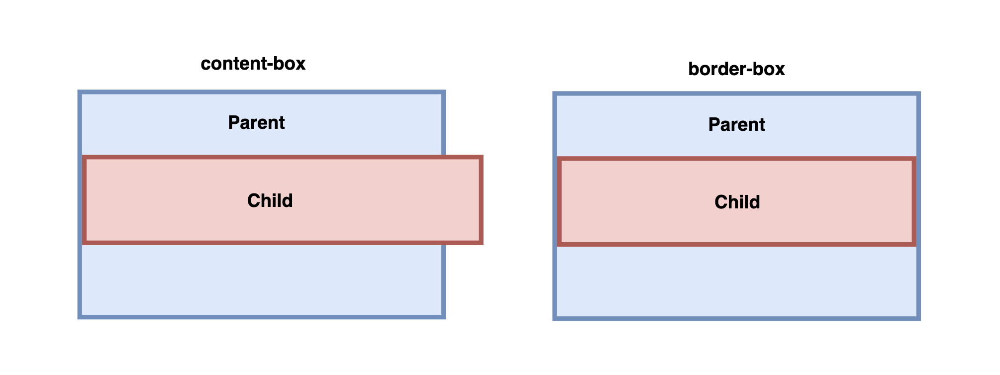
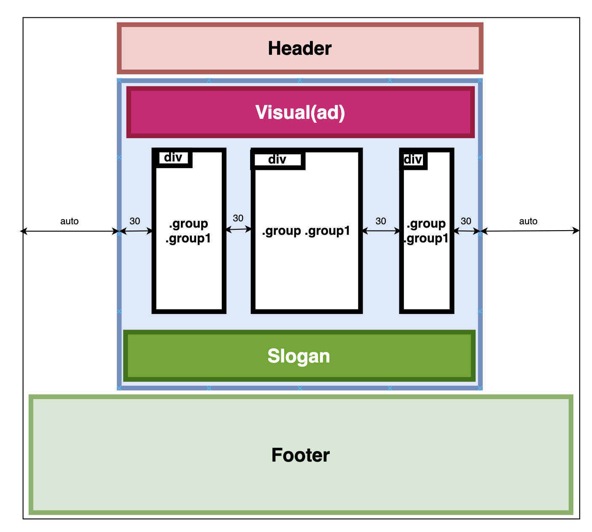
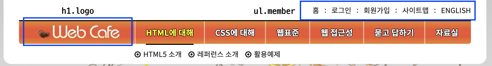
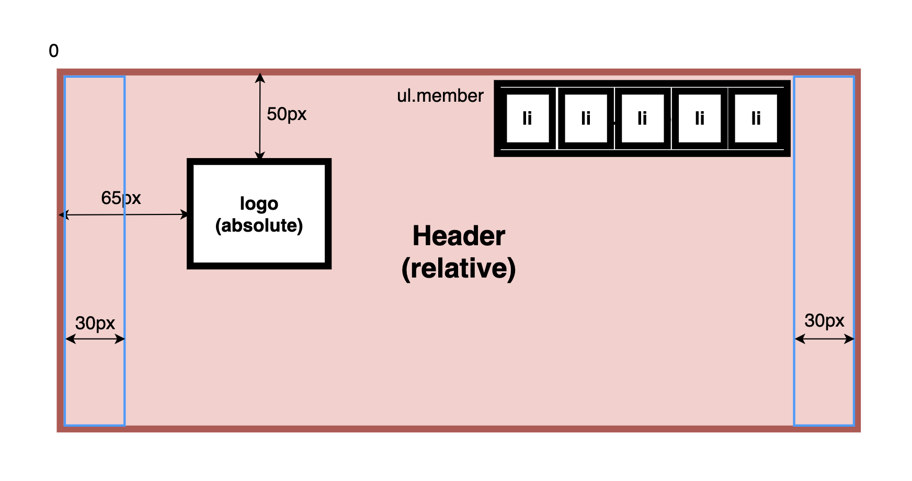

# [20-10-20] TIL

## 박스 모델


## Box-Sizing

### content-box

- content-box는 기본 CSS 박스 크기 결정법을 사용한다. 요소의 너비를 100 픽셀로 설정하면 콘텐츠 영역이 100 픽셀 너비를 가지고, 테두리와 안쪽 여백은 이에 더해진다.

```css
.child {
  box-sizing: content-box;
  width: 100%;
  padding: 5px;
}
```

### border-box

- border-box는 테두리와 안쪽 여백의 크기도 요소의 크기로 고려한다. 너비를 100 픽셀로 설정하고 테두리와 안쪽 여백을 추가하면, 콘텐츠 영역이 줄어들어 총 너비 100 픽셀을 유지한다.

```css
.child {
  box-sizing: border-box;
  width: 100%;
  padding: 5px;
}
```



## 전체 페이지 상세 레이아웃



```css
.header,
.visual,
.main,
.slogan {
  width: 940px;
  box-sizing: border-box;
  margin: 0 auto;
}

.main {
  padding: 30px 15px;
  /* overflow: hidden을 부여함으로써 .main이 BFC를 갖도록 하여 내부의 group을 포함한
     높이를 가질 수 있게 한다. */
  overflow: hidden;
  min-height: 450px;
}

.group {
  float: left;
  margin: 0 15px;
}
.group1 {
  width: 250px;
}
.group2 {
  width: 380px;
}
.group3 {
  width: 190px;
}
```

## Header 레이아웃





```html
<header class="header">
  <h1 class="logo">
    <a href="#"></a>
  </h1>
  <ul class="member">
    <li><a href="#">홈</a></li>
    <li>
      <span class="divider" aria-hidden="true">ㅣ</span><a href="#">로그인</a>
    </li>
    <li>
      <span class="divider" aria-hidden="true">ㅣ</span><a href="#">회원가입</a>
    </li>
    <li>
      <span class="divider" aria-hidden="true">ㅣ</span><a href="#">사이트맵</a>
    </li>
    <li>
      <span class="divider" aria-hidden="true">ㅣ</span><a href="#">english</a>
    </li>
  </ul>
</header>
```

```css
/* 헤더 */
.header {
  background: #fff;
  position: relative;
  border-radius: 0 0 15px 15px;
  padding: 0 30px;
}

/* 로고 */
.logo {
  position: absolute;
  top: 50px;
  left: 65px;
  margin: 0;
}

/* 안내 링크 목록 */
.member {
  margin: 0;
  padding-left: 0;
  list-style: none;
  text-align: right;
}
.member li {
  display: inline-block;
  padding: 2px 0;
}
.member a {
  display: inline-block;
  padding: 6px 0;
}
```
