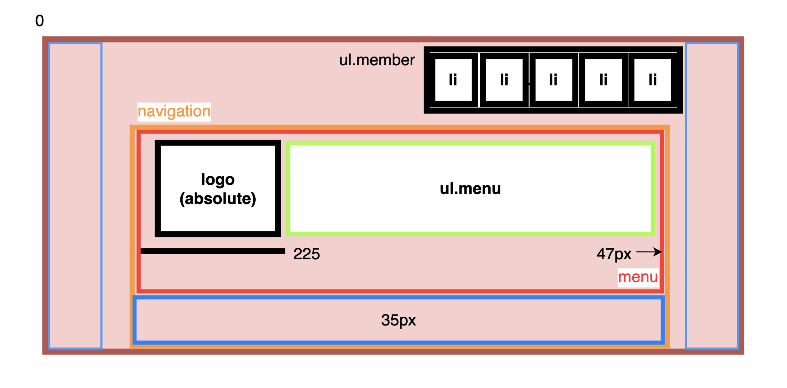

# [20-10-21] TIL

## Header 레이아웃 - 2



```html
<header>
  ...
  <nav class="navigation">
    <ul class="menu">
      ...
    </ul>
  </nav>
</header>
```

```css
.navigation {
  padding-bottom: 35px;
}
.menu {
  border-top: 2px solid currentColor;
  list-style: none;
  height: 47px;
  border-radius: 0 0 5px 5px;
  padding-left: 225px;
}
```


```html
<header>
  ...
  <nav class="navigation">
    <ul class="menu">
      <button></button>
      <ul class="sub-menu">
        <li><a></a></li>
        ...
      </ul>
    </ul>
  </nav>
</header>
```

```css
.menu-item {
  position: relative;
  float: left;
  border-left: 2px solid rgba(255, 255, 255, 0.5);
}

.menu-button {
  cursor: pointer;
  background: transparent;
  color: #fff;
  font-weight: 700;
  font-size: 1.6rem;
  line-height: 45px;
  padding: 0 20px;
  border: 0;
  text-shadow: 1px 0 0 #000, 0 1px 0 #000, -1px 0 0 #000, 0 -1px 0 #000;
}

.sub-menu {
  margin: 0;
  padding-left: 0;
  list-style: none;
  position: absolute;
  top: 47px;
  display: none;
  /* 부모 요소에서 줄바꿈 금지*/
  white-space: nowrap;
}
```
