# [20-10-22] TIL 👊

## Box Model

### CSS Box Model이란?

> Parts of a box

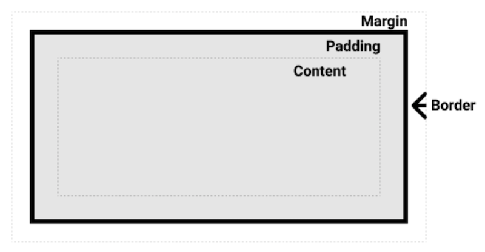

### Block and inline boxes

CSS에는 크게 두 가지 타입의 박스가 있다 - **block boxes**,**inline boxes**.

> **block box**

- **대표적인 블록 요소**

  - `<div>`
  - `<form>`
  - `<h1> ~ <h6>`
  - `<header>`
  - `<main>`
  - `<footer>`
  - `<section>`
  - `<nav>`
  - `<ol>, <ul>, <li>`
  - `<p>`
  - ...

- 상위 컨테이너의 `width`를 100% 사용한다.
- 일반적으로 인라인 요소와 다른 블록 요소를 포함할 수 있다.
- 각각의 box는 새로운 줄에서 시작된다.
- `width`와 `height` 속성을 적용할 수 있다.
- `padding`,`margin`,`border`

> **inline box**

- **대표적인 인라인 요소**

  - `<a>`
  - `<button>`
  - ``
  - `<input>`
  - `<label>`
  - `<span>`
  - ...

- 내부에 있는 요소의 크기만큼의 `width`를 사용한다.
- 일반적으로 데이터와 다른 인라인 요소만 포함 가능하며, 블록 요소는 포함할 수 없다.
- 각각의 box는 동일한 줄에 배치된다.
- `width`와 `height` 속성을 적용할 수 없다.
- 위 아래 `padding`과 위 아래 `margin`이 화면에 렌더링은 되지만 다른 요소와 겹쳐서 나타난다.

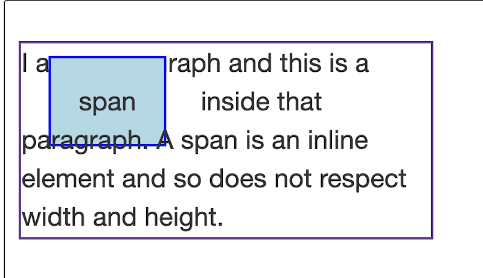

```html
<p>
  I am a paragraph and this is a <span>span</span> inside that paragraph. A span
  is an inline element and so does not respect width and height.
</p>
```

```css
span {
  margin: 20px;
  padding: 20px;
  width: 80px; /* 적용 되지 않음 */
  height: 50px; /* 적용 되지 않음 */
  background-color: lightblue;
  border: 2px solid blue;
}
```

### inline-block display

`inline`과 `block`의 특성을 모두 살려, `width`와 `height`를 적용할 수 있고 `inline` 박스에서 발생하는 겹침 현상을 회피할 수 있다. 또한 다음 요소가 새로운 줄로 바뀌지 않도록 만들 수 있다.

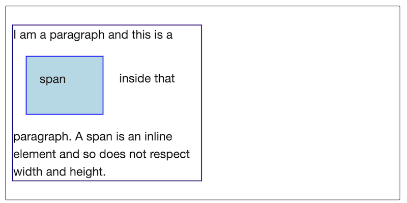

```css
span {
  ...
  display: inline-block;
}
```

또 다른 예로 `padding`을 추가하여 선택할 수 있는 영역을 확대하길 원하는 경우 유용하게 사용할 수 있다. `<a>` 태그 역시 인라인 요소이므로 `display: inline-block`으로 설정하고 `padding`을 적용한다면 링크를 클릭할 수 있는 영역을 확장할 수 있다.

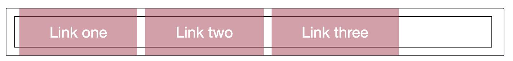

```css
.links-list a {
  background-color: rgba(179, 57, 81, 0.5);
  color: #fff;
  text-decoration: none;
  padding: 1em 2em;
}
```

```html
<nav>
  <ul class="links-list">
    <li><a href="">Link one</a></li>
    <li><a href="">Link two</a></li>
    <li><a href="">Link three</a></li>
  </ul>
</nav>
```

`display: inline-block`을 적용하기 이전에는 `.links-list a`의 요소가 `inline`이므로 위 아래 `padding`이 렌더링은 되지만 공간을 점유하지 못하고 있는 것을 확인할 수 있다.

```css
.links-list a {
  ...
  display: inline-block;
}
```

위와 같이 `inline-block`으로 설정해주면 겹침 현상이 사라지는 것을 확인할 수 있다.

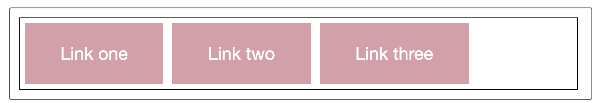

## Normal flow

**normal flow**는 페이지 레이아웃을 전혀 제어하지 않은 경우 브라우저가 기본적으로 HTML 페이지를 구성하는 방법을 말한다.

```html
<p>나는 고양이를 사랑한다.</p>

<ul>
  <li>고양이 먹이를 사세요</li>
  <li>운동</li>
  <li>기운내 친구야</li>
</ul>

<p>여기가 끝!</p>
```


`<ul>`,`<li>` 모두 block 요소이므로 요소가 배치되면서 줄바꿈이 일어나는 것을 확인할 수 있다. `inline` 요소는 새로운 줄에 나타나는 대신, 같은 라인에 다른 요소와 함께 차례대로 자리 잡게 될 것이다. 단 부모의 너비 내에서 자신이 자리잡을 수 있는 공간이 없다면 overflow되는 텍스트 혹은 요소는 새로운 줄에 나타난다.

이처럼 브라우저가 요소를 배치하는 기본적인 방법을 normal flow라 한다. 그렇다면 요소가 배치되는 방식을 변경할 수 있는 방법에는 무엇이 있을까?

- `display` 속성 - `block`,`inline`,`inline-block`과 같이 속성을 부여함으로써 해당 태그가 갖는 기본 배치 방식(normal flow)를 벗어나 다른 방식으로 배치되게끔 할 수 있다.
- `float` 속성 - `left`,`right` 속성을 적용함으로써 block 요소가 어떤 요소의 한 쪽 측면으로 밀려나게끔 할 수 있다.
- `position` 속성 - `static`은 기본값이자 normal flow를 따르지만, `relative`,`absolute`를 사용하여 normal flow를 벗어나게끔 할 수 있다.
- 테이블 레이아웃 - `display: table`과 같은 속성을 사용하여 테이블이 아닌 요소에 적용할 수 있다.
- Multi-column 레이아웃 - `column-count` 같은 속성을 사용하여 block 요소를 단 형태로 배치할 수 있다.

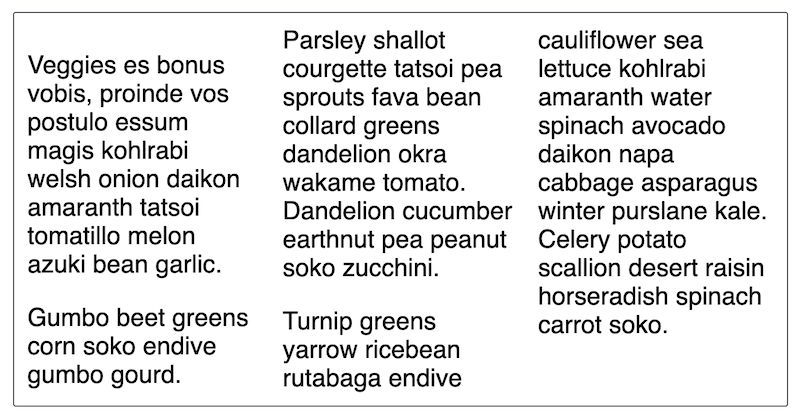

```css
.container {
  column-count: 3;
}
```

```html
<div class="container">
  <p>
    Veggies es bonus vobis, proinde vos postulo essum magis kohlrabi welsh onion
    daikon amaranth tatsoi tomatillo melon azuki bean garlic.
  </p>

  <p>
    Gumbo beet greens corn soko endive gumbo gourd. Parsley shallot courgette
    tatsoi pea sprouts fava bean collard greens dandelion okra wakame tomato.
    Dandelion cucumber earthnut pea peanut soko zucchini.
  </p>

  <p>
    Turnip greens yarrow ricebean rutabaga endive cauliflower sea lettuce
    kohlrabi amaranth water spinach avocado daikon napa cabbage asparagus winter
    purslane kale. Celery potato scallion desert raisin horseradish spinach
    carrot soko.
  </p>
</div>
```

## Floats

```html
<h1>간단한 float 예제</h1>

<div class="box">float</div>

<p>...</p>

<p>...</p>

<p>...</p>
```

```css
body {
  width: 90%;
  max-width: 900px;
  margin: 0 auto;
  font: 0.9em/1.2 Arial, Helvetica, sans-serif;
}

.box {
  width: 150px;
  height: 100px;
  border-radius: 5px;
  background-color: rgb(207, 232, 220);
  padding: 1em;
}
```

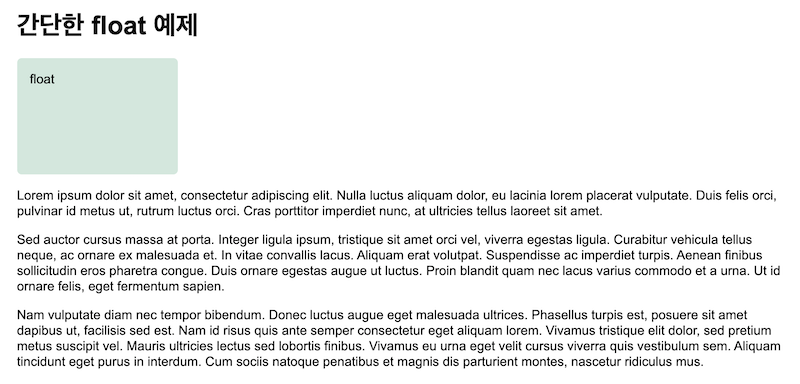

normal flow에서는 `.box`가 block 요소이므로 줄 바꿈이 발생하여 텍스트 위에 자리잡고 있게 된다. 이제 `.box`에 `float` 속성과 `margin-right` 속성을 추가해보자.

```css
.box {
  ...
  float: left;
  margin-right: 15px;
}
```

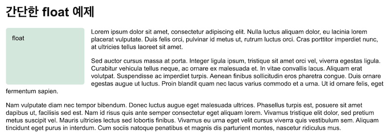

`float`로 설정된 대상 요소(`.box`)는 normal flow에서 벗어나 부모 컨테이너(여기서는 `<body>`)의 왼쪽에 고정되어 있다. `float`된 요소 아래에 위치하고 있던 텍스트는 `float`된 요소를 감싸게 된다.

`.box`의 바로 뒤에 있는 `p`에 `special` 클래스를 부여해보자.

```html
...

<div class="box">float</div>

<p class="special">...</p>
```

```css
.special {
  background-color: rgb(79, 185, 227);
  padding: 10px;
  color: #fff;
}
```

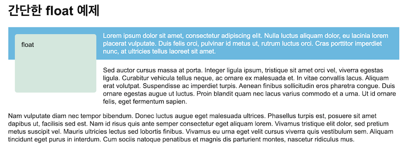

`.special`의 background가 `float`된 요소 아래부터 시작되는 것을 확인할 수 있다. `float`가 적용되면 normal flow에서 벗어나기 때문에 block 요소인 `<p>`는 `width`를 100%로 유지하고 있는 것을 확인할 수 있다.

### Clearing floats

`float` 된 요소는 normal flow에서 벗어나 다른 요소들은 그 옆에 표시되는 것을 확인할 수 있었다. 하지만 원치 않는 요소까지 `float` 옆에 위치하는 것을 막기 위해서는 `clear` 속성을 부여해야 한다.

```html
...
<div class="box">float</div>

<p class="special">...</p>
<p class="cleared">...</p>
```

```css
.cleared {
  clear: left;
}
```

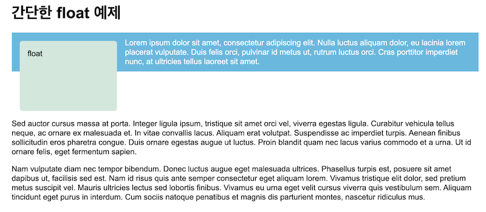

`.cleared`가 적용된 요소는 더 이상 그 옆에 위치되지 않는 것을 확인할 수 있다.

- `left`: `float: left`가 적용된 항목들 clear
- `right`: `float: right`가 적용된 항목들 clear
- `both`: 양쪽 모두 clear

### Clearing boxes wrapped around a float

위의 경우처럼 `<p>`보다 긴 `float`된 요소를 wrapping해서 두 요소를 모두 포함할만큼의 `height`를 갖는 box를 만든다고 해보자.

```html
<div class="wrapper">
  <div class="box">float</div>

  <p>...</p>
</div>
```

```css
.wrapper {
  background-color: rgb(79, 185, 227);
  padding: 10px;
  color: #fff;
}

.cleared {
  /* clear: left; */
}
```

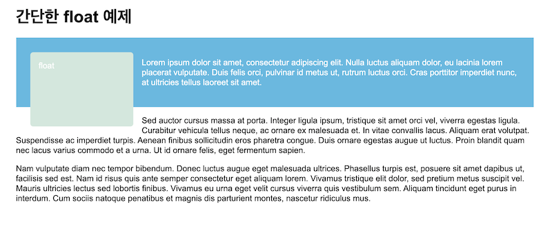

그러나 의도와는 달리 여전히 `float` 뒤에서 `<p>`의 배경 색상이 시작하는 것을 확인할 수 있다. 물론 이렇게 된 까닭은 `float`가 normal flow에서 벗어났기 때문이다.

> **The clearfix hack**

위의 상황을 처리하는 고전적인 방법은 "clearfix hack"이라고 알려진 방법을 적용하는 것이다.

```css
.wrapper::after {
  content: '';
  clear: both;
  display: block;
}
```

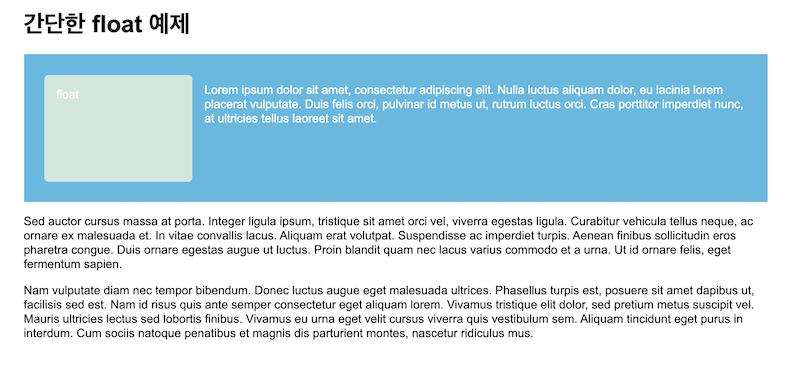

본질적으로는 `float` 아래에 `<div>`와 같은 block 요소를 추가하고, 거기에 `clear: both`를 설정한 것과 같다.

> **overflow**

다른 방법으로는 `.wrappper`에 `overflow` 속성을 `visible` 이외의 값으로 설정하는 방법이 있다.

```css
.wrapper {
  ...
  overflow: auto;
}
```

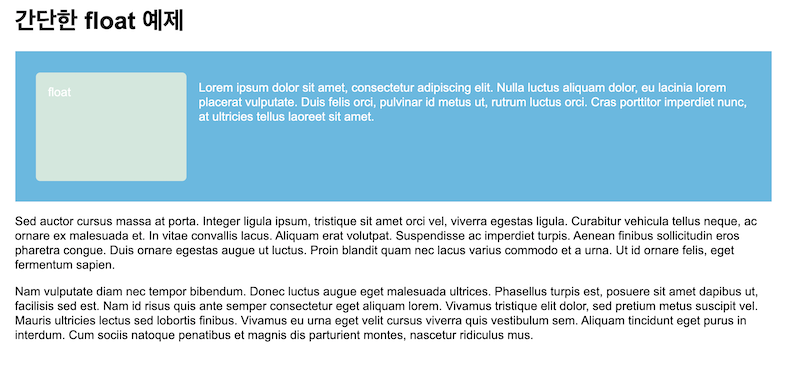

`overflow` 속성은 [block formatting context]()를 생성하여 처리하기 때문에 `float` 요소 역시 BFC에 포함되기 때문에 가능한 방법이다.

> **display: flow-root**

이 속성을 지원하는 브라우저에서는 BFC를 명시적으로 생성하게 된다. 호환성을 따져보고 적절하게 사용하면 된다.

```css
.wrapper {
  /* overflow: auto; */
  display: flow-root;
}
```

## Reference

- [MDN: The box model](https://developer.mozilla.org/ko/docs/Learn/CSS/Building_blocks/%EC%83%81%EC%9E%90_%EB%AA%A8%EB%8D%B8)
- [MDN: Floats](https://developer.mozilla.org/en-US/docs/Learn/CSS/CSS_layout/Floats)
