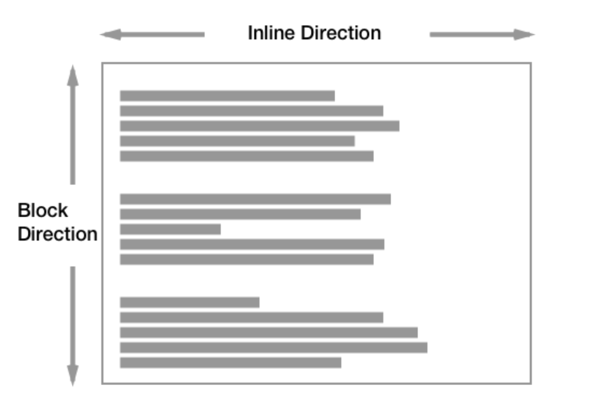
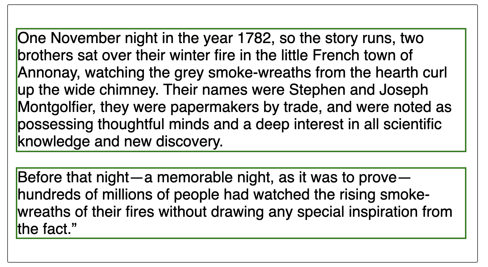
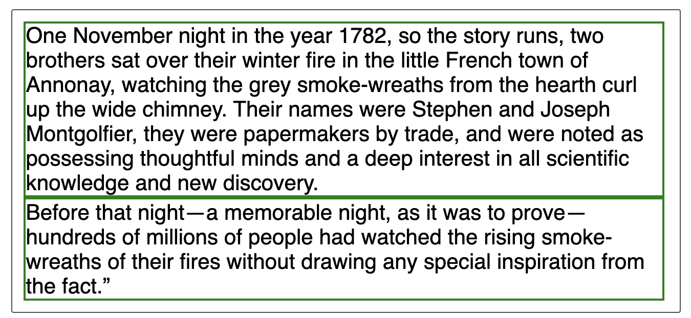

# [20-10-22] TIL 👊

## Block Formatting Context에 포함된 요소(Elements)

수평(horizontal) 작성 모드에서 블록 요소는 세로 방향으로 하나씩 배치된다.



블록 요소는 스펙에 정의된 특성에 따라 두 개의 블록 요소 사이에 margin이 존재한다면 두 요소가 겹치지 않고 분리되도록 만들어 준다.



위의 예제에서 `<p>` 요소 간에 간격이 존재하는 이유는 브라우저의 기본 스타일로 인해 `margin-top`과 `margin-bottom`이 적용되어 있는 상태이기 때문이다.

따라서 다음과 같이 `margin`을 0으로 설정하면 `border`가 맞닿는 것을 확인할 수 있다.

```css
p {
  margin: 0;
}
```



## Inline Formatting Context에 포함된 요소(Elements)

inline 박스는 수평(Horizontally)으로 쌓인다. 한 줄(line boxes) 안에 해당 inline 박스를 전부 담을 수 없는 상황이라면 새로운 line boxes에 렌더링된다.

## Reference

- [MDN: Block and inline layout in normal flow](https://developer.mozilla.org/en-US/docs/Web/CSS/CSS_Flow_Layout/Block_and_Inline_Layout_in_Normal_Flow)
- [MDN: Virtual formatting model](https://developer.mozilla.org/en-US/docs/Web/CSS/Visual_formatting_model#Line_boxes)
