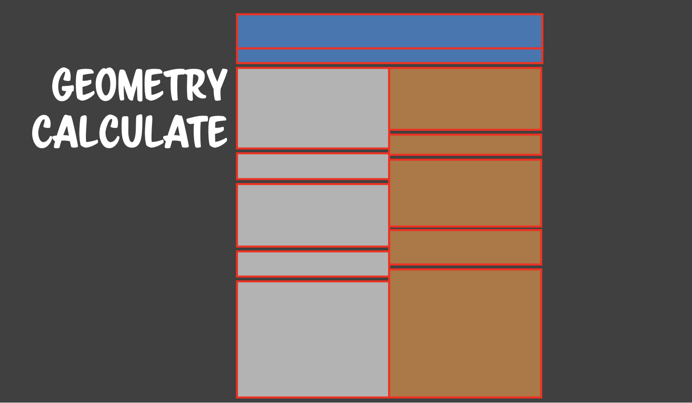
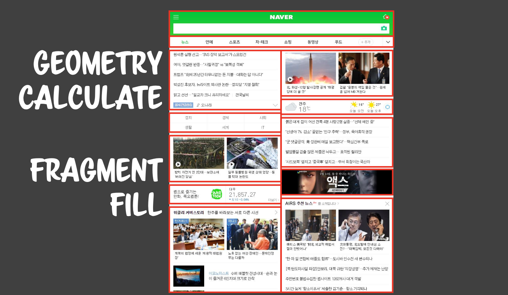
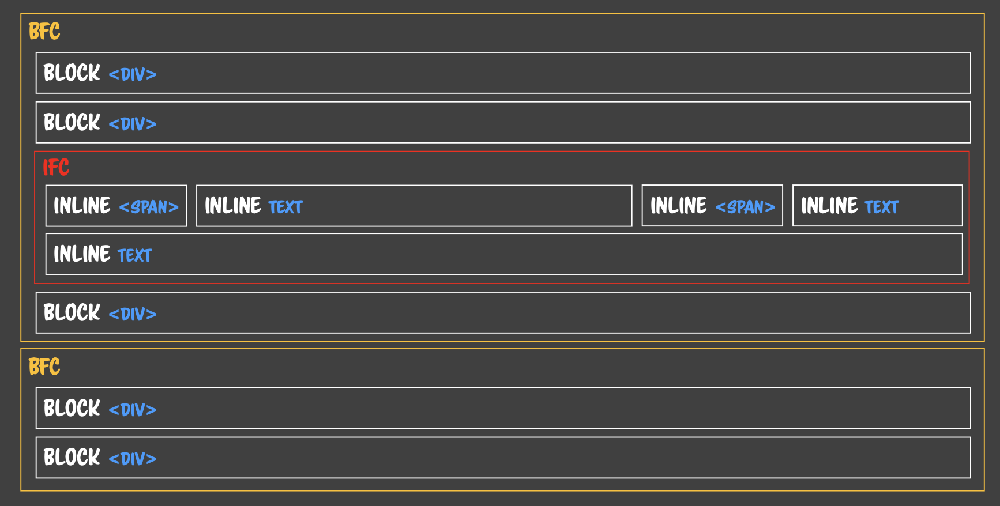
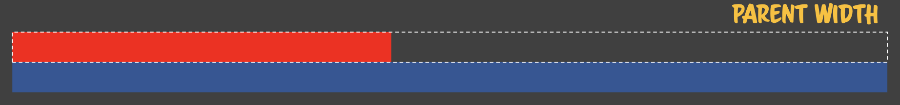
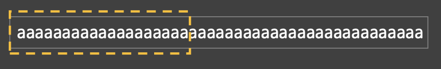
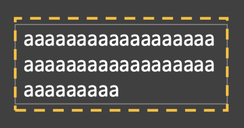
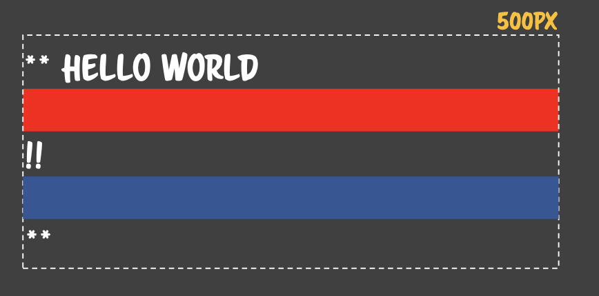
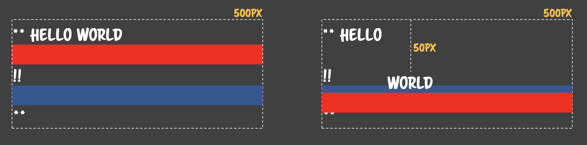

# 201026 - TIL 👊

## 순열과 조합(Permutations and Combinations)

### 조합(Combinations)

<sub>4</sub>C<sub>3</sub>을 코드로 구현해보자.

```javascript
Input: [1, 2, 3, 4];
Output: [
  [1, 2, 3],
  [1, 2, 4],
  [1, 3, 4],
  [2, 3, 4]
];
```

4 개 중에서 3개를 선택할 때 나올 수 있는 모든 조합을 구하는 것이 목적이며, 순서가 바뀌어도 같은 조합으로 취급한다.

```
start:

  ① 1을 선택함 → 나머지인 [2,3,4] 중에서 2개를 선택하는 조합을 나열한다.
  [(1),2,3], [(1),2,4], [(1),3,4]
  ② 2를 선택함 → 나머지인 [3,4] 중에서 2개를 선택하는 조합을 나열한다.
  [(2),3,4]
  ③ 3을 선택함 → 나머지인 [4] 중에서 2개를 선택하는 조합을 나열한다.
  []
  ④ 4를 선택함 → 나머지인 [] 중에서 2개를 선택하는 조합을 나열한다.
  []

end:
```

```javascript
const getCombinations = (arr, toSelectNumber) => {
  if (toSelectNumber === 1) return arr.map((value) => [value]);
  // 1개를 선택하는 경우에는 배열 내에 있는 요소를 각각 선택하는 것과 동일하다.
  // ex) [1,2,3] → [[1],[2],[3]]

  return arr.reduce((result, fixed, index, origin) => {
    const rest = origin.slice(index + 1); // 선택된 fixed를 제외한 나머지
    const combinations = getCombinations(rest, selectNumber - 1); // 나머지에서 현재 뽑아야 하는 개수의 보다 한 개 더 적게 선택해야 한다.
    const attached = combinations.map((combination) => [fixed, ...combination]);
    // 반환된 결과에 선택해둔 fixed를 앞에 붙여주어야 한다.
    return (result = [...result, ...attached]);
  });
};

const example = [1, 2, 3, 4];
const result = getCombinations(example, 3);
// [[1,2,3],[1,2,4],[1,3,4],[2,3,4]]
```

### 순열(Permutations)

조합은 **순서**에 관계없이 선택한 방식이라면, 순열에서는 **순서**가 중요하다.

> <sub>n</sub>P<sub>r</sub> = <sub>n</sub>C<sub>r</sub> x r!<br>
> 조합을 구한 후, 뽑고자 하는 수의 factorial을 곱하면 순열을 구하는 공식이다.

`[1,2,3,4]`에서 3개를 뽑아 순열을 만든다고 해보자.

```
[1,2,3] => 여기서 순서를 바꾸는 경우의 수 = 3!
[1,2,4] => 여기서 순서를 바꾸는 경우의 수 = 3!
[1,3,4] => 여기서 순서를 바꾸는 경우의 수 = 3!
[2,3,4] => 여기서 순서를 바꾸는 경우의 수 = 3!
```

```
1(fixed) → permutation([2,3,4])
         → 2(fixed) → permutation([3,4])
                    → 3(fixed) → permutation([4])
2(fixed) → permutation([1,3,4]) ...
3(fixed) → permutation([1,2,4]) ...
4(fixed) → permutation([1,2,3]) ...
```

그렇다면 이제 기존 조합 함수에서 나머지인 `rest`를 구하는 부분을 fixed 된 위치를 제외한 배열로 만들어주면 된다.

```javascript
const rest = [...origin.slice(0, index), ...origin.slice(index + 1)];
```

```javascript
const getPermutations = (arr, toSelectNumber) => {
  if (toSelectNumber === 1) return arr.map((value) => [value]);

  return arr.reduce((result, fixed, index, origin) => {
    const rest = [...origin.slice(0, index), ...origin.slice(index + 1)];
    const permutations = getPermutations(rest, toSelectNumber - 1);
    const attached = permutations.map((permutation) => [fixed, ...permutation]);
    return (result = [...result, ...attached]);
  });
};

const example = [1, 2, 3, 4];
const result = getPermutations(example, 3);
/*
  [1,2,3], [1,2,4],
  [1,3,2], [1,3,4],
  [1,4,2], [1,4,3],
  [2,1,3], [2,1,4],
  [2,3,1], [2,3,4],
  [2,4,1], [2,4,3],
  [3,1,2], [3,1,4],
  [3,2,1], [3,2,4],
  [3,4,1], [3,4,2],
  [4,1,2], [4,1,3],
  [4,2,1], [4,2,3],
  [4,3,1], [4,3,2]
*/
```

## CSS-Rendering System

### 1. Graphics System

고전 그래픽 시스템은 특정 위치([x,y], bit)를 변화시키면서 표현하는 방식이었다.

하지만 Fixed Number로 모든 것을 표현하기에는 Screen size, Chrome size, Hierachy 등 범용적으로 사용하기에는 분명한 한계가 존재하였다.

따라서 Abstract Calculator를 이용하여 함수를 통해 화면에 그려질 때 환경을 인식하여 Fixed Number로 변환되는 방식을 사용하게 되었다.

> %, left, block, inline, float ...

위와 같이 추상화되어 있는 계산 방식을 통해 Reactive하게 표현할 수 있는 시스템으로 발전하게 된다.

Abstract Graphics 시스템 하에서 공통되는 부분을 묶는 단위를 컴포넌트(Components)라 하고, 이러한 컴포넌트들이 일정한 규칙과 사용법을 준수해야 하는 형태로 구현되어 있다면 프레임워크(Framework)가 되는 것이다.

대표적으로 HTML 자체를 하나의 프레임워크로 본다면, 각각의 태그가 컴포넌트가 될 것이고, Bootstrap을 하나의 프레임워크의 기준으로 삼는다면 각각의 요소 하나가 컴포넌트가 될 것이다.

### 2. Rendering System

> Geometry Caclulate

구획을 우선적으로 나눈다. 구획 별 크기, 위치 등이 계산된다 → `reflow`



> Fragment Fill

Geometry Calculate에서 나뉘어진 구획을 칠하는 과정 → `repaint`

따라서 `reflow`가 발생할 때마다 바뀐 형태에 맞춰 다시 `repaint`가 발생하게 된다.



### 3. Normal flow

Normal flow는 다음과 같은 3가지의 Visual Formatting Model의 기준에 따라 렌더링된다.

> Position

- `static` | `relative` | `absolute` | `fixed` | `inherit`
- `static`, `relative`만 Normal flow를 따른다.



> Block Formatting Context (BFC)

```html
<div style="width: 500px; background: red;">&nbsp;</div>
<div style="background: blue;">&nbsp;</div>
```



BFC는 block 요소에 대해 적용되며, 부모의 가로 길이를 모두 차지한다(`width: 100%`). 이때 상위 블록 요소의 `height`가 시작하는 지점이 된다. 다만 위의 그림에서 빨간색 사각형이 가로 전체를 차지하지 않는 것처럼 보이더라도(`background`가 `width: 100%`를 차지하지 않더라도) Geometry 계산 시 전체 너비는 모두 계산되고 Fragment fill만 실제 너비만큼만 칠해지는 것이다.

> Inline Formatting Context (IFC)

inline 요소에 적용되며 자신의 컨텐츠 크기만큼만의 width와 height를 가진다 → width, height를 설정하는 것이 불가능하다. 또한 inline 요소들의 width의 합이 부모의 width를 넘어가게 되면 다음 행으로 넘어가게 된다. 그때 inline 요소들 중에 `line-height`가 가장 큰 값을 기준으로 다음 행으로 넘어가게 된다.

```html
<div style="width:200px">aaaaa...</div>
```



공백 문자가 없는 텍스트는 하나의 inline 요소로 취급하기 때문에 위의 예시에서는 부모의 width를 넘어가게 되는 것이다.

```html
<div style="width:200px">
  aaaaaaaaaaaaaaaaaaaaa aaaaaaaaaaaaaaaaaaaaa aaaaaaaaaaa
</div>
```



위의 예시에서는 공백 문자 자체를 또 다른 inline 요소로 취급하기 때문에 `<span>` 태그가 적용된 것처럼 인식되어 렌더링 되기 때문에 줄바꿈이 발생하는 것이다.

이때 `word-break: break-all`로 지정하면 각각의 요소를 별개의 inline 요소로 식별하여 공백 문자를 주지 않아도 `<div>` 영역을 벗어나면 줄바꿈이 일어나지만 Geometry Calculate가 급증하게 되므로 성능 저하가 발생할 수 있다. `word-break: normal`은 기본값인데 앞서 살펴본 예시와 동일하게 공백 문자를 기준으로 inline 요소를 분리한다. 또 하나의 inline 요소는 부모 영역을 넘어가도 줄바꿈이 발생하지 않는다.

> BFC + IFC

```html
<div style="width: 500px;">
  **
  <span>
    HELLO
    <span
      >WORLD
      <div style="background:red;">&nbsp;</div>
    </span>
    !!
    <div style="background:blue;">&nbsp;</div>
  </span>
  **
</div>
```



1. BFC가 시작된다.
2. inline 요소인 '\*\*','HELLO','WORLD'에 대해 IFC가 적용된다.
3. block(div) 요소를 만나면서 IFC는 종료되고, BFC가 활성화되며 빨간색 상자가 그려진다.
4. inline 요소인 '!!'를 만나면서 IFC가 활성화된다.
5. block(div) 요소를 만나면서 IFC가 종료되고, BFC가 활성화되면서 파란색 상자가 그려진다.
6. inline 요소인 '\*\*'를 만나서 IFC가 활성화된다.

> Relative Positioning (RP)

`static`으로 그려진 다음에 `relative`로 선언된 요소는 해당 위치로 이동한다. 즉, Normal flow에 따라 먼저 렌더링 된 후, `position: relative`인 요소만 `z-index`가 올라가고, 옮겨진 위치에 칠해지는 것이다. 이때 별도의 Geometry Caculate는 이루어지지 않는다.



## Reference

- [JavaScript로 순열과 조합 알고리즘 구현하기](https://medium.com/@jun.choi.4928/javascript%EB%A1%9C-%EC%88%9C%EC%97%B4%EA%B3%BC-%EC%A1%B0%ED%95%A9-%EC%95%8C%EA%B3%A0%EB%A6%AC%EC%A6%98-%EA%B5%AC%ED%98%84%ED%95%98%EA%B8%B0-21df4b536349)
- [코드스피츠76 - CSS Rendering](https://www.youtube.com/watch?v=_o1zsrBkZyg)
