# [201027] - TIL 👊

## Float

> left | right | none | inherit

### 특징

- 새로운 BFC를 생성한다.
- Normal flow를 벗어나 Line box를 따라 그려지게 된다.
- text나 inline 요소의 Guard 역할을 한다.

```html
<div style="width:500px">
  <div style="height:50px;background:red;"></div>
  <div style="width:200px;height:150px;float:left;background:green;"></div>
  <div style="height:50px;background:skyblue"></div>
</div>
```

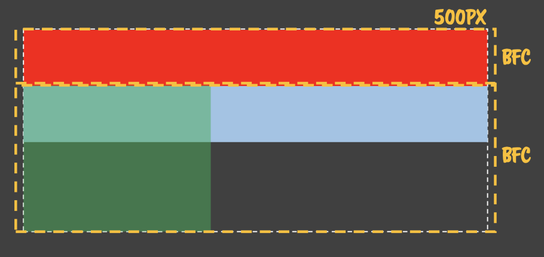

초록색 `<div>`에서 `float:left;`를 설정하는 순간 기존의 BFC를 벗어나 **새로운 BFC를 생성한다.**

`float`된 요소에 별도의 BFC가 생성되었으므로 기존의 Normal flow를 따라 하늘색의 `<div>`가 아래에 위치하게 된다.

```html
<div style="width:100%">
  <div style="height:50px; background:red;"></div>
  <div style="width:50%; height:150px; float:left; background:green"></div>
  Hello
  <div style="height:50px; background:skyblue">WORLD</div>
  !!
</div>
```

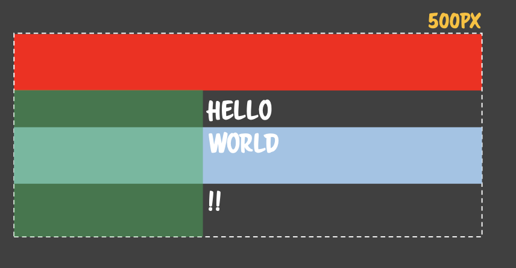

`float` 되는 순간 새로운 BFC가 생성되었고, `Hello`는 inline 요소이다. 하지만 녹색 `<div>`가 line box를 점유하고 있으므로, inline 요소의 Guard 역할을 하여 `Hello`는 Guard를 뚫지 못하고 바깥으로 밀려난 것이다.

!> DOM 구조에 관계없이 inline 요소는 Guard에 영향을 받고 block 요소는 Guard에 영향을 받지 않아 하늘색 `<div>`는 기존과 동일하게 `width:100%`로 그려진다.

```html
<style>
  .left {
    float: left;
  }
  .right {
    float: right;
  }
</style>
<div style="width:500px">
  <div class="left" style="width:200px;height:150px">1</div>
  <div class="right" style="width:50px;height:150px">2</div>
  <div class="right" style="width:50px;height:100px">3</div>
  <div class="left" style="width:150px;height:50px">4</div>
  <div class="right" style="width:150px;height:70px">5</div>
  <div class="left" style="width:150px;height:50px">6</div>
  <div class="left" style="width:150px;height:50px">7</div>
  <div style="height:30px;background:red">
    ABC1 ABC2 ABC3 ABC4 ABC5 ABC6 ABC7 ABC8
  </div>
</div>
```

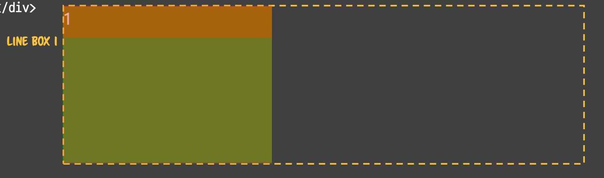

동일한 BFC 내에 float 요소가 있는지 확인하며 현재 float 요소가 존재하지 않으므로 BFC의 width 전체를 line box로 설정하고 line box의 왼쪽에 요소를 배치한다.

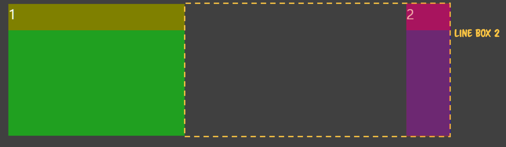

float된 요소가 이미 존재한다면 해당 영역을 제외한 부분을 line box로 설정하고, 그 안에 요소가 배치될 수 있는지 확인하고 가능한 상태이므로 오른쪽에 배치한다.

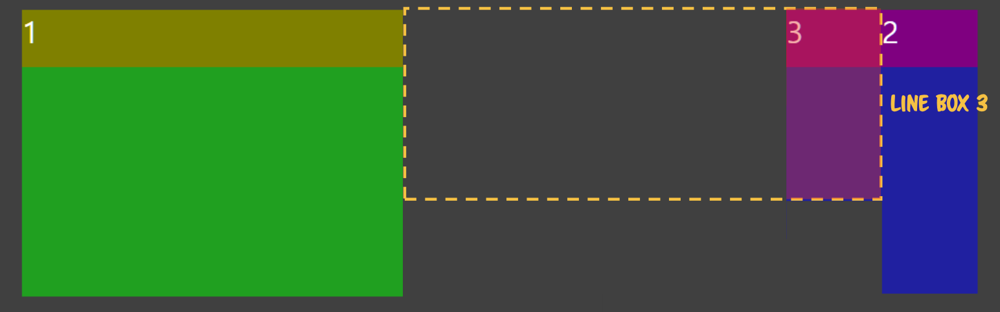

float 요소가 배치되지 않은 영역을 line box로 설정하고, 배치가 가능하므로 오른쪽에 배치한다.

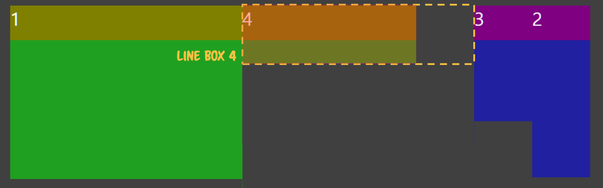
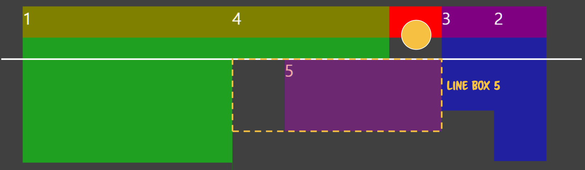

float 된 요소가 없는 영역에 line box를 설정하였으나, 배치할 요소가 들어갈만큼 충분한 width가 제공되지 않으므로 가장 높은 baseline을 기준으로 새롭게 line box를 설정한 뒤 요소를 배치한다.

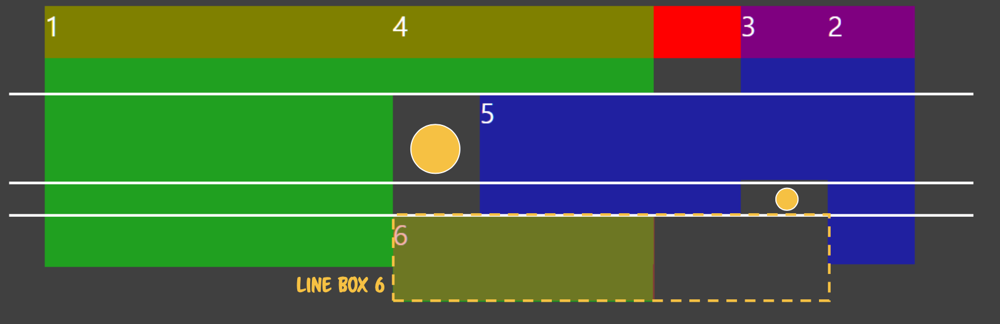
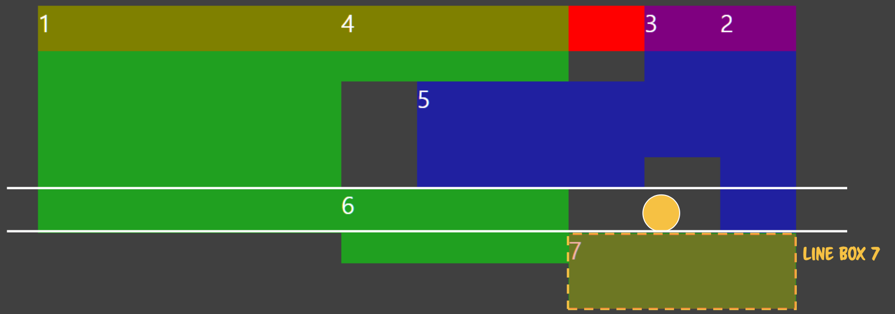
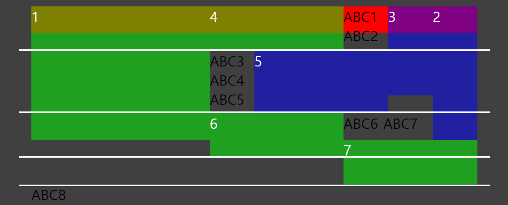

맨 마지막의 빨간색 `<div>`는 Normal flow를 따라 그려지므로 맨 윗줄에 그려지지만, 그 안에 있는 text는 Guard에 막혀 밀려나게 된다. 다만 `ABC8`이 맨 아랫줄 왼쪽에 위치하는 이유는 7번째 `<div>`가 `float: left`로 선언되어 있는데, 왼쪽 영역이 비어있는 것처럼 보인다 하더라도 가용 가능한 line box의 가장 왼쪽을 점유한 상태이므로 새로운 줄로 밀려나게 되는 것이다.

## overflow

> visible | hidden | scroll | auto | initial | inherit

`hidden`,`scroll` 속성을 가질 때 새로운 BFC를 즉시 생성한다.

```html
<div style="width:500px">
  <div class="left" style="width:200px;height:150px">1</div>
  <div class="right" style="width:50px;height:150px">2</div>
  <div class="right" style="width:50px;height:100px">3</div>
  <div class="left" style="width:150px;height:50px">4</div>
  <div class="right" style="width:150px;height:70px">5</div>
  <div class="left" style="width:150px;height:50px">6</div>
  <div class="left" style="width:150px;height:50px">7</div>

  <div class="hidden" style="height:30px;background:red">A</div>
  <div class="hidden" style="height:15px;background:orange">B</div>
  <div style="height:30px;background:black"></div>
  <div class="hidden" style="height:30px;background:red">C</div>
  <div class="hidden" style="height:20px;background:orange">D</div>
  <div style="height:30px;background:black"></div>
  <div class="hidden" style="background:red">E</div>
  <div style="height:30px;background:black"></div>
</div>
```

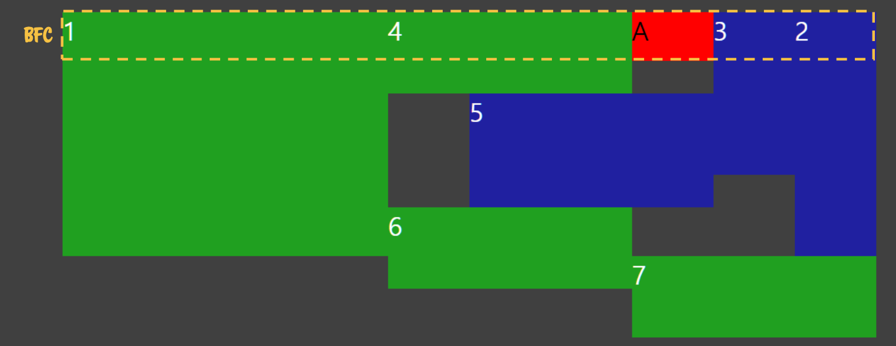

우선적으로 배치 가능한 line box에 위치하게 된다. 따라서 `overflow: hidden`이 주어지지 않았을 때와 달리 실제 width가 줄어들게 된다.

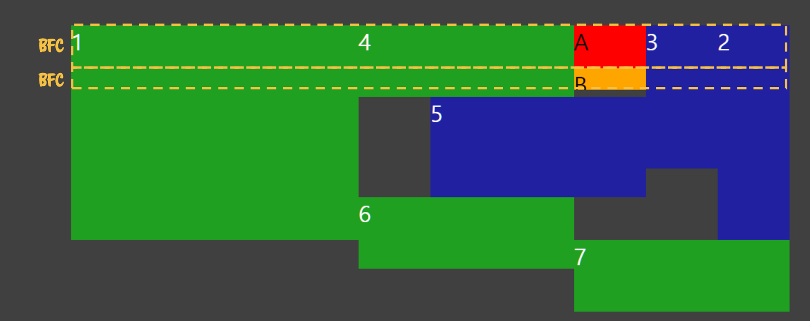
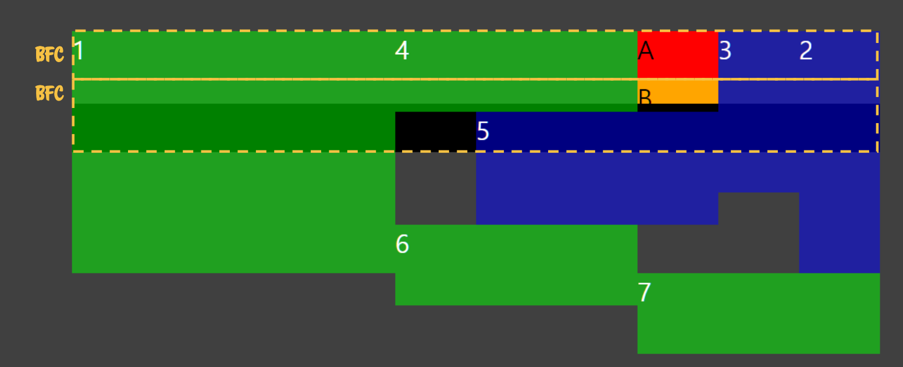
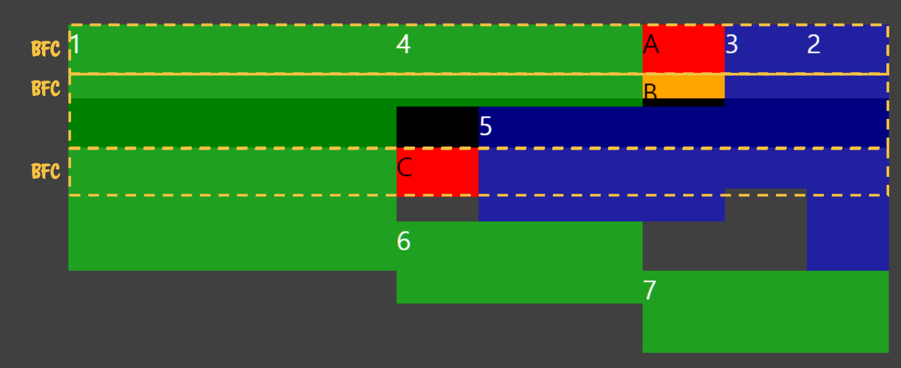
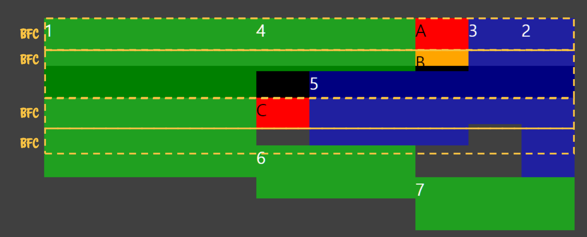
D의 경우 line box 내에 요소를 배치할 만큼 높이가 충분한 위치가 존재하지 않아 표시되지 않는다(width가 0이 된다). 하지만 height는 차지하고 있음에 주의해야 한다.
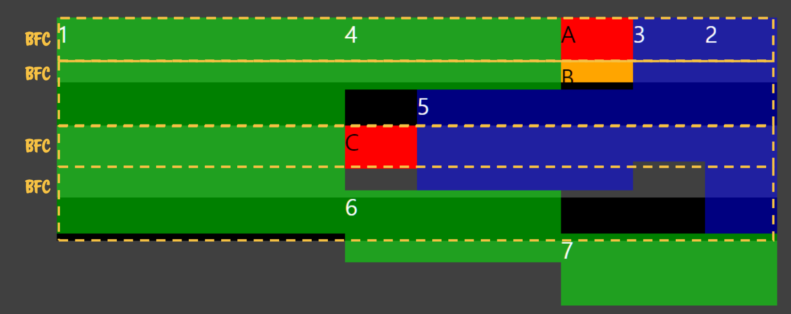
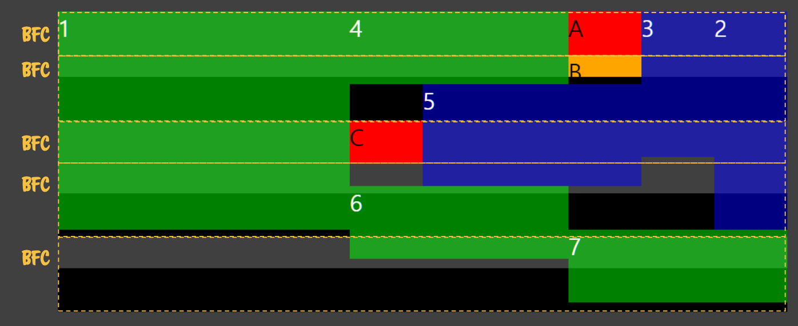
E의 경우에도 D와 마찬가지로 line box 내에 배치할만한 충분한 높이를 가진 공간이 존재하지 않아 width가 0이 되었지만,height는 차지하고 있게 된다.
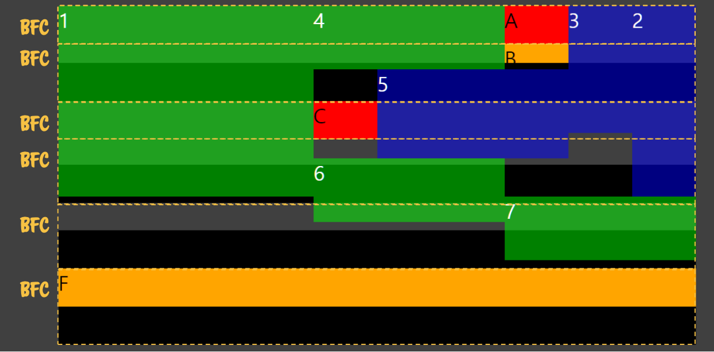

!> 따라서 `overflow: hidden`이 부여된 요소 각각에 대해 새로운 BFC가 생성되고, 또 width가 존재하지 않는 요소라 하더라도 height를 점유하고 있게 되므로 reflow를 발생시키게 되고 성능 저하로까지 이어질 수 있다.

## Reference

- [코드스피츠76 - CSS Rendering](https://www.youtube.com/watch?v=_o1zsrBkZyg)
