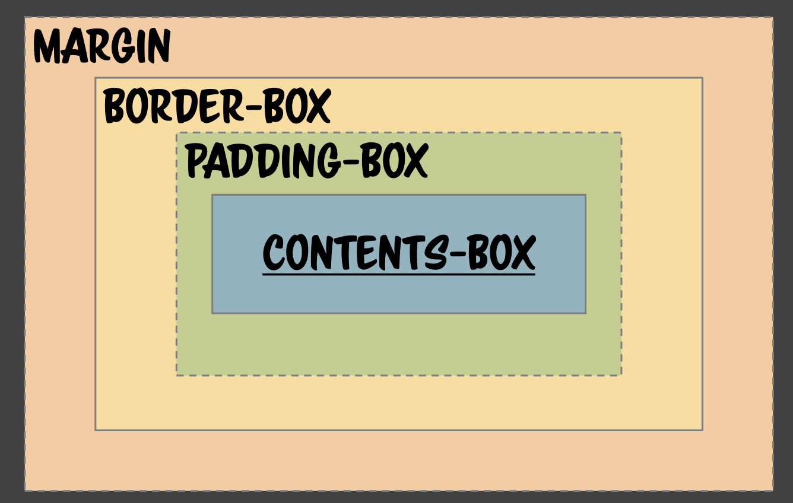
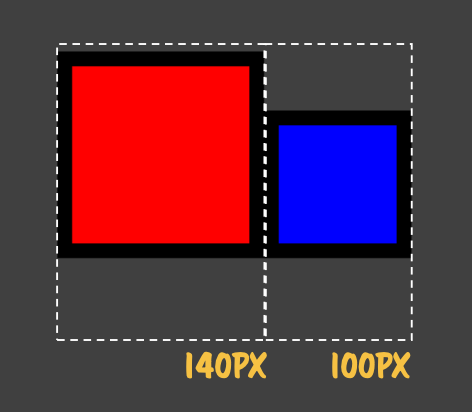
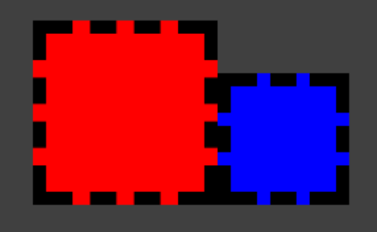
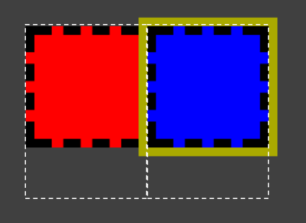
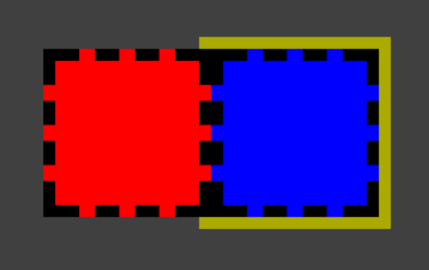

# [201028] - TIL 👊

## Box Model



한 개의 Element는 총 4개의 Box를 갖고 있다.

- `margin`: `border` 바깥의 영역으로 투명하지만 영역을 점유하고 있는 공간이다.
- `border`: 외곽선이지만,두께를 늘리는 등 영역을 차지할 수 있는 요소이기 때문에 하나의 프로퍼티라 볼 수 있다.
- `padding`: `border`와 `contents` 간의 사이 공간을 의미한다.

## Box Sizing

> content-box | border-box

요소의 크기를 `border`를 기준으로 설정할 것인지 `content`를 기준으로 설정할 것인지 정할 수 있다.

```html
<style>
  div {
    width: 100px;
    height: 100px;
    padding: 10px;
    border: 10px solid #000;
    display: inline-block;
  }
</style>
<div style="background:red;"></div>
<div style="background:blue;box-sizing:border-box"></div>
```



분명 같은 크기를 설정하였지만 `box-sizing`에 따라 전체 크기가 달라지는 것을 확인할 수 있다.

```html
<style>
  div {
    width: 100px;
    height: 100px;
    padding: 10px;
    border: 10px dashed #000;
    display: inline-block;
  }
</style>
<div style="background:red;"></div>
<div style="background:blue;box-sizing:border-box"></div>
```



기존과 달리 `border`의 속성을 `dashed`로 지정했을 때 `border` 영역에도 background 색상이 적용된 것을 확인할 수 있다. 따라서 `border-box` 영역은 완전히 분리되어 있는 영역이 아니라 겹쳐서 존재하는 것이다. 따라서 `border`를 그리기 위해서는 먼저 `contents + padding` 영역을 모두 그리고 외곽의 위치를 찾아서 다시 `border`를 그리므로 Geometry Calculate가 필요하다.

```html
<style>
  div {
    width: 100px;
    height: 100px;
    padding: 10px;
    border: 10px dashed #000;
    display: inline-block;
  }
</style>
<div style="background:red;"></div>
<div style="background:blue;box-shadow:0 0 0 10px #aa0"></div>
```



위의 예제는 `box-shadow`를 이용하여 또 다른 `border`로 활용한 것이다. 파란 박스의 경우 `box-shadow`는 레이아웃(Geometry)에는 전혀 영향을 주지 않고 색상만 칠해져있다(Repaint).

```html
<style>
  div {
    width: 100px;
    height: 100px;
    padding: 10px;
    border: 10px dashed #000;
    display: inline-block;
  }
</style>
<div style="background:red;position:relative;"></div>
<div style="background:blue;box-shadow:0 0 0 10px #aa0"></div>
```



`position: relative`가 부여되면 Normal flow를 따라 그려지고 `z-index`가 상승한 것처럼 새로 그려지는 방식이었다(Only repaint). 따라서 바로 전의 예제와는 다르게 빨간색 상자가 `box-shadow`와 파란색 상자의 `border`를 모두 가리게 되는 것이다.

## Reference

- [코드스피츠76 - CSS Rendering](https://www.youtube.com/watch?v=_o1zsrBkZyg)
