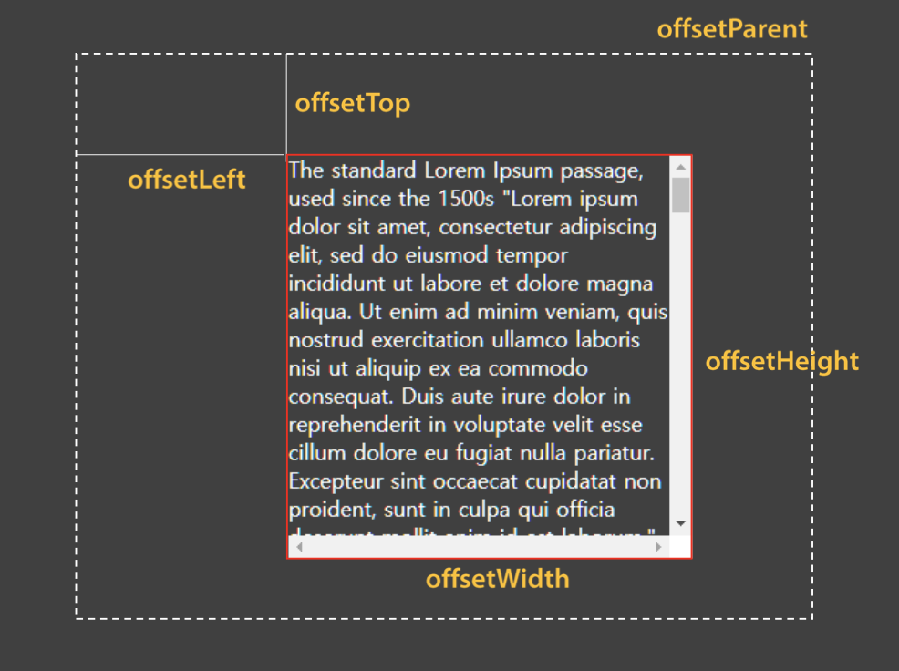
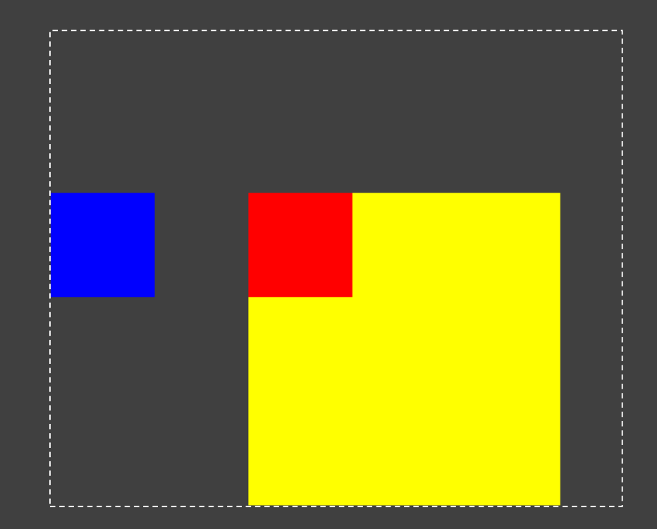
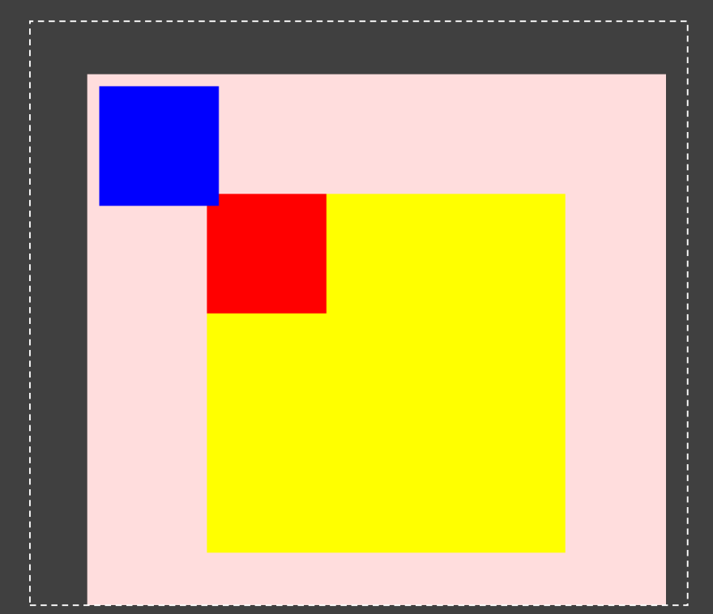
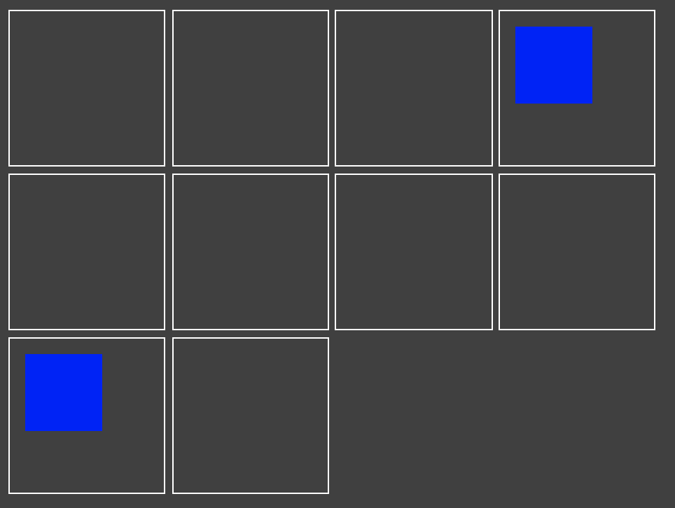

# [201028] - TIL 👊

## Position

> static | absolute | fixed | relative

- `static`: 기본 값으로 Normal flow를 따라 배치된다.
- `relative`: Normal flow에 배치된 위치를 기준으로 좌표를 지정한다. Normal flow에 따라 그리고 난 뒤 해당 수치만큼 `z-index`가 상승해서 이동한다.
- `absolute`: top/left 등이 지정되면 offset parent를 기준으로 이동하고, top/left 등이 명시되지 않으면 DOM 구조 상 parent를 기준으로 삼는다.
- `fixed`: 스크롤과 관계 없이 viewport의 좌측 상단을 기준으로 설정한다.

> Offset

Geometry Calculate가 완료되어 정확한 수치로 계산된 것을 의미한다. 이때 브라우저는 효율성을 위해 Geometry Calculate를 Box 크기를 조정할 때마다 개별적으로 계산하는 것이 아니라 한 번에 해결하려고 한다. 이때 계산되는 단위를 프레임(frame)이라 한다.



이때 offset을 계산할 기준으로 삼는 것이 offset parent이며, 이는 DOM 구조와는 별개이므로 주의해야 한다.

- offset parent → null

  - root, HTML, body
  - position: fixed
  - out of DOM tree

- Recursive search
  - 재귀적으로 탐색하면서 parent 중에서 position: absolute 혹은 relative인 요소를 offset parent로 삼고, 만약 부모 중에 존재하지 않는다면 body를 offset parent로 삼는다.

```html
<div style="width:300px;height:300px;background:yellow;margin:100px">
  <div style="width:100px;height:100px;position:absolute;background:red"></div>
  <div
    style="width:100px;height:100px;position:absolute;left:0;background:blue"
  ></div>
</div>
```



위의 예제에서 파란색 박스는 left가 지정되었으므로 offset parent의 좌측에 배치된 것이다. 재귀적으로 탐색하면서 parent 중에 position: absolute나 relatvie로 선언된 요소를 찾았으나 발견하지 못해서 body를 offset parent로 설정하였다.

빨간색 박스의 경우에는 별도의 offset을 지정해주지 않았으므로 Normal flow로 배치되었을 때의 위치에 자리하게 된다.

```html
<div
  style="position:absolute;left:50px;top:50px;background:pink;width:600px;height:600px"
>
  <div style="width:300px;height:300px;background:yellow;margin:100px">
    <div
      style="width:100px;height:100px;position:absolute;background:red"
    ></div>
    <div
      style="width:100px;height:100px;position:absolute;left:10px;top:10px;background:blue"
    ></div>
  </div>
</div>
```



위의 예제에서 분홍색 상자는 offset parent가 body로 설정되어 offset 만큼 body를 기준으로 움직인 것을 확인할 수 있다.

그러나 이전 예제와는 달리 파란색 상자는 position: absolute로 설정된 분홍색 상자를 기준으로 offset 만큼 이동한 것을 확인할 수 있다.

```html
<style>
  .in {
    display: inline-block;
    width: 100px;
    height: 100px;
    border: 1px solid #fff;
  }
  .abs {
    width: 50px;
    height: 50px;
    position: absolute;
    left: 10px;
    top: 10px;
    background: #00f;
  }
</style>
<div class="in"></div>
<div class="in"></div>
<div class="in"></div>
<div class="in" style="position:relative">
  <div class="abs"></div>
</div>
<div class="in"></div>
<div class="in"></div>
<div class="in"></div>
<div class="in"></div>
<div class="in" style="position:relative">
  <div class="abs"></div>
</div>
<div class="in"></div>
```



위의 예제에서 `.in`은 inline-block이므로 수평 방향으로 쌓이게 되고, `.abs`는 모두 absolute로 설정되어 offset을 가지고 있게 된다. 이때 부모 요소 중에 position: relative 또는 absolute로 설정된 요소를 기준으로 offset 만큼 떨어져서 배치된 것을 확인할 수 있다.

## Reference

- [코드스피츠76 - CSS Rendering](https://www.youtube.com/watch?v=_o1zsrBkZyg)
