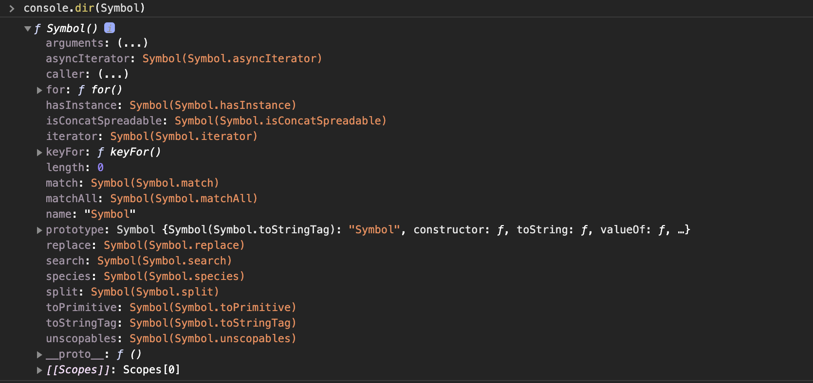
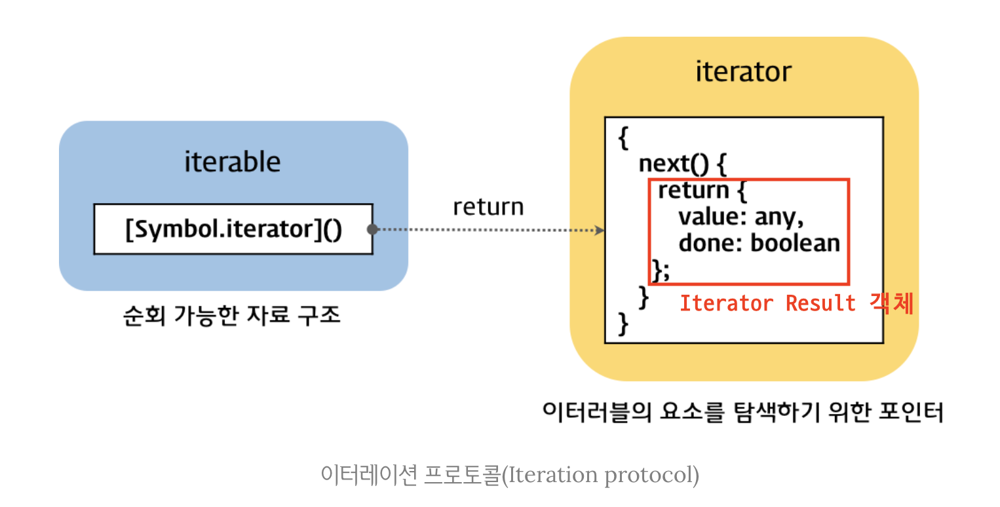

# [201031] - TIL 👊

## Symbol

심벌(symbol)은 ES6에서 도입된 7번째 데이터 타입으로 변경 불가능한 **원시 타입**의 값이다. symbol은 다른 값과 중복되지 않는 유일한 값이다. 따라서 주로 이름의 충돌 위험이 없는 유일한 프로퍼티 키를 만들기 위해 사용한다.

### Symbol 함수

symbol은 `Symbol` 함수를 호출하여 생성한다. 다른 원시값(`string`,`number`,`boolean`,`undefined`,`null`)은 리터럴 표기법을 통해 값을 생성할 수 있지만 symbol은 `Symbol` 함수를 호출하여야만 생성할 수 있다. 이때 생성된 symbol 값은 외부로 노출되지 않아 확인이 불가능하며, **다른 값과 절대 중복되지 않는 유일한 값**이다.

```javascript
// Symbol 함수를 호출하여 유일한 symbol 값을 생성한다.
const newSymbol = Symbol();
console.log(typeof newSymbol); // symbol

// symbol 값은 외부로 노출되지 않기 때문에 확인이 불가능하다.
console.log(newSymbol); // Symbol()
```

`Symbol` 함수는 `String`,`Number`,`Boolean` 생성자 함수와는 다르게 `new` 연산자와 함께 호출하지 않는다. `new` 연산자와 함께 생성자 함수 또는 클래스를 호출하면 객체(인스턴스)가 생성되지만 symbol 값은 변경 불가능한 유일한 원시 값이기 때문에 `new` 연산자를 사용하는 것이 오히려 부자연스럽다고 할 수 있다.

```javascript
new Symbol(); // TypeError: Symbol is not a constructor
```

`Symbol` 함수에는 선택적으로 문자열을 인수로 전달할 수 있다. 이 문자열은 생성된 symbol 값에 대한 설명(description)으로 디버깅 용도로만 사용되고, symbol 값을 생성하는 데에는 어떠한 영향도 주지 않는다. 따라서 symbol 값에 대한 description이 동일하게 제공되어 생성되더라도 각각의 symbol 값은 유일한 값이다.

```javascript
// symbol 값에 대한 description이 동일하더라도 유일한 symbol 값을 생성한다.
const newSymbol1 = Symbol('newSymbol');
const newSymbol2 = Symbol('newSymbol');

console.log(newSymbol1 === newSymbol2); // false
```

symbol 값도 문자열,숫자,불리언과 같이 객체처럼 접근하면 암묵적으로 Wrapper 객체를 생성한다. 다음 예제의 `description` 프로퍼티와 `toString` 메서드는 `Symbol.prototype`의 프로퍼티이다.

```javascript
const newSymbol = Symbol('newSymbol');

console.log(newSymbol.description); // newSymbol
console.log(newSymbol.toString()); // Symbol(newSymbol)
```

symbol 값은 암묵적으로 문자열이나 숫자 타입으로 변환되지는 않지만, 불리언 타입으로는 암묵적인 타입 변환이 가능하다. 이를 이용하여 `if` 문 등에서 식별 가능하다.

```javascript
const newSymbol = Symbol();

console.log(newSymbol + ''); // TypeError: Cannot convert a Symbol value to a string
console.log(+newSymbol); // TypeError: Cannot convert a Symbol value to a string
console.log(!!newSymbol); // true
if (newSymbol) console.log('newSymbol is exist');
```

### Symbol.for / Symbol.keyFor

`Symbol.for` 메서드는 인수로 전달받은 문자열을 key로 사용하여 key와 symbol 값의 쌍이 저장되어 있는 전역 symbol 레지스트리(Global Symbol Registry)에서 해당 key와 일치하는 symbol 값을 검색한다.

- [검색 성공] → 검색된 symbol 값을 반환한다.
- [검색 실패] → 새로운 symbol 값을 생성하여 전달된 인수를 key로 설정하여 전역 symbol 레지스트리에 저장한 후, 생성된 symbol 값을 반환한다.

```javascript
// 전역 symbol 레지스트리에서 검색 실패
const s1 = Symbol.for('newSymbol');
// 전역 symbol 레지스트리에서 검색 성공 → 검색된 symbol 값을 반환
const s2 = Symbol.for('newSymbol');

console.log(s1 === s2); // true
```

`Symbol` 함수는 호출될 때마다 유일한 symbol 값을 생성한다. 이때 자바스크립트 엔진이 관리하는 symbol 값 저장소인 전역 symbol 레지스트리에서 symbol 값을 식별할 수 있는 key를 지정하지 않았으므로 전역 symbol 레지스트리에 등록되어 관리되지 않는다. 그러나 `Symbol.for` 메서드를 사용하면 애플리케이션 전역에서 중복되지 않는 유일한 상수인 symbol 값을 생성하여 전역 symbol 레지스트리를 통해 공유하는 것이 가능하다.

`Symbol.keyFor` 메서드를 사용하면 전역 symbol 레지스트리에서 저장된 symbol 값의 키를 추출하는 것이 가능하다.

```javascript
const s1 = Symbol.for('newSymbol');
Symbol.keyFor(s1); // → newSymbol

const s2 = Symbol('newSymbol');
Symbol.keyFor(s2); // → undefined
```

### symbol vs 상수

예를 들어 위,아래,왼쪽,오른쪽을 표현하는 상수를 정의한다고 가정해보자.

```javascript
const Direction = {
  UP: 1,
  DOWN: 2,
  LEFT: 3,
  RIGHT: 4
};

const myDirection = Direction.UP;
if (myDirection === Direction.UP) {
  console.log('UP!');
}
```

위 예제처럼 값에는 특별한 의미가 없고 상수 이름 자체에 의미가 있는 경우가 있다. 이때 저장되어 있는 값이 변경될 수 있으며, 다른 변수 값과 중복될 가능성이 존재한다는 것이다. 이러한 경우 변경되거나 중복될 가능성이 있는 무의미한 상수 대신 중복될 가능성이 없는 symbol 값을 사용하는 것이 가능하다.

```javascript
const Direction = {
  UP: Symbol('up'),
  DOWN: Symbol('down'),
  LEFT: Symbol('left'),
  RIGHT: Symbol('right')
};

const myDirection = Direction.UP;
if (myDirection === Direction.UP) {
  console.log('UP!');
}
```

> **enum**  
> enum은 열거형(Enumerated type)이라고 부른다. 자바스크립트에서는 enum을 지원하지 않지만 타입스크립트에서는 enum을 지원한다.  
> 자바스크립트에서 enum을 모방하여 사용하기 위해서는 객체의 변경을 방지하기 위해 `Object.freeze` 메서드와 symbol 값을 사용한다.
>
> ```javascript
> const Direction = Object.freeze({
>   UP: Symbol('up'),
>   DOWN: Symbol('down'),
>   LEFT: Symbol('left'),
>   RIGHT: Symbol('right')
> });
> ```

### 프로퍼티 키로써의 symbol

객체의 프로퍼티 키는 빈 문자열을 포함하는 모든 문자열 또는 symbol 값으로 생성하는 것이 가능하며, 동적으로 생성하는 것도 가능하다.

아래의 예제에서 프로퍼티 키로 사용할 표현식을 대괄호([...])로 묶어 사용하는데 이는 배열을 표현하는 것이 아니라 계산된 프로퍼티 이름(computed property name)을 의미한다.

```javascript
const obj = {
  [Symbol.for('newSymbol')]: 1
};
obj[Symbol.for('newSymbol')]; // → 1
```

**symbol 값은 유일한 값이므로 이를 이용하여 프로퍼티 키를 생성하면 다른 프로퍼티 키와 절대 충돌하지 않으며 기존에 존재하던 프로퍼티 키는 물론 추후에 추가될 어떠한 프로퍼티 키와도 충돌할 위험이 없다.**

### 프로퍼티 은닉

symbol 값을 프로퍼티 키로 사용하여 생성한 프로퍼티는 `for...in` 문이나 `Object.keys`, `Object.getOwnPropertyNames` 메서드로는 찾을 수 없다. 이러한 특성을 이용하여 외부에 노출할 필요가 없는 프로퍼티를 은닉할 수 있다.  
하지만 ES6에서 도입된 `Object.getOwnPropertySymbols` 메서드를 사용하면 symbol 값을 프로퍼티 키로 사용하여 생성된 프로퍼티를 찾을 수 있다.

```javascript
const obj = {
  [Symbol('newSymbol')]: 1
};
for (const key in obj) {
  console.log(key); // 아무것도 출력되지 않는다.
}
console.log(Object.keys(obj)); // []
console.log(Object.getOwnPropertyNames(obj)); // []

console.log(Object.getOwnPropertySymbols(obj)); // [Symbol(newSymbol)]
const symbolKey = Object.getOwnPropertySymbols(obj)[0];
console.log(obj[symbolKey]); // 1
```

### Well-known Symbol

자바스크립트가 기본적으로 제공하는 Built-In symbol 값이 있다. Built-In symbol 값은 `Symbol` 함수의 프로퍼티에 할당되어 있다.



ECMAScript Specification에서는 이러한 Built-IN symbol 값을 **Well-Known Symbol**이라 부르며, 이는 자바스크립트 엔진의 내부 알고리즘에 사용된다.

예를 들어, `Array`,`String`,`Map`,`Set`,`TypedArray`,`arguments`,`NodeList`,`HTMLCollection`과 같이 `for...of` 문으로 순회 가능한 Built-In 이터러블(Iterable)은 Well-known Symbol인 `Symbol.iterator`를 키로 갖는 메서드를 갖게 되며, `Symbol.iterator` 메서드를 호출하면 이터레이터(Iterator)를 반환하도록 ECMAScript Spectification에 규정되어 있다. 정리하면 Built-In 이터러블은 이터레이션 프로토콜(Iteration Protocol)을 준수한다.

만약 Built-In 이터러블이 아닌 일반 객체를 이터러블처럼 동작하도록 구현하고 싶다면 이터레이션 프로토콜을 준수하도록 만들면 된다. Well-known Symbol인 `Symbol.iterator`를 키로 갖는 메서드를 객체에 추가하고 이터레이터를 반환하도록 구현하면 해당 객체는 이터러블이 된다.

```javascript
const iterable = {
  // Symbol.iterator 메서드를 구현하여 이러레이션 프로토콜을 따르도록 만든다.
  [Symbol.iterator]() {
    let cur = 1;
    const max = 5;
    // Symbol.iterator 메서드는 next 메서드를 보유하고 있는 이터레이터를 반환한다.
    return {
      next() {
        return { value: cur++, done: cur > max + 1 };
      }
    };
  }
};

for (const num of iterable) {
  console.log(num); // 1 2 3 4 5
}
```

이때 이터레이션 프로토콜을 준수하기 위해 일반 객체에 추가해야 하는 메서드의 키인 `Symbol.iterator`는 기존에 존재하던 프로퍼티 키 또는 추후에 추가될 프로퍼티 키와 절대 중복되는 일은 없을 것이다.

이처럼 symbol은 중복되지 않는 상수 값을 생성하는 것과 기존에 작성된 코드에 영향을 주지 않고 새로운 고유한 프로퍼티를 추가하기 위해, 즉 하위 호환성을 보장하기 위해서 도입된 개념이다.

## 이터러블

### 이터레이션 프로토콜

ES6에서 도입된 이터레이션 프로토콜(Iteration Protocol)은 순회 가능한(Iterable) Data Collection(자료구조)을 만들기 위해 ECMAScript Specification에 정의된 규칙이다.

ES6 이전의 배열, 문자열, 유사 배열 객체, DOM Collection 등은 통일된 규칙 없이 `for`,`for...in` 문, `forEach` 메서드 등 다양한 방법으로 순회 가능하였다. 그러나 ES6부터는 이터레이션 프로토콜을 준수하는 이터러블로 통일하여 `for...of` 문, spread 문법, 배열 비구조화 할당의 대상으로 사용할 수 있도록 만들었다.

이터레이션 프로토콜에는 이터러블 프로토콜과 이터레이터 프로토콜이 있다.

> **이터러블 프로토콜(Iterable Protocol)**

Well-known Symbol인 `Symbol.iterator`를 프로퍼티 키로 사용한 메서드를 직접 구현하거나 프로토타입 체인을 통해 상속받은 `Symbol.iterator` 메서드를 호출하면 이터레이터 프로토콜을 준수하는 이터레이터를 반환한다. 이러한 규칙을 이터러블 프로토콜이라 하며, **이터러블 프로토콜을 준수한 객체를 이터러블이라 한다. 이터러블은 `for...of` 문을 통해 순회 가능하며 spread 문법과 배열 비구조화 할당의 대상으로 사용이 가능하다.**

> **이터레이터 프로토콜(Iterator Protocol)**

이터러블의 `Symbol.iterator` 메서드를 호출하면 이터레이터 프로토콜을 준수한 **이터레이터**를 반환한다. 이터레이터는 `next` 메서드를 보유하고 있으며 `next` 메서드를 호출하면 이터러블을 순회하며 `value`와 `done`을 프로퍼티 키로 갖는 `Iterator Result` 객체를 반환한다. 이러한 규칙을 이터레이터 프로토콜이라 하며, **이터레이터 프로토콜을 준수한 객체를 이터레이터라 한다.** 이터레이터는 이터러블의 요소를 탐색하기 위한 포인터 역할을 한다.



### 이터러블

이터러블은 `Symbol.iterator`를 프로퍼티 키로 사용한 메서드를 직접 구현하거나 프로토타입 체인을 통해 상속받은 객체를 말한다.

```javascript
const isIterable = (v) =>
  v !== null && typeof v[Symbol.iterator] === 'function';

isIterable([]); // true
isIterable(''); // true
isIterable(new Map()); // true
isIterable(new Set()); // true
isIterable({}); // false
```

배열은 `Array.prototype`의 `Symbolr.iterator` 메서드를 상속받는 이터러블이다. 이터러블은 `for...of` 문으로 순회 가능하며, spread 문법과 배열 비구조화 할당의 대상으로 사용 가능하다.

```javascript
const array = [1, 2, 3];

// 배열은 Array.prototype의 Symbol.iterator 메서드를 상속받는 이터러블이다.
console.log(Symbol.iterator in array); // true

for (const item of array) {
  console.log(item);
}
console.log([...array]); // [1,2,3]
const [first, ...rest] = array;
console.log(first, rest); // 1, [2,3]
```

`Symbol.iterator` 메서드를 직접 구현하지 않거나 상속받지 않은 일반 객체는 이터러블 프로토콜을 준수하지 않으므로 이터러블이 아니다.

```javascript
const obj = { a: 1, b: 2 };

console.log(Symbol.iterator in obj); // false
for (const item of obj) {
  // TypeError: obj is not iterable
  console.log(item);
}
const [a, b] = obj; // TypeError: obj is not iterable
```

### 이터레이터

이터러블의 `Symbol.iterator` 메서드를 호출하면 이터레이터 프로토콜을 준수한 이터레이터를 반환한다. 이때 **이터러블의 `Symbol.iterator` 메서드가 반환한 이터레이터는 `next` 메서드를 갖는다.**

```javascript
const array = [1, 2, 3];

// Symbol.iterator 메서드는 이터레이터를 반환한다.
const iterator = array[Symbol.iterator]();

// Symbol.iterator 메서드가 반환한 이터레이터는 next 메서드를 갖는다.
console.log('next' in iterator); // true
```

이터레이터의 `next` 메서드는 이터러블의 각 요소를 순회하기 위한 포인터의 역할을 하며, 호출될 때마다 이터러블을 순차적으로 한 단계씩 순회한 결과를 나타내는 Iterator Result 객체를 반환한다.

```javascript
const array = [1, 2, 3];

const iterator = array[Symbolr.iterator]();

console.log(iterator.next()); // { value: 1, done: false }
console.log(iterator.next()); // { value: 2, done: false }
console.log(iterator.next()); // { value: 3, done: false }
console.log(iterator.next()); // { value: undefined, done: true }
```

### Built-In 이터러블

자바스크립트는 이터레이션 프로토콜을 준수하는 객체인 Built-In 이터러블을 제공한다.

| Built-In 이터러블 | `Symbolr.iterator` 메서드                                                              |
| ----------------- | -------------------------------------------------------------------------------------- |
| `Array`           | `Array.prototype[Symbol.iterator]`                                                     |
| `String`          | `String.prototype[Symbol.iterator]`                                                    |
| `Map`             | `Map.prototype[Symbol.iterator]`                                                       |
| `Set`             | `Set.prototype[Symbol.iterator]`                                                       |
| `TypedArray`      | `TypedArray.prototype[Symbol.iterator]`                                                |
| `arguments`       | `arguments[Symbol.iterator]`                                                           |
| `DOM Collection`  | `NodeList.prototype[Symbol.iterator]` <br> `HTMLCollection.prototype[Symbol.iterator]` |

### for...in vs for...of

`for...in` 문은 객체의 프로토타입 체인 상에 존재하는 모든 프로토타입의 프로퍼티 중에서 프로퍼티 어트리뷰트 `[[Enumerable]]`의 값이 `true`인 프로퍼티를 순회하며 열거(Enumeration)한다. 이때 프로퍼티 키가 symbol인 프로퍼티는 열거하지 않는다.

`for...of` 문은 내부적으로 이터레이터의 `next` 메서드를 호출하여 이터러블을 순회하며 `next` 메서드가 반환한 Iterator Result 객체의 `value` 프로퍼티 값을 `for...of` 문의 변수에 할당한다. 그때 `done` 프로퍼티 값이 `false`이면 이터러블의 순회를 계속하고 `true`가 되면 순회를 중단한다.

```javascript
const iterable = [1, 2, 3];

const iterator = iterable[Symbol.iterator]();

for (;;) {
  const res = iterator.next();
  if (res.done) break;
  const item = res.value;
  console.log(item);
}
```

### 유사 배열 객체

유사 배열 객체는 마치 배열처럼 index를 통해 프로퍼티 값에 접근 가능하고, `length` 프로퍼티를 갖는 객체를 말한다. 유사 배열 객체는 `length` 프로퍼티를 갖기 때문에 `for` 문으로 순회가능하고, index를 나타내는 숫자 형식의 문자열을 프로퍼티 키로 가지므로 배열처럼 인덱스를 이용하여 프로퍼티 값에 접근이 가능하다.

```javascript
const arrayLike = {
  0: 1,
  1: 2,
  2: 3,
  length: 3
};

for (let i = 0; i < arrayLike.length; i++) {
  console.log(arrayLike[i]);
}
```

그러나 유사 배열 객체는 이터러블이 아니므로 `for...of` 문은 사용할 수 없다.

```javascript
for (const item of arrayLike) {
  console.log(item);
}
// TypeError: arrayLike is not iterable
```

단, `arguments`, `NodeList`, `HTMLCollection`은 유사 배열 객체이면서 이터러블이다. ES6에서 이터러블이 도입되면서 유사 배열 객체인 앞의 세 객체에 `Symbol.iterator` 메서드를 구현하여 이터러블이 된 것이다. 하지만 이터러블이 된 이후에도 `length` 프로퍼티를 가지며 index를 이용하여 접근 가능하므로 유사 배열 객체이면서 이터러블인 것이다.  
배열 역시 ES6에서 이터러블이 도입되면서 `Symbol.iterator` 메서드를 구현하여 이터러블이 되었다.  
하지만 모든 유사 배열 객체가 이터러블인 것은 아니며 그러한 경우 ES6에서 도입된 `Array.from` 메서드를 사용하여 배열로 간단하게 변환할 수 있다. `Array.from` 메서드는 유사 배열 객체 또는 이터러블을 인수로 전달받아 배열로 변환한 뒤 반환한다.

```javascript
const arrayLike = {
  0: 1,
  1: 2,
  2: 3,
  length: 3
};

const arr = Array.from(arrayLike);
console.log(arr); // [1,2,3]
```

### 이터레이션 프로토콜의 필요성

이터러블은 `for...of` 문, spread 문법, 배열 비구조화 할당과 같은 Consumer에 의해 사용되므로 Provider의 역할을 한다고 할 수 있다.

만약 Provider가 각각의 순회 방식을 갖게 된다면 Consumer는 각각의 Provider에 대한 순회 방식을 모두 고려해야 한다. 그러나 Provider가 일관된 규칙을 갖는 것이 보장(이터레이션 프로토콜)된다면 Consumer는 해당 규칙에 대응할 수 있도록만 구현하면 된다.

이처럼 이터레이션 프로토콜은 다양한 Provider가 하나의 순회 방식을 갖도록 강제하여 Consumer가 효율적으로 다양한 Provider에 대응할 수 있도록 **Consumer와 Provider를 연결하는 인터페이스의 역할을 하게 되는 것이다.**


### 사용자 정의 이터러블

이터레이션 프로토콜을 준수하지 않는 일반 객체도 사용자 정의 이터러블로 만들 수 있다. 예를 들어 피보나치 수열을 구현하는 객체를 이터러블로 만들어 보자.

```javascript
const fibonacci = {
  [Symbol.iterator]() {
    let [pre, cur] = [0, 1];
    const max = 10;

    return {
      next() {
        [pre, cur] = [cur + pre + cur];
        return { value: cur, done: cur >= max };
      }
    };
  }
};

for (const num of fibonacci) {
  console.log(num); // 1 2 3 5 8
}
const arr = [...fibonacci];
console.log(arr); // [1,2,3,5,8]

const [first, second, ...rest] = fibonacci;
console.log(first, second, rest); // 1 2 [3 5 8]
```

### 이터러블을 생성하는 함수

앞선 예제에서는 내부에 수열의 최대값인 `max`를 이용하기 때문에 외부에서 전달된 값을 이용하여 활용할 수 없다는 한계가 존재한다. 따라서 수열의 최대값을 인수로 전달받아 이터러블을 반환하는 함수로 만들어보자.

```javascript
const fibonacciFunc = function (max) {
  let [pre, cur] = [0, 1];

  return {
    [Symbol.iterator]() {
      return {
        next() {
          [pre, cur] = [cur, pre + cur];
          return { value: cur, done: cur >= max };
        }
      };
    }
  };
};

for (const num of fibonacciFunc(10)) {
  console.log(num); // 1 2 3 5 8
}
```

### 이터러블이면서 이터레이터인 객체를 생성하는 함수

```javascript
// fibonacciFunc 함수는 이터러블을 반환한다.
const iterable = fibonacciFunc(5);
// Symbol.iterator 메서드는 이터레이터를 반환한다.
const iterator = iterable[Symbol.iterator]();

console.log(iterator.next()); // { value: 1, done: false }
console.log(iterator.next()); // { value: 2, done: false }
console.log(iterator.next()); // { value: 3, done: false }
console.log(iterator.next()); // { value: 5, done: true }
```

만약 이터러블이면서 이터레이터인 객체를 생성하면 `Symbol.iterator` 메서드를 호출하지 않아도 된다. 다음 객체는 `Symbol.iterator` 메서드와 `next` 메서드를 보유한 이터러블이면서 이터레이터이다. `Symbol.iterator` 메서드는 `this`를 반환하므로 `next` 메서드를 갖는 이터레이터를 반환하는 것이다.

```javascript
const fibonacciFunc = function (max) {
  let [pre, cur] = [0, 1];
  return {
    [Symbol.iterator]() {
      return this;
    }
    next() {
      [pre, cur] = [cur, pre + cur];
      return {value: cur, done: cur >= max};
    }
  };
};

let iter = fibonacciFunc(10);

for (const num of iter) {
  console.log(num); // 1 2 3 5 8
}

iter = fibonacciFunc(10);

console.log(iter.next()); // { value: 1, done: false}
console.log(iter.next()); // { value: 2, done: false}
console.log(iter.next()); // { value: 3, done: false}
console.log(iter.next()); // { value: 5, done: false}
console.log(iter.next()); // { value: 8, done: false}
console.log(iter.next()); // { value: 13, done: true}
```

### 무한 이터러블과 지연 평가

```javascript
const fibonacciFunc = function () {
  let [pre, cur] = [0,1];
  return {
    [Symbol.iterator]() {
      return this;
    }
    next() {
      [pre, cur] = [cur, pre + cur];
      // 무한 수열을 구현해야 하므로 done 프로퍼티를 생략한다.
      return {value : cur};
    }
  };
};

for (const num of fibonacciFunc()) {
  if (num > 10000) break;
  console.log(num); // 1 2 3 5 8 ... 4181 6765
}

const [f1, f2, f3] = fibonacciFunc();
console.log(f1, f2, f3); // 1 2 3
```

배열이나 문자열 등은 모든 데이터를 메모리에 미리 확보한 다음 데이터를 공급한다. 하지만 위 예제의 이터러블은 **지연 평가**(Lazy evaluation)을 통해 데이터를 생성한다. 지연 평가는 데이터가 필요한 시점이 되면 그때 데이터를 생성하는 기법이다. 즉, 평과 결과가 필요할 때까지 평가를 늦추는 기법이다.

위 예제에서 `fibonacciFunc` 함수는 무한 이터러블을 생성하지만 Consumer인 `for...of` 문이나 배열 비구조화 할당 등이 실행되기 이전까지는 데이터를 생성하지 않는다. `for...of` 문의 경우 이터러블을 순회할 때 내부에서 이터레이터의 `next` 메서드를 호출하는 데 바로 이때 데이터가 생성된다.

이처럶 지연 평가를 사용하면 불필요한 데이터를 미리 생성하지 않고 필요한 데이터를 필요한 순간에 생성하므로 빠른 수행 속도와 불필요한 메모리 낭비를 막을 수 있다는 장점이 있다.

## spread 문법

ES6에서 도입된 spread 문법은 하나로 뭉쳐 있는 여러 값들의 집합을 펼쳐서 개별적인 값들의 목록으로 만든다. spread 문법의 대상은 `for...of` 문으로 순회할 수 있는 이터러블에 한정된다.

```javascript
// ...[1,2,3]은 [1,2,3]을 개별 요소로 분리한다.
console.log(...[1, 2, 3]); // 1 2 3

// 문자열은 이터러블이다.
console.log(...'Hello'); // H e l l o

// Map,Set은 이터러블이다.
console.log(
  ...new Map([
    ['a', '1'],
    ['b', '2']
  ]);
); // ['a', '1'] ['b', '2']
```

spread 문법의 결과는 값이 아니다. 즉, spread 문법(...)이 피연산자를 연산하여 값을 생성하는 연산자가 아님을 의미한다. 따라서 spread 문법의 결과는 변수에 할당할 수 없다.

```javascript
const list = ...[1,2,3]; // Syntax Error: Unexpected token ...
```

### 함수 호출문의 인수 목록에서 사용하는 경우

```javascript
const arr = [1, 2, 3];

const max = Math.max(arr); // → NaN
```

`Math.max` 메서드는 매개변수 개수를 확정할 수 없는 가변 인자 함수다. 다음과 같이 개수가 정해져 있지 않은 여러 개의 숫자를 인수로 전달받아 인수 중에서 최대값을 반환한다.

```javascript
Math.max(1); // → 1
Math.max(1, 2); // → 2
Math.max(1, 2, 3); // → 3
Math.max(); // → Infinity
```

만약 `Math.max` 메서드에 숫자가 아닌 배열을 인수로 전달하면 최대값을 구할 수 없으므로 `NaN`을 반환한다.

```javascript
Math.max([1, 2, 3]); // → NaN
```

spread 문법이 존재하기 이전에는 배열을 펼쳐 요소들의 목록을 함수의 인수로 전달하고 싶은 경우 `Function.prototype.apply`를 사용하였다.

```javascript
var arr = [1, 2, 3];

// apply 함수의 2번째 인수(배열)는 apply 함수가 호출하는 함수의 인수 목록이다.
// 따라서 배열이 펼쳐져서 인수로 전달되는 효과가 있다.
var max = Math.max.apply(null, arr); // → 3
```

spread 문법을 사용하면 간결하고 가독성을 높이면서 사용할 수 있다.

```javascript
const arr = [1, 2, 3];

const max = Math.max(...arr);
```

spread 문법과 rest 파라미터는 형태는 동일하지만, 반대의 개념이다. rest 파라미터는 함수에 전달된 인수들의 목록을 배열로 전달받기 위해 사용하고, spread 문법은 여러 개의 값이 하나로 뭉쳐 있는 배열과 같은 이터러블을 펼쳐서 개별적인 값들의 목록을 만드는 것이다.

```javascript
function foo(...rest) {
  console.log(rest); // 1, 2, 3 → [1,2,3]
}

foo(...[1, 2, 3]); // [1,2,3] → 1, 2, 3
```

### 배열 리터럴 내부에서 사용하는 경우

spread 문법을 배열 리터럴에서 사용하면 ES5에서 사용하던 방식보다 간결하게 가독성을 높일 수 있다.

#### concat

```javascript
// ES5
var arr = [1, 2].concat([3, 4]);
console.log(arr); // [1,2,3,4]

// ES6
const arr = [...[1, 2], ...[3, 4]];
console.log(arr); // [1,2,3,4]
```

#### splice

ES5에서 어떤 배열의 중간에 다른 배열의 요소들을 추가하거나 제거하려면 `splice` 메서드를 사용한다. 이때 세 번째 인수로 배열을 전달하면 배열 자체가 추가된다.

```javascript
// ES5
var arr1 = [1, 4];
var arr2 = [2, 3];

// 세 번째 인수 arr2를 해체하여 전달하지 않으면 배열 자체가 추가된다.
arr1.splice(1, 0, arr2);
console.log(arr1); // [1, [2, 3], 4]

/*
  apply 메서드의 두 번째 인수는 apply 메서드가 호출한 splice 메서드의 인수 목록이다.
  apply 메서드의 두 번째 인수 [1, 0].concat(arr2)는 [1,0,2,3]으로 평가된다.
  따라서 splice 메서드에 apply 메서드의 두 번째 인수 [1,0,2,3]이 해체되어 전달된다.
*/
Array.prototype.splice.apply(arr1, [1, 0].concat(arr2));
console.log(arr1); // [1,2,3,4]
```

spread 문법을 사용하면 다음과 같이 더욱 간결하고 가독성 좋게 표현할 수 있다.

```javascript
// ES6
const arr1 = [1, 4];
const arr2 = [2, 3];

arr1.splice(1, 0, ...arr2);
console.log(arr1); // [1,2,3,4]
```

#### slice

ES5에서는 배열을 복사하기 위해 `slice` 메서드를 사용하였으나 ES6부터는 spread 문법을 이용하면 가독성을 높일 수 있다.

```javascript
// ES5
var origin = [1, 2];
var copy = origin.slice();

console.log(copy); // [1,2]
console.log(copy === origin); // false

// ES6
const origin = [1, 2];
const copy = [...origin];

console.log(copy); // [1,2]
console.log(copy === origin); // false
```

이때 `slice`나 spread 문법 둘 다 원본 배열의 각 요소를 얕은 복사(Shallow copy)하여 새로운 복사본을 생성한다.

#### 이터러블을 배열로 변환

ES5에서 이터러블을 배열로 변환하려면 `Function.prototype.apply` 또는 `Function.prototype.call` 메서드를 사용하여 `slice` 메서드를 호출해야 한다.

```javascript
// ES5
function sum() {
  // 이터러블이면서 유사 배열 객체인 arguments를 배열로 변환
  var args = Array.prototype.slice.call(arguments);

  return args.reduce(function (pre, cur) {
    return pre + cur;
  }, 0);
}
console.log(sum(1, 2, 3)); // 6
```

이 방법은 이터러블 뿐만 아니라 이터러블이 아닌 유사 배열 객체도 배열로 변환할 수 있다.

```javascript
// 이터러블이 아닌 유사 배열 객체
const arrayLike = {
  0: 1,
  1: 2,
  2: 3,
  length: 3
};

const arr = Array.prototype.slice.call(arrayLike); // → [1, 2, 3]
console.log(Array.isArray(arr)); // true
```

spread 문법을 사용하면 좀 더 간편하게 이터러블을 배열로 변환할 수 있다. `arguments` 객체는 이터러블이면서 유사 배열 객체이다. 따라서 스프레드 문법의 대상이 될 수 있다.

```javascript
function sum() {
  return [...arguments].reduce((pre, cur) => pre + cur, 0);
}
console.log(sum(1, 2, 3)); // 6
```

또한 rest 파라미터를 사용하는 방식도 가능하다.

```javascript
const sum = (...args) => args.reduce((pre, cur) => pre + cur, 0);
console.log(sum(1, 2, 3)); // 6
```

단, 이터러블이 아닌 유사 배열 객체는 스프레드 문법의 대상이 될 수 없다.

```javascript
const arrayLike = {
  0: 1,
  1: 2,
  2: 3,
  length: 3
};
const arr = [...arrayLike];
// TypeError: object is not iterable (cannot read property Symbol(Symbol.iterator))
```

이터러블이 아닌 유사 배열 객체를 배열로 변경하려면 ES6에서 도입된 `Array.from` 메서드를 사용한다. `Array.from` 메서드는 유사 배열 객체 또는 이터러블을 인수로 전달받아 배열로 변환하여 반환한다.

```javascript
Array.from(arrayLike); // → [1,2,3]
```

#### 객체 리터럴 내부에서 사용하는 경우

2020년 7월 기준 TC39 프로세서의 stage 4(Finished) 단계에 제안되어 있는 spread 프로퍼티를 사용하면 객체 리터럴의 프로퍼티 목록에서도 spread 문법을 사용할 수 있다. spread 문법의 대상은 이터러블이었지만 spread 프로퍼티 제안에서는 일반 객체를 대상으로도 spread 문법의 사용을 허용한다.

```javascript
// spread 프로퍼티

// 객체 복사(얕은 복사)
const obj = { x: 1, y: 2 };
const copy = { ...obj };
console.log(copy); // { x: 1, y: 2 }
console.log(obj === copy); // false

// 객체 병합
const merged = { x: 1, y: 2, ...{ a: 3, b: 4 }
console.log(merged); // { x: 1, y: 2, a: 3, b: 4 }
```

spread 프로퍼티가 제안되기 이전에는 ES6에서 도입된 `Object.assign` 메서드를 사용하여 병합하거나 프로퍼티를 변경 혹은 추가하였다.

```javascript
// 객체 병합. 프로퍼티 중복 시 뒤에 위치한 프로퍼티가 우선된다.
const merged = Object.assign({}, { x: 1, y: 2 }, { y: 10, z: 3 });
console.log(merged); // { x: 1, y: 10, z: 3 }

// 특정 프로퍼티 변경
const changed = Object.assign({}, { x: 1, y: 2 }, { y: 100 });
console.log(changed); // { x: 1, y: 100}

// 프로퍼티 추가
const added = Object.assign({}, { x: 1, y: 2 }, { z: 0 });
console.log(added); // { x: 1, y: 2, z: 0 }
```

spread 프로퍼티는 `Object.assign` 메서드를 대체할 수 있는 간편한 문법이다.

```javascript
const merged = { ...{ x: 1, y: 2 }, ...{ y: 10, z: 3 } };
console.log(merged); // { x: 1, y: 10, z: 3 }

const changed = { ...{ x: 1, y: 2 }, y: 100 };
console.log(chaged); // { x: 1, y: 100 }

const added = { ...{ x: 1, y: 2 }, z: 0 };
console.log(added); // { x: 1, y: 2, z: 0 }
```

## Reference

- [모던 자바스크립트 Deep Dive 33장 - 7번째 데이터 타입 Symbol](http://www.yes24.com/Product/Goods/92742567)
- [모던 자바스크립트 Deep Dive 34장 - 이터러블](http://www.yes24.com/Product/Goods/92742567)
- [모던 자바스크립트 Deep Dive 35장 - 스프레드 문법](http://www.yes24.com/Product/Goods/92742567)
- [Poiemaweb - ECMAScript6 - 6.10 Iteration & for...of](https://poiemaweb.com/es6-iteration-for-of)
