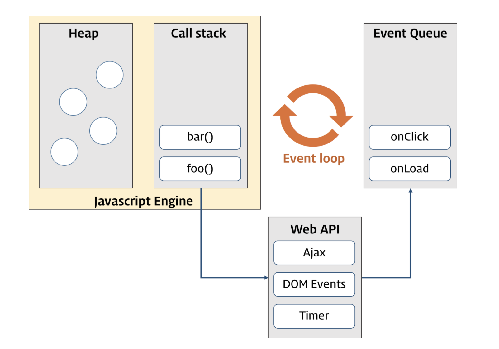

# 비동기성 (Asynchrony)

**자바스크립트 엔진은 단 하나의 실행 컨텍스트 스택을 갖는다.** 따라서 동시에 2개 이상의 함수를 동시에 실행할 수는 없다. 실행 컨텍스트 스택의 최상위 요소인 "현재 실행 중인 실행 컨텍스트"를 제외한 나머지 모든 실행 컨텍스트는 모두 실행 대기 중인 태스크(task)들이다.

자바스크립트 엔진은 한 번에 하나의 태스크만 실행 할 수 있는 **싱글 스레드(Single thread)** 방식으로 동작한다. 싱글 스레드 방식은 한 번에 하나의 태스크만 실행할 수 있기 때문에 시간이 걸리는 태스크를 실행하는 경우 블로킹(blocking)이 발생한다. 예를 들어 `setTimeout` 함수와 유사하게 일정 시간이 경과한 이후에 콜백 함수를 호출하는 `sleep` 함수를 구현한다고 생각해보자.

```javascript
// sleep 함수는 일정 시간(delay)이 경과한 이후에 콜백 함수(func)를 호출한다.
function sleep(func, delay) {
  const delayUntil = Date.now() + delay;

  // 현재 시간에 delay를 더한 delayUntil이 현재 시간보다 작으면 반복한다.
  while (Date.now() < delayUntil);
  // 일정 시간(delay)이 경과한 이후에 콜백 함수(func)를 호출한다.
  func();
}

function foo() {
  console.log('foo');
}

function bar() {
  console.log('bar');
}

// sleep 함수는 3초 동안 대기하다가 콜백 함수(foo)를 실행할 것이다.
sleep(foo, 3 * 1000);
// bar 함수는 sleep 함수의 실행이 종료된 이후에 호출되므로 3초 이상 블로킹된다.
bar();

// (3초 경과 후) 'foo' → 'bar'
```

이처럼 현재 실행 중인 태스크가 종료될 때까지 다음에 실행될 태스크가 대기하는 방식을 **동기(synchronous) 처리**라고 한다. 동기 처리 방식은 태스크를 순차적으로 처리하므로 실행 순서가 보장된다는 장점이 있지만, 앞에 위치한 태스크가 종료될 때까지 뒤에 위치한 태스크들은 블로킹된다는 단점이 존재한다.

```javascript
function foo() {
  console.log('foo');
}

function bar() {
  console.log('bar');
}

// 타이머 함수 setTimeout은 일정 시간이 경과한 이후에 콜백 함수 foo를 호출한다.
// 타이머 함수 setTimeout은 bar 함수를 블로킹하지 않는다.
setTimeout(foo, 3 * 1000);
bar();
// 'bar' → (3초 경과 후) 'foo'
```

`setTimeout` 함수는 앞서 구현한 `sleep` 함수와 유사하게 특정 시간이 경과한 이후에 콜백 함수를 호출하지만 `setTimeout` 함수 이후에 위치한 태스크를 블로킹하지 않고 곧바로 실행한다는 차이가 존재한다. 이처럼 현재 실행 중인 태스크가 종료되지 않은 상태라 하더라도 다음 태스크를 곧바로 실행하는 방식을 **비동기(asynchronous) 처리**라고 한다. 비동기 처리 방식은 블로킹은 발생하지 않으나, 태스크의 실행 순서가 보장되지 않는다는 단점이 존재한다.

## 이벤트 루프 (Event Loop)

자바스크립트는 싱글 스레드로 동작하기 때문에 한 번에 하나의 태스크만 처리할 수 있다. 그러나 브라우저가 동작하는 것을 살펴보면 많은 태스크가 동시에 처리되는 것처럼 느껴진다.

예를 들어 이벤트를 처리하기도 하고, HTTP 요청을 통해 서버로부터 데이터를 가져오면서 화면에 렌더링을 진행하기도 한다. 이처럼 자바스크립트에서 동시성(concurrency)을 지원하는 것이 바로 **이벤트 루프**(event loop)다.



이벤트 루프는 브라우저에 내장되어 있는 기능 중 하나로 구글의 V8 자바스크립트 엔진을 비롯한 대부분의 자바스크립트 엔진은 크게 2개의 영역으로 구분하는 것이 가능하다.

> **콜 스택**(call stack)

- 실행 컨텍스트가 추가되고 제거되는 스택인 실행 컨텍스트 스택을 의미한다.
- 함수를 호출하면 해당 함수 실행 컨텍스트가 콜 스택에 푸시되며 순차적으로 실행된다. 자바스크립트 엔진은 단 하나의 콜 스택을 사용하기 때문에 최상위(현재 실행중인) 실행 컨텍스트가 종료되어 콜 스택에서 제거되기 전까지는 다른 어떠한 태스크도 실행되지 않는다.

> **힙**(Heap)

- 객체가 저장되는 메모리 공간으로, 콜 스택을 구성하는 실행 컨텍스트는 힙에 저장되어 있는 객체를 참조한다.

콜 스택과 힙으로 구성되어 있는 자바스크립트 엔진은 단순히 태스크가 요청되면 콜 스택을 통해 요청된 작업을 순차적으로 실행할 뿐이다. **비동기 처리에서 소스코드의 평가와 실행을 제외한 모든 처리는 자바스크립트 엔진을 구동하는 환경인 브라우저 또는 Node.js가 담당한다.** 비동기 방식으로 동작하는 `setTimeout`의 콜백 함수의 평가와 실행은 자바스크립트 엔진이 담당하지만 호출 스케줄링을 위한 타이머 설정과 콜백 함수의 등록은 브라우저 또는 Node.js가 담당한다. 이를 위해서 브라우저 환경은 태스크 큐와 이벤트 루프를 제공한다.

> **태스크 큐**(task queue/event queue/callback queue)

- `setTimeout`이나 `setInterval`과 같은 비동기 함수의 콜백 함수 또는 이벤트 핸들러가 일시적으로 보관되는 영역으로, 태스크 큐와 별도로 프로미스의 후속 처리 메서드의 콜백 함수가 일시적으로 보관되는 마이크로태스크 큐도 존재한다.

> **이벤트 루프**(event loop)

- 이벤트 루프는 콜 스택에 현재 실행 중인 실행 컨텍스트가 있는지, 그리고 태스크 큐에 대기 중인 함수(콜백 함수, 이벤트 핸들러 등)가 있는지 반복해서 확인하는 작업을 수행한다. 만약 **콜 스택이 비어 있고 태스크 큐에 대기 중인 함수가 있다면 이벤트 루프는 순차적(FIFO)으로 태스크 큐에 대기 중인 함수를 콜 스택으로 이동시킨다.** 이때 콜 스택으로 이동한 함수는 실행된다. 즉, 태스크 큐에 일시 보관된 함수들은 비동기 처리 방식으로 동작한다.

```javascript
// eventLoop는 큐(FIFO) 역할을 하는 배열이다.
var eventLoop = [];
var event;

// 무한 실행
while (true) {
  // Tick 발생!
  if (eventLoop.length > 0) {
    // 큐에 있는 다음 이벤트 조회
    event = eventLoop.shift();
    // 다음 이벤트를 실행
    try {
      event();
    } catch (err) {
      reportError(err);
    }
  }
}
```

위의 코드에서는 `while`로 무한 루프를 발생시키는데, 이 루프의 매 순회(iteration)을 틱(tick)이라 하고, 틱이 발생할 때마다 큐에 적재된 이벤트(콜백 함수)를 꺼내어 실행한다.  
`setTimeout()`은 콜백을 이벤트 루프 큐에 넣지 않는다. `setTimeout()`은 타이머를 설정하는 함수일 뿐이다. 타이머가 종료되면 환경(브라우저, Node.js)이 콜백 함수를 이벤트 루프에 삽입한 뒤 틱이 발생할 때 콜백 함수를 꺼내어 실행하게 되는 것이다.  
만약 이벤트 루프가 20개(혹은 그 이상)의 원소로 가득 차 있다고 생각해보자. FIFO 방식으로 동작하므로 어떠한 콜백 함수도 먼저 앞으로 가려하지 않고 자신의 차례가 돌아올 때까지 기다릴 것이다. 이러한 특성 때문에 `setTimeout()` 타이머가 완벽하게 정확한 타이밍으로 동작하지 않는 점이 설명된다. 적어도 지정한 시간(interval) 이전에는 콜백 함수가 실행되지 않을 것이라는 사실은 보장할 수 있지만 정확히 언제 실행될지는 이벤트 루프의 상태에 따라 달라지게 되는 것이다. 이벤트 루프에는 개발자가 작성한 프로그램 이외에 다른 이벤트도 삽입될 수 있기 때문이다.

그렇다면 브라우저 환경에서 다음 예제가 어떻게 동작할지 살펴보자.

```javascript
function foo() {
  console.log('foo');
}
function bar() {
  console.log('bar');
}
setTimeout(foo, 0); // 0초(실제로는 4ms) 후에 foo 함수가 호출된다.
bar();
// bar foo
```

1. 전역 코드가 평가되어 전역 실행 컨텍스트가 생성되고 콜 스택에 푸시된다.
2. 전역 코드가 실행되면서 `setTimeout` 함수가 호출된다. 이때 `setTimeout` 함수의 함수 실행 컨텍스트가 생성되고 콜스택에 푸시되어 현재 실행 중인 실행 컨텍스트가 된다. 브라우저의 Web API(호스트 객체)인 타이머 함수도 함수이므로 함수 실행 컨텍스트를 생성한다.
3. `setTimeout` 함수가 실행되면 콜백 함수를 호출 스케줄링하고 종료되어 콜 스택에서 제거된다. 이때 호출 스케줄링, 즉 타이머 설정과 타이머가 만료되면 콜백 함수를 태스크 큐에 푸시하는 것은 브라우저의 역할이다.
4. 다음 작업들은 브라우저가 수행하는 작업과 엔진이 수행하는 작업인데 이 작업들은 **병행적**으로 처리된다.

> **브라우저가 수행하는 작업**

브라우저는 타이머를 설정하고 타이머의 만료를 기다린다. 이후에 타이머가 만료되면 콜백 함수 `foo`가 태스크 큐에 푸시된다. 이때 지연 시간(delay)가 4ms 이하인 경우 최소 지연 시간 4ms가 지정된다. 따라서 **4ms 후에 콜백 함수 `foo`가 태스크 큐에 푸시되어 대기하게 된다.** 그러나 `setTimeout` 함수로 호출 스케줄링한 콜백 함수가 정확히 명시한 지연 시간 후에 호출된다는 보장은 할 수 없다. 지연 시간 이후에 콜백 함수가 태스크 큐에 푸시되어 대기하게 되지만 콜 스택이 비어있지 않다면 호출할 수 없으므로 약간의 시간차가 발생할 수 있다.

> **자바스크립트 엔진이 수행하는 작업**

`bar` 함수가 호출되어 `bar` 함수의 함수 실행 컨텍스트가 생성되고 콜 스택에 푸시되어 현재 실행 중인 실행 컨텍스트가 된다. 이후 `bar` 함수가 종료되면 콜 스택에서 제거된다. 이때 브라우저가 타이머를 설정한 후 4ms가 경과했다면 **`foo` 함수는 여전히 태스크 큐에서 대기 중인 상태일 것이다.**

5. 전역 코드 실행이 종료되고 전역 실행 컨텍스트가 콜 스택에서 제거된다. 따라서 콜 스택에 어떠한 실행 컨텍스트도 존재하지 않는 상태이다.
6. 이벤트 루프는 콜 스택이 비어 있음을 감지하고 태스크 큐에서 대기 중인 콜백 함수 `foo`가 이벤트 루프에 의해 콜 스택에 푸시된다. 따라서 콜백 함수 `foo`의 함수 실행 컨텍스트가 생성되고 콜 스택에 푸시되어 현재 실행 중인 실행 컨텍스트가 되며 `foo` 함수가 종료되면 콜 스택에서 제거된다.

정리하면 **비동기 함수인 `setTimeout`의 콜백 함수는 태스크 큐에 푸시되어 대기하다가 콜 스택이 비게 되면, 다시 말해 전역 코드 및 명시적으로 호출된 함수가 모두 종료되면 비로소 콜 스택에 푸시되어 실행되게 된다.**

여기서 싱글 스레드 방식으로 동작하는 것은 **브라우저가 아니라 브라우저에 내장된 자바스크립트 엔진**이라는 점에 주의해야 한다. 만약 모든 자바스크립트 코드가 자바스크립트 엔진 하에서 싱글 스레드 방식으로만 동작한다 하면 자바스크립트는 비동기로 동작할 수 없다. 즉, **자바스크립트 엔진은 싱글 스레드로 동작하지만 브라우저는 멀티 스레드로 동작한다.**

예를 들어, `setTimeout` 함수의 모든 처리가 자바스크립트 엔진에서 싱글 스레드로만 수행된다고 가정해보자. 이때 `setTimeout` 함수의 호출 스케줄링을 위한 타이머 설정도 자바스크립트 엔진이 수행해야 하므로 대기 시간 동안 어떠한 태스크도 실행할 수 없을 것이다. 즉, `setTimeout` 함수의 타이머 설정까지 자바스크립트 엔진이 싱글 스레드 방식으로 처리해야 한다면 자바스크립트가 비동기 방식으로 동작하는 것은 절대로 불가능할 것이다.

브라우저는 자바스크립트 엔진 외에도 렌더링 엔진과 Web API를 제공한다. Web API는 ECMAScript 사양에 정의된 함수가 아니라 브라우저가 제공하는 API이며, DOM API와 타이머 함수, HTTP 요청(Ajax)과 같은 비동기 처리를 포함한다.

앞선 예제에서 살펴보았듯이 브라우저의 Web API인 `setTimeout` 함수가 호출되면 자바스크립트 엔진의 콜 스택에 푸시되어 실행된다. 그러나 타이머 설정과 타이머가 만료됬을 때 콜백 함수를 태스크 큐에 등록하는 작업은 엔진이 아닌 브라우저가 수행하게 된다. 이처럼 브라우저와 엔진이 협력하여 비동기 함수인 `setTimeout` 함수를 실행하는 것이다.

## 병렬 스레딩

비동기(async)와 병렬(parallel)은 일반적으로 유사하다고 알고 있지만 엄밀히 말하면 의미는 완전히 다르다. 비동기의 경우 '지금'과 '나중' 간의 간극에 관한 용어이고, 병렬은 동시에 일어나는 일들과 연관된다.

프로세스(process)와 스레드(thread)는 가장 많이 쓰이는 병렬 컴퓨팅(parallel) 수단으로, 별개의 프로세서(processor), 심지어는 물리적으로 분리된 컴퓨터에서도 독립적으로(때로는 동시에) 실행되며 여러 개의 스레드가 하나의 프로세스 메모리를 공유한다.

반면 이벤트 루프는 작업 단위로 나누어 순차적으로 실행하지만 공유 메모리에 병렬로 접근하거나 변경할 수는 없다.

```javascript
function later() {
  answer = answer * 2;
  console.log('answer', answer);
}
```

`later()` 함수 전체 내용은 이벤트 루프 큐에서는 하나의 원소로 취급하므로 스레드 간섭이 발생하지 않는 싱글 스레드 환경에서는 위와 같은 함수가 여러 개 쌓여 있다 하더라도 문제가 발생하지 않는다. 하지만 하나의 프로그램에서 여러 스레드를 처리하는 병렬 시스템에선 예상치 못한 일이 발생할 수 있다.

```javascript
var a = 20;

function foo() {
  a = a + 1;
}

function bar() {
  a = a * 2;
}

ajax('http://some.url.1', foo);
ajax('http://some.url.2', bar);
```

자바스크립트 엔진은 싱글 스레드 환경에서 동작하므로 `foo() → bar()` 순서로 실행하면 결과는 42지만 반대로 `bar() → foo()` 순서로 실행되면 결과는 41이 된다.

같은 데이터를 공유하는 자바스크립트 이벤트의 병렬 실행 문제는 더 복잡하다. `foo()`와 `bar()`를 각각 실행하는 두 스레드가 있다고 가정해보자. 만약 정확히 동일한 시점에 두 스레드가 실행된다면 어떻게 될까?

> **thread 1** (X,Y는 임시 메모리 공간)

```javascript
foo():
  1. 'a' 값을 'X' 로 load한다.
  2. '1' 을 'Y' 에 저장한다.
  3. 'X' 와 'Y' 를 더하고 그 결과를 'X' 에 저장한다.
  4. 'X' 값을 'a' 에 저장한다.
```

> **thread 2** (X,Y는 임시 메모리 공간)

```javascript
bar():
  1. 'a' 값을 'X' 로 load한다.
  2. '2' 을 'Y' 에 저장한다.
  3. 'X' 와 'Y' 를 곱하고 그 결과를 'X' 에 저장한다.
  4. 'X' 값을 'a' 에 저장한다.
```

두 스레드가 병렬 상태로 실행되면 위와 같이 중간 단계에서 `X`와 `Y`라는 메모리 공간을 공유하는 문제가 발생한다. 그렇다면 `a`의 최종 상태는 어떻게 될까?

```javascript
[t1]-1. ('X'에서 'a'값을 읽어들인다. → '20')
[t2]-1. ('X'에서 'a'값을 읽어들인다. → '20')
[t1]-2. ('Y'에 '1'을 저장한다. → '1')
[t2]-2. ('Y'에 '2'을 저장한다. → '2')
[t1]-3. ('X'와 'Y'를 더하고 그 결과를 'X'에 저장한다. → '22')
[t1]-4. ('a'에 'X' 값을 저장한다. → '22')
[t2]-3. ('X'와 'Y'를 곱하고 그 결과를 'X'에 저장한다. → '44')
[t2]-4. ('a'에 'X' 값을 저장한다. → '44')
// a → 44

[t1]-1. ('X'에서 'a'값을 읽어들인다. → '20')
[t2]-1. ('X'에서 'a'값을 읽어들인다. → '20')
[t2]-2. ('Y'에 '2'을 저장한다. → '2')
[t1]-2. ('Y'에 '1'을 저장한다. → '1')
[t2]-3. ('X'와 'Y'를 곱하고 그 결과를 'X'에 저장한다. → '20')
[t1]-3. ('X'와 'Y'를 더하고 그 결과를 'X'에 저장한다. → '21')
[t1]-4. ('a'에 'X' 값을 저장한다. → '21')
[t2]-4. ('a'에 'X' 값을 저장한다. → '21')
// a → 21
```

이처럼 실행 순서에 따라 결과값이 다르게 나온다.

자바스크립트는 절대로 스레드 간에 데이터를 공유하지 않으므로 위와 같은 비결정성(Nondeterminism)은 문제가 되지 않는다. 하지만 그렇다고 해서 자바스크립트 프로그램이 항상 결정적(Deterministic)이란 소리는 아니다. 이전의 예제와 같이 `foo()`와 `bar()`의 실행 순서에 따라 다른 결과인 41과 42를 도출하기 때문이다.
