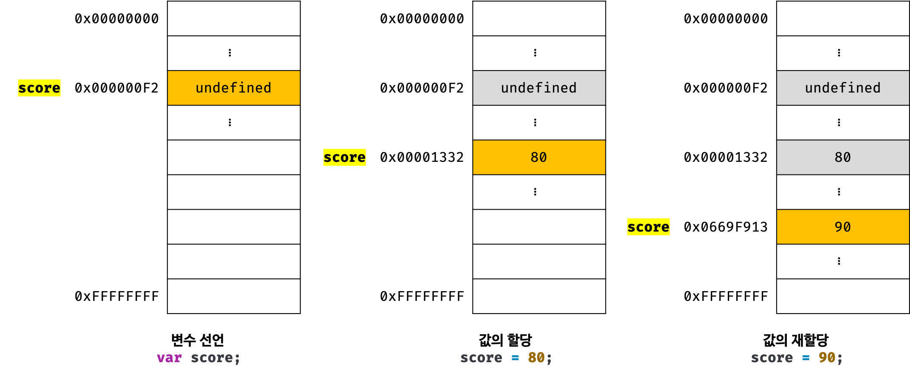

# 변수(Variable)

## 1. 변수란 무엇인가?

```javascript
10 + 20;
```

자바스크립트에서 위와 같은 연산을 진행했다고 하면 결과인 `30`은 메모리 어딘가에 저장되어 있을 것이다. 하지만 문제는 CPU가 연산해서 만들어 낸 결과인 `30`을 재사용할 수 없다는 점에 있다. 만약 연산 결과를 단 한 번만 사용하는 것이 목적이었다면 문제가 아니었겠지만, 연산 결과인 `30`을 재사용해야 하는 상황이라면 메모리 주소를 통해 연산 결과 `30`이 저장되어 있는 메모리 공간에 직접 접근하는 것 이외에는 다른 방법이 존재하지 않는다.

하지만 메모리 주소를 통해 값에 직접 접근하는 것은 실수로 운영체제가 제어하고 있는 값을 변경하는 등의 치명적인 오류로 이어질 가능성이 존재하기 때문에 몹시 위험하다.

또한 값이 저잘될 메모리 주소는 코드가 실행될 때마다 메모리의 상황에 따라 임의로 결정되기 때문에 자바스크립트에서는 허용하지도 않을 뿐더러 시도하지 않는 것이 좋다.

따라서 프로그래밍 언어에서 값을 저장하고 참조하는 메커니즘으로 **특정 값의 위치를 가리키는 상징적인 이름**을 필요로 하게 되었는데 그것이 바로 변수이며, 변수를 이용하면 개발자가 직접 메모리 주소에 접근할 필요 없이 안전하게 값에 접근할 수 있게 된다.

> 변수(variable)는 하나의 값을 저장하기 위해 확보한 메모리 공간 자체 또는 그 메모리 공간을 식별하기 위해 붙인 이름을 의미한다.

```javascript
var result = 10 + 20;
```

변수라는 개념을 도입하면 `10 + 20`의 연산 결과가 저장되어 있는 위치(메모리 공간)에 상징적인 이름인 변수(`result`)라는 태그를 붙일 수 있게 된다.


이때 변수에 값을 저장하는 것을 할당(assignment)이라 하고, 변수에 저장된 값을 읽어 들이는 것을 참조(reference)라 한다. 변수명은 값이 저장된 메모리 공간에 대해 사람이 이해할 수 있는 언어로 작성한 상징적인 이름이다. 따라서 변수명을 이용하여 해당 변수 값을 참조하고자 하면 자바스크립트 엔진은 변수명과 매핑되어 있는 메모리 주소를 통해 해당 메모리 공간에 저장되어 있는 값을 반환하게 된다.

## 2. 식별자(Identifier)

**식별자는 어떤 값을 구별해서 식별할 수 있는 고유한 이름**을 말한다. 값은 메모리 공간에 저장되어 있기 때문에 식별자를 이용하여 메모리 공간에 저장되어 있는 특정 값을 구별하여 식별할 수 있어야 한다. 그렇기 때문에 식별자는 어떤 값이 저장되어 있는 메모리 주소를 기억(저장)해야 한다.

위의 그림에서 식별자 `result`는 값 `30`을 식별할 수 있었다. 이를 위해 식별자 `result`는 값이 저장되어 있는 메모리 주소 `0x0669F913`을 기억하고 있어야 한다. 따라서 식별자는 값이 저장되어 있는 메모리 주소와 매핑되어 있으며, 이러한 매핑 정보 역시 메모리에 저장되어야 한다.

이처럼 **식별자는 값이 아닌 메모리 주소를 기억하고 있는 상태이다.** 또한 식별자는 변수명에 국한해서 사용되지 않으며 함수,클래스 등의 이름은 모두 식별자가 된다. 변수명을 이용해서는 메모리 공간에 존재하는 변수 값을 식별할 수 있고, 함수명을 이용해서 메모리 상에 존재하는 함수를 식별할 수 있기 때문이다. 즉, 메모리 상에 존재하는 어떤 값을 식별할 수 있는 이름은 모두 식별자이다.

## 3. 변수 선언 (Variable Declaration)

변수를 선언한다는 것은 값을 저장하기 위한 메모리 공간을 확보(allocate)하고 변수 이름과 확보된 메모리 공간의 주소를 연결(name binding)해서 값을 저장할 수 있게 준비하는 것이다. 변수 선언에 의해 확보된 메모리 공간은 해제(release)되기 이전까지 해당 메모리 공간을 사용할 수 없도록 보호되므로 안전하게 사용할 수 있다.

`var` 키워드는 키워드 뒤에 위치한 변수명으로 새로운 변수를 선언할 것을 지시하는 키워드이다.

```javascript
var score; // 변수 선언
```

> **키워드(keyword)**  
> 키워드는 해당 키워드를 만났을 때 자바스크립트 엔진이 수행해야 할 동작을 규정한 일종의 명령어다. 예를 들어, `var` 키워드를 만나면 자바스크립트 엔진은 뒤에 위치한 변수명으로 새로운 변수를 선언한다.


변수를 선언한 이후, 아직 변수에 값을 할당하지 않았지만 확보된 메모리 공간에는 자바스크립트 엔진에 의해 `undefined`라는 값이 암묵적으로 할당되어 초기화가 이루어진다.

자바스크립트 엔진은 변수 선언을 다음과 같은 2단계에 거쳐 수행한다.

1. **선언 단계**: 변수 이름을 등록하여 자바스크립트 엔진에게 변수의 존재를 알린다.
2. **초기화 단계**: 값을 저장하기 위한 메모리 공간을 확보하고 암묵적으로 `undefined`를 할당해 초기화한다.

> **변수 이름은 어디에 등록되는가?**  
> 모든 식별자는 실행 컨텍스트에 등록된다. 여기서 실행 컨텍스트는 엔진이 소스 코드를 평가하고 실행하기 위해 필요한 환경을 제공하고 코드의 실행 결과를 실제로 관리하는 영역으로 이를 이용하여 식별자와 스코프는 관리된다. 따라서 실행 컨텍스트에 변수를 등록함으로써 엔진에게 해당 변수의 존재를 알릴 수 있게 되는 것이다.

여기서 `var` 키워드를 사용한 변수 선언은 선언 단계와 초기화 단계가 동시에 진행된다. 선언 단계에서 실행 컨텍스트에 변수명 `score`를 등록하고, 초기화 단계에서 `score`에 암묵적으로 `undefined`를 할당하는 것이다.

만약 초기화 단계가 없다면 확보된 메모리 공간에 남아있을 수 있는 쓰레기 값(garbage value)이 참조될 수 있으므로 암묵적으로 `undefined`로 초기화해 주는 것이다.

## 4. 변수 호이스팅

자바스크립트 엔진은 소스 코드를 순차적으로 실행하기 앞서 소스 코드의 평가 과정에서 모든 선언문(변수, 함수 등)을 소스 코드에서 찾아내 먼저 먼저 실행하게 된다.

자바스크립트 엔진은 선언 단계에서 실행 컨텍스트에 변수 이름을 등록한다 하였으므로 런타임 이전에 변수 선언에 대해서는 미리 실행 컨텍스트에 등록하는 작업을 진행하는 것이다.

정리하면 **변수 선언은 소스 코드가 한 줄씩 순차적으로 실행되는 시점, 런타임(runtime)이 아닌 그 이전 단계에 실행되는 것이다.**

이때 **변수 선언문이 코드의 선두로 끌어 올려진 것처럼 동작하는 자바스크립트 고유의 특징**을 **변수 호이스팅**(variable hoisting)이라 한다.

여기서 주의할 점은 호이스팅의 대상이 모든 선언문이라는 것으로 `var`,`let`,`const`,`function`,`function*`,`class` 키워드를 사용해서 선언하는 모든 식별자도 런타임 이전 단계에서 먼저 실행되며 호이스팅이 발생한다.

## 5. 값의 할당

```javascript
var score; // 변수 선언
score = 80; // 값의 할당

var score = 80; // 변수 선언과 값의 할당
```

위의 코드에서 변수 선언과 값의 할당을 2개의 문으로 나누어 표현한 코드와 변수 선언과 값의 할당을 하나의 문으로 단축 표현한 코드는 정확히 동일하게 동작한다. 자바스크립트 엔진은 변수 선언과 값의 할당을 하나의 문으로 단축 표현한다 하더라도 변수 선언과 값의 할당을 2개의 문으로 나누어 각각 실행한다.

!> **변수 선언은 소스코드가 순차적으로 실행되는 시점인 런타임 이전에 먼저 실행되지만 값의 할당은 소스코드가 순차적으로 실행되는 시점인 런타임에 실행된다.**

```javascript
console.log(score); // undefined

var score = 80; // 변수 선언과 값의 할당

console.log(score); // 80
```


주의할 점은 변수에 값을 할당할 때는 이전 값 `undefined`가 저장되어 있던 메모리 공간을 지우고 그 메모리 공간에 할당 값 80을 새롭게 저장하는 것이 아니라 새로운 메모리 공간을 확보하고 그 곳에 값 `80`을 저장한다는 점이다.

## 6. 값의 재할당

```javascript
var score = 80; // 변수 선언과 값의 할당
score = 90; // 값의 재할당
```

`var` 키워드로 선언한 변수는 값을 재할당할 수 있다. 재할당은 현재 변수에 저장된 값을 버리고 새로운 값을 저장하는 것으로 `var` 키워드로 선언한 변수는 선언과 동시에 `undefined`로 초기화되기 때문에 엄밀히 말하면 변수에 처음으로 값을 할당하는 것 역시 사실은 재할당이라 할 수 있다.

이때 **값을 재할당할 수 없어 변수에 저장된 값을 변경할 수 없다면 변수가 아닌 상수**(constant)라 한다. 즉, 상수는 단 한 번만 할당할 수 있는 변수이다.

다시 위의 코드로 돌아가서 변수에 값을 재할당하면 `score` 변수의 값은 `80`에서 재할당한 값 `90`으로 변경된다. 처음 값을 할당했을 때와 마찬가지로 이전 값이 저장되어 있던 메모리 공간을 지우고 그 메모리 공간에 `90`을 새롭게 저장하는 것이 아니라 새로운 메모리 공간을 확보하고 그 메모리 공간에 `90`을 저장한다.



현재 `score` 변수의 값은 90이며 `undefined`와 `80`은 어떠한 변수도 값으로 갖고 있지 않은 상태이므로 가비지 콜렉터에 의해 메모리에서 자동 해제된다. 단, 메모리에서 언제 해제되는 지는 예측할 수 없다.

!> 가바지 콜렉터 내용 추가적으로 정리

> **unmanaged language**

C 같은 언어로 개발자가 명시적으로 메모리를 할당하고 해제하기 위해 `malloc()`과 `free()` 같은 저수준(low-level) 메모리 제어 기능을 제공한다. 메모리 제어를 개발자가 주도할 수 있으므로 개발자의 역량에 따라 최적의 성능을 확보할 수 있지만 그 반대의 경우 치명적 오류를 생산할 가능성도 있다.

> **managed language**

자바스크립트가 대표적이며 메모리의 할당 및 해제를 위한 메모리 관리 기능을 언어 차원에서 담당하고 개발자의 직접적인 메모리 제어를 허용하지 않는다. 더이상 사용하지 않는 메모리의 해제는 가비지 콜렉터가 수행하며 개발자가 이 과정에 관여할 수 없다. 개발자의 역량에 의존하는 부분이 상대적으로 작아져 어느 정도 일정한 생산성을 확보할 수 있다는 장점이 있지만 성능 면에서는 손실이 발생할 수 밖에 없다.

## 7. 식별자 네이밍 규칙

- 식별자는 특수문자를 제외한 문자, 숫자, 언더스코어(\_), 달러 기호(\$)를 포함할 수 있다.
- 단, 식별자는 특수문자를 제외한 문자, 언더스코어(\_), 달러 기호(\$)로 시작해야 한다. **숫자로 시작하는 것은 허용하지 않는다.**
- 예약어는 식별자로 사용할 수 없다.

> **예약어(reserved word)**

```
await break case catch class const continue debugger default delete do else enum export extends false finally for function if implements* import in Instanceof interface* let* new null package* private* protected* public* return super static* switch this throw true try typeof var void while with yield*

*: 식별자로 사용 가능하나 Strict Mode에서는 사용 불가
```

ES5부터 식별자를 유니코드 문자를 허용하므로 알파벳 이외의 한글이나 일본어 사용도 가능하다.

다만 다음의 경우에는 명명 규칙에 위배된다.

```javascript
var first-time; // SyntaxError: Unexpected token -
var 1st; // SyntaxError: Invalid or unexpected token
var this; // SyntaxError: Unexpected token this
```

또한 자바스크립트는 대소문자를 구별한다.

네이밍 컨벤션(naming convention)은 하나 이상의 영어 단어로 구성된 식별자를 만들때의 적용 방법이다.

```javascript
// 카멜 케이스 (camelCase)
var firstName;

// 스네이크 케이스 (snake_case)
var first_name;

// 파스칼 케이스 (PascalCase)
var FirstName;

// 헝가리언 케이스 (typeHungarianCase)
var strFirstName; // type + identifier
var $elem = document.getElementById('myId'); // DOM 노드
var observable$ = fromEvent(document, 'click'); // RxJS 옵저버블
```

일반적으로 **변수나 함수의 이름에는 카멜 케이스**를 사용하고 **생성자 함수,클래스의 이름에는 파스칼 케이스**를 사용한다.

# 표현식과 문

## 1. 값

값(value)은 표현식(expression)이 평가(evaluate)되어 생성된 결과를 의미한다. 평가란 식을 해석해서 값을 생성하거나 참조하는 것을 의미한다.

```javascript
// 10 + 20은 평가되어 숫자 값 30을 생성한다.
10 + 20; // 30
```

모든 값은 데이터 타입을 가지며 메모리에 2진수, 비트(bit)의 나열로 저장된다. 이때 메모리에 저장된 값은 데이터 타입에 따라 다르게 해석될 수 있다. 예를 들어 메모리에 저장된 값 0100 0001은 숫자로는 65이지만 문자로는 'A'인 경우가 있다.

변수는 **하나의 값**을 저장하기 위해 확보한 메모리 공간 자체 또는 그 메모리 공간을 식별하기 위해 붙인 이름이므로, 변수에 할당되는 것은 값이다.

```javascript
// 변수에는 10 + 20이 평가되어 생성된 숫자 값 30이 할당된다.
var sum = 10 + 20;
```

## 2. 리터럴

리터럴(literal)은 사람이 이해할 수 있는 문자 또는 약속된 기호를 사용해 값을 생성하는 표기 방식(notation)을 말한다.

```javascript
// 숫자 리터럴 3
3;
```

위 코드에서 3은 숫자 리터럴으로, 사람이 이해할 수 있는 아라비아 숫자를 사용해 숫자 리터럴 3을 코드에 기술하면 자바스크립트 엔진은 이를 평가해 숫자 값 3을 생성한다.

이처럼 리터럴은 사람이 이해할 수 있는 문자(아라비아 숫자, 알파벳, 한글 등) 또는 미리 약속된 기호로 표기한 코드다. 자바스크립트 엔진은 코드가 실행되는 시점인 런타임(runtime)에 리터럴을 평가해 값을 생성한다. 즉, 리터럴은 값을 생성하기 위해 미리 약속한 표기법이라고 할 수 있다.

```javascript
// 정수 리터럴
100
// 부동소수점 리터럴
10.5
// 2진수 리터럴(0b로 시작)
0b01000001
// 8진수 리터럴(ES6에서 도입. 0o로 시작)
0o101
// 16진수 리터럴(ES6에서 도입. 0x로 시작)
0x41

// 문자열 리터럴
'Hello'
"World"

// 불리언 리터럴
true
false

// null 리터럴
null

// undefined 리터럴
undefined

// 객체 리터럴
{ name: 'Lee', address: 'Seoul' }

// 배열 리터럴
[ 1, 2, 3 ]

// 함수 리터럴
function() {}

// 정규표현식 리터럴
/[A-Z]+/g
```

## 3. 표현식

표현식(expression)은 값으로 평가될 수 있는 문(statement)이다. 즉, 표현식이 평가되면 새로운 값을 생성하거나 기존 값을 참조한다.

리터럴 역시 값으로 평가되기 때문에 표현식이라 할 수 있다.

```javascript
var score = 100;
```

리터럴 100은 자바스크립트 엔진에 의해 평가되어 값을 생성하므로 리터럴은 그 자체로 표현식이다.

```javascript
var score = 50 + 50;
```

50 + 50은 리터럴과 연산자로 이루어져 있지만 결과적으로는 평가되어 숫자 값 100을 생성하므로 표현식이다.

```javascript
score; // → 100
```

변수 식별자를 참조하면 변수 값으로 평가된다. 식별자 참조는 값을 생성하지는 않지만 값으로 평가되므로 표현식이다.

?> **값으로 평가되는 문은 모두 표현식이다.**

```javascript
// 리터럴 표현식
10;

// 식별자 표현식
sum;
person.name;
arr[1];

// 연산자 표현식
10 + 20;
sum = 10;
sum !== 10;

// 함수/메서드 호출 표현식
square();
person.getName();
```

표현식은 값으로 평가되기 때문에 문법적으로 값이 위치할 수 있는 자리에는 표현식도 위치할 수 있다.

예를 들어 산술 연산자의 좌항과 우항에는 숫자 값이 위치해야 하는데 숫자 값으로 평가될 수 있는 표현식이라면 숫자 값 대신 사용하는 것도 가능하다.

```javascript
var x = 1 + 2;

// 식별자 표현식 x는 3으로 평가된다.
x + 3; // → 6
```

위에서 `x`는 할당되어 있는 숫자 값 3으로 평가된다. 즉, 숫자 값이 위치해야 할 자리에 표현식이 위치한 것이다. 이처럼 표현식은 다른 표현식의 일부가 되어 새로운 값을 만들어낼 수 있다.

!> console.log 동작 방식(obj)넘겼을 때 connect만 넘긴다는 내용 주말에 정리하기

## 4. 문

?> 문(statement)은 프로그램을 구성하는 기본 단위이자 최소 실행 단위

문의 집합으로 이루어진 것이 바로 프로그램이며, 문을 작성하고 순서에 맞게 나열하는 것이 프로그래밍이다.

문은 여러 토큰으로 구성되는데, 토큰(token)이란 문법적인 의미를 가지며, 문법적으로 더 이상 나눌 수 없는 코드의 기본 요소를 의미한다. 예를 들어 키워드, 식별자, 연산자, 리터럴, 세미콜론이나 마침표 등의 특수 기호는 문법적인 의미를 가지며, 문법적으로 더 이상 나눌 수 없는 코드의 기본 요소이므로 모두 토큰이다.

문을 명령문이라고도 하는데, 컴퓨터에 내리는 명령을 의미한다. 문이 실행되면 명령이 실행되고 무슨 일인가가 일어나게 된다.

문은 선언문, 할당문, 조건문, 반복문 등으로 구분할 수 있다. 변수 선언문을 실행하면 변수가 선언되고, 할당문을 실행하면 값이 할당이 된다. 조건문을 실행하면 지정한 조건에 따라 실행할 코드 블록이 결정되어 실행되고, 반복문을 실행하면 특정 코드 블록이 반복 실행된다.

```javascript
// 변수 선언문
var x;

// 표현식 문(할당문)
x = 5;

// 함수 선언문
function foo() {}

// 조건문
if (x > 1) {
  console.log(x);
}

// 반복문
for (var i = 0; i < 2; i++) {
  console.log(i);
}
```

여기서 세미콜론은 문의 종료를 의미하는데, 자바스크립트 엔진은 세미콜론을 이용하여 문이 종료한 위치를 파악하고 순차적으로 하나씩 문을 실행한다. 따라서 문을 끝낼 때는 세미콜론을 붙여야 한다. 단, `if`,`for`,함수 등의 코드 블록 뒤에는 세미콜론을 붙이지 않는다. 이러한 코드 블록은 언제나 문의 종료를 의미하는 자체 종결성(self closing)을 갖기 때문이다.

## 5. 표현식인 문과 표현식이 아닌 문

표현식은 문의 일부일 수도 있고 그 자체로 문이 되는 것도 가능하다.

```javascript
// 변수 선언문은 값으로 평가될 수 없으므로 표현식 X
var x;

// x = 1 + 2는 표현식이면서 완전한 문이기도 하다.
x = 1 + 2;
```

**표현식인 문과 표현식이 아닌 문을 구별하는 가장 간단한 방법은 변수에 할당해 보는 것이다.** 표현식인 문은 값으로 평가되므로 변수에 할당할 수 있다.

```javascript
// 표현식이 아닌 문은 값처럼 사용할 수 없다.
var foo = var x; // SyntaxError: Unexpected token var
```

이에 반해 할당문 x = 100은 그 자체가 표현식이다. 즉, 할당문은 표현식인 문이기 때문에 값처럼 사용할 수 있다.

```javascript
// 표현식인 문은 값처럼 사용할 수 있다
var foo = (x = 100);
console.log(foo); // 100
```

할당문을 값처럼 변수에 할당했다. 표현식인 문인 할당문은 할당한 값으로 평가되어 `foo`에 100이 할당되게 된다.

> **완료 값(completion value)**  
> 크롬 개발자 도구에서 표현식이 아닌 문을 실행하면 언제나 `undefined`를 출력한다. 이를 완료 값이라하며 완료 값은 표현식의 평가 결과가 아니다. 따라서 다른 값과 같이 변수에 할당할 수 없고 참조할 수도 없다.  
> 크롬 개발자 도구에서 표현식인 문을 실행하면 언제나 평가된 값을 반환한다.

# 데이터 타입

- 원시 타입(primitive type)
  - 숫자(`number`) 타입: 숫자. 정수와 실수 구분 없이 하나의 숫자 타입만 존재
  - 문자열(`string`) 타입: 문자열
  - 불리언(`boolean`) 타입: 논리적 참(true)과 거짓(false)
  - `undefined` 타입: var 키워드로 선언된 변수에 암묵적으로 할당되는 값
  - `null` 타입: 값이 없다는 것을 의도적으로 명시할 때 사용하는 값
  - 심벌(`symbol`) 타입: ES6에서 추가된 7번째 타입
- 객체 타입 (object/reference type): 객체, 함수, 배열 등

## 1. 숫자 타입

ECMAScript 사양에 따르면 숫자 타입의 값은 배정밀도 64비트 부동소수점 형식을 따른다. 모든 수를 실수로 처리하며, 정수만 표현하기 위한 데이터 타입(integer type)이 별도로 존재하지 않는다.

```javascript
var integer = 10; // 정수
var double = 10.12; // 실수
var negative = -20; // 음의 정수
```

정수,실수,2진수,8진수,16진수 리터럴은 모두 메모리에 배정밀도 64비트 부동소수점 형식의 2진수로 저장된다. 자바스크립트는 2,8,16진수를 표현하기 위한 데이터 타입을 제공하지 않기 때문에 이들 값을 참조하면 모두 10진수로 해석된다.

```javascript
var binary = 0b010000001; // 2진수
var octal = 0o101; // 8진수
var hex = 0x41; // 16진수

// 표기법만 다를 뿐 모두 같은 값이다.
console.log(binary); // 65
console.log(octal); // 65
console.log(hex); // 65
console.log(binary === octal); // true
console.log(octal === hex); // true
```

자바스크립트의 숫자 타입은 정수만을 위한 타입이 없고 모든 수를 실수로 처리하기 때문에 정수로 표시된다 하더라도 사실은 실수라는 것을 의미하며 정수로 표시되는 수끼리 나누더라도 실수가 나올 수 있다.

```javascript
console.log(1 === 1.0); // true
console.log(4 / 2); // 2
console.log(3 / 2); // 1.5
```

숫자 타입은 추가적으로 세 가지 특별한 값들도 표현할 수 있다.

- `Infinity`: 양의 무한대
- `-Infinity`: 음의 무한대
- `NaN`: 산술 연산 불가(not-a-number)

```javascript
console.log(10 / 0); // Infinity
console.log(10 / -0); // -Infinity
console.log(1 * 'String'); // NaN
```

## 2. 문자열 타입

문자열 타입은 텍스트 데이터를 나타내는 데 사용한다. 문자열은 0개 이상의 16비트 유니코드 문자(UTF-16)들의 집합으로 전 세계 대부분의 문자를 표현할 수 있다. 자바스크립트에서 일반적으로는 작은 따옴표를 이용한다.

```javascript
var string;
string = '문자열';
string = '문자열';
string = `문자열`; // 백틱(ES6)

string = '작은따옴표로 감싼 문자열 내의 "큰따옴표"는 문자열로 인식된다.';
string = "큰따옴표로 감싼 문자열 내의 '작은따옴표'는 문자열로 인식된다.";
```

다른 타입의 값과 달리 문자열을 따옴표로 감싸는 이유는 키워드나 식별자 같은 토큰과 구분하기 위해서다. 만약 문자열을 따옴표로 감싸지 않으면 자바스크립트 엔진은 키워드나 식별자 같은 토큰으로 인식한다.

```javascript
var string = hello; // ReferenceError: hello is not defined
```

자바스크립트의 문자열은 원시 타입이며, 변경 불가능한 값(immutable)이다. 따라서 문자열이 생성되면 해당 문자열을 변경할 수 없음을 의미한다.

## 3. 템플릿 리터럴

### 3.1 멀티라인 문자열

일반 문자열과 달리 템플릿 리터럴에서는 이스케이프 시퀀스를 사용하지 않고도 줄바꿈이 허용되며, 모든 공백도 있는 그대로 적용된다.

### 3.2 표현식 삽입

`+` 연산자는 피연산자 중 하나 이상이 문자열인 경우 문자열 연결 연산자로 동작하고 그 외의 경우에는 덧셈 연산자로 동작한다.

템플릿 리터럴 내에서는 표현식 삽입을 통해 간단히 문자열을 삽입할 수 있다.

```javascript
var first = 'sung-baek';
var last = 'Kim';

console.log(`${first} ${last}`); // sung-baek Kim
```

이때 `${}`안의 표현식은 평가 결과가 문자열이 아니더라도 문자열로 타입이 강제 변환되어 삽입된다.

## 4. 불리언 타입

논리적 참,거짓을 나타내는 `true`,`false` 뿐이다.

## 5. undefined 타입

`undefined` 타입의 값은 `undefined`가 유일하다.

`var` 키워드로 선언한 변수는 암묵적으로 `undefined`로 초기화된다. 변수 선언에 의해 확보된 메모리 공간에 미리 위치할 수 있는 쓰레기 값(garbage value)을 비우기 위해 자바스크립트 엔진이 `undefined`로 초기화하게 된다. 따라서 변수 선언 이후 값을 할당하지 않은 변수를 참조하면 `undefined`가 반환된다.

```javascript
var foo;
console.log(foo); // undefined
```

이처럼 `undefined`는 개발자가 의도적으로 할당하기 위한 값이 아니라 자바스크립트 엔진이 변수를 초기화할 때 사용하는 값이다. 따라서 변수 참조 시 `undefined`가 반환된다면 참조한 변수가 선언 이후 값이 할당된 적이 없는, 즉 초기화되지 않은 변수라는 것을 알 수 있게 된다.

따라서 개발자가 변수에 값이 없다는 것을 명시하고 싶을 때는 `undefined` 대신 `null`을 할당하는 것이 좋다.

## 6. null 타입

PL에서 `null`은 변수에 값이 없다는 것을 의도적으로 명시할 때 사용하며, 이는 변수가 이전에 참조하던 값을 더 이상 참조하지 않겠다는 의미이다. 이는 이전에 할당되어 있던 값에 대한 참조를 명시적으로 제거하는 것을 의미하며 엔진은 아무에게도 참조되지 않는 메모리 공간에 대해 가비지 콜렉션을 수행할 것이다.

## 7. symbol 타입

심벌은 ES6에서 추가된 7번째 타입으로 변경 불가능한 원시 타입의 값이다. 심벌은 다른 값과 중복되지 않는 유일무이한 값이며 이름이 충돌할 위험이 없는 객체의 유일한 프로퍼티 키를 만들기 위해 사용한다.

심벌 이외의 원시값은 리터럴을 통해 생성하지만 심벌은 `Symbol` 함수를 호출해 생성한다.

```javascript
var key = Symbol('key');
console.log(typeof key);

var obj = {};

obj[key] = 'value';
console.log(obj[key]); // value
```

## 8. 객체 타입

앞서 살펴본 6가지 데이터 타입 이외의 값은 모두 객체 타입이다.

## 9. 데이터 타입의 필요성

### 9.1 데이터 타입에 의한 메모리 공간의 확보와 참조

값은 메모리에 저장하고 참조할 수 있어야 한다. 메모리에 값을 저장하려면 먼저 확보해야 할 메모리 공간의 크기를 결정해야 한다.

```javascript
var score = 100;
```

위의 코드가 실행되면 컴퓨터는 숫자 값 100을 저장하기 위해 메모리 공간을 확보한 후 확보된 메모리에 숫자 값 100을 2진수로 저장한다. 자바스크립트 엔진은 데이터 타입에 따라 정해진 크기의 메모리 공간을 확보하게 된다.

위의 코드에서는 리터럴 100을 숫자 타입의 값으로 해석하고 숫자 타입의 값 100을 저장하기 위해 8바이트의 메모리 공간을 확보한 뒤 100을 2진수로 저장한다.

이제 값을 참조하려면 한 번에 읽어 들어야 할 메모리 공간의 크기, 즉 바이트 수를 알아야 하는데 `score` 변수의 경우 숫자 타입의 값이 할당되어 있으므로 자바스크립트 엔진은 `score` 변수를 숫자 타입으로 인식한다. 숫자 타입은 8바이트 단위로 저장되므로 `score` 변수를 참조하면 8바이트 단위로 메모리 공간에 저장된 값을 읽어 들인다.

## 9.2 데이터 타입에 의한 값의 해석

하지만 메모리에서 읽어들인 2진수를 어떻게 해석해야 하는 지에 대한 문제는 여전히 존재하게 된다.

모든 값은 데이터 타입을 가지며 메모리에 2진수의 형태로 저장된다. 메모리에 저장된 값은 데이터 타입에 따라 다르게 해석될 수 있다.

앞에서 살펴본 예제의 `score` 변수에 할당된 값은 숫자 타입의 값이므로 `score` 변수를 참조하면 메모리 공간의 주소에서 읽어 들인 2진수를 숫자로 해석한다.

?> 데이터 타입이 필요한 이유

- 값을 저장할 때 확보해야 하는 **메모리 공간의 크기**를 결정하기 위해
- 값을 참조할 때 한 번에 읽어 들여야 할 **메모리 공간의 크기**를 결정하기 위해
- 메모리에서 읽어 들인 **2진수를 어떻게 해석**할지 결정하기 위해

## 10. 동적 타이핑

자바스크립트는 변수를 선언할 때 타입을 선언하지 않고, 미리 선언한 데이터 타입의 값만 할당할 수 있지 않다.

```javascript
var foo;
console.log(typeof foo); // undefined

foo = 3;
console.log(typeof foo); // number

foo = 'Hello';
console.log(typeof foo); // string

foo = true;
console.log(typeof foo); // boolean

foo = null;
console.log(typeof foo); // object

foo = Symbol(); // 심벌
console.log(typeof foo); // symbol

foo = {}; // 객체
console.log(typeof foo); // object

foo = []; // 배열
console.log(typeof foo); // object

foo = function () {}; // 함수
console.log(typeof foo); // function
```

`typeof` 연산자로 변수를 연산하면 변수에 할당된 값의 데이터 타입을 반환한다.

자바스크립트에서는 값을 할당하는 시점에 변수의 타입이 동적으로 결정되고 변수의 타입은 언제든지 자유롭게 변경될 수 있다.

따라서 자바스크립트 변수는 선언이 아닌 **할당에 의해 타입이 결정된다.** 이러한 특징을 동적 타이핑이라하며, 자바스크립트는 동적 타입 언어가 된다.

그러나 동적 타입 언어는 유연성은 높지만 신뢰성이 떨어진다. 그 이유는 변수의 값을 확인하기 전까지는 타입을 확신할 수 없기 때문이다.

따라서 변수를 사용할 때 주의해야 할 사항이 있다.

- 변수는 꼭 필요한 경우에 한해 제한적으로 사용한다. 재할당에 의해 언제든지 변경될 수 있기 때문이다.
- 변수의 유효 범위(스코프)는 최대한 좁게 만들어야 한다.
- 전역 변수의 사용을 자제하자.
- 변수보다는 상수의 사용을 고려하자.
- 변수 이름은 목적이나 의미를 파악할 수 있도록 네이밍하자.
