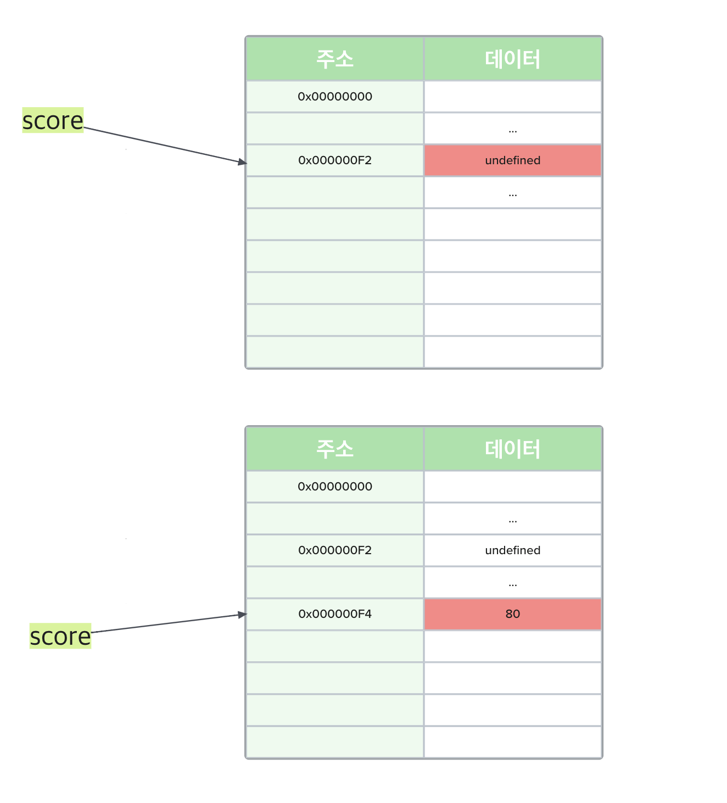
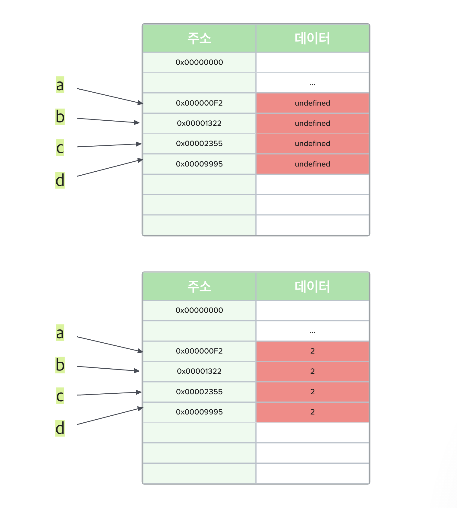
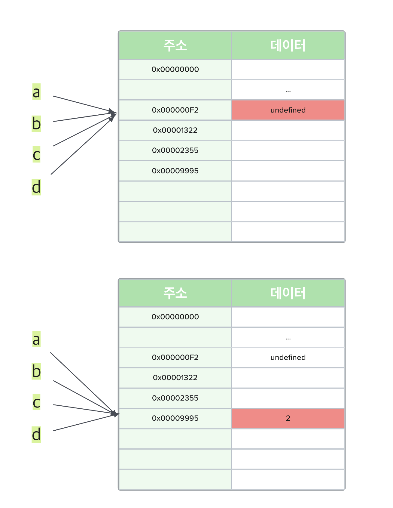

# 원시 타입의 값은 왜 불변 값일까?

```javascript
console.log(score); // undefined

var score = 80;

console.log(score); // 80
```

위와 같은 코드에서 변수 선언문이 자바스크립트 엔진에 의해 먼저 실행된다는 점은 자명하다(Hoisting). 그렇다면 `score`가 가리키는 메모리 공간의 값에 `80`을 할당했을 때 왜 새로운 `80`이라는 값을 만들고 해당 메모리 공간의 주소를 `score`와 매핑시켜주는 것일까?



!> 실제 메모리 구조와 다르지만 이해 하기 쉽게 표현한 방식이다.

단순히 `undefined`를 `80`으로 변경해주면 될 것 같은데, 궂이 `80`을 새로 만들어 해당 주소를 변수와 매핑시키는 이유는 메모리 공간 효율 때문이다.

원시 값이 가변값이라 가정하고 변수 4개를 선언하고 `2`로 초기화해보자.

```javascript
var a, b, c, d;
a = b = c = d = 2;
```



원시 값이 가변값이었다면 동일한 `2`라는 값을 갖고 있는 메모리 공간이 4개(8 × 4 byte)를 필요로 하게 된다.



그러나 원시 값이 가변 값이 아닌 불변 값이기 때문에 새로운 값을 필요로 할때마다 값을 생성하여 메모리 공간에 할당하는 방식으로 동작하게 된다면 4개의 변수가 동일한 값을 가질 때는 해당 값을 가지고 있는 변수가 참조하고 있는 메모리 주소만 변경시켜주면 된다. 따라서 `undefined`가 차지하는 byte 크기는 알 수 없기 때문에 숫자 값 `2`만 고려해본다면 8 byte만으로 4개의 변수가 가지고 있는 값을 필요로 할때 참조할 수 있게 되는 것이다.

물론 위의 예시에서는 변수가 많지 않아 크게 체감되지 않을 수 있지만 실제 프로그램은 동작하면서 무수히 많은 변수를 사용하기 때문에 원시 값을 불변 값으로 처리하게 되면서 특히 중복된 데이터를 처리하는 데 있어서 효율을 높일 수 있게 되는 것이다.
