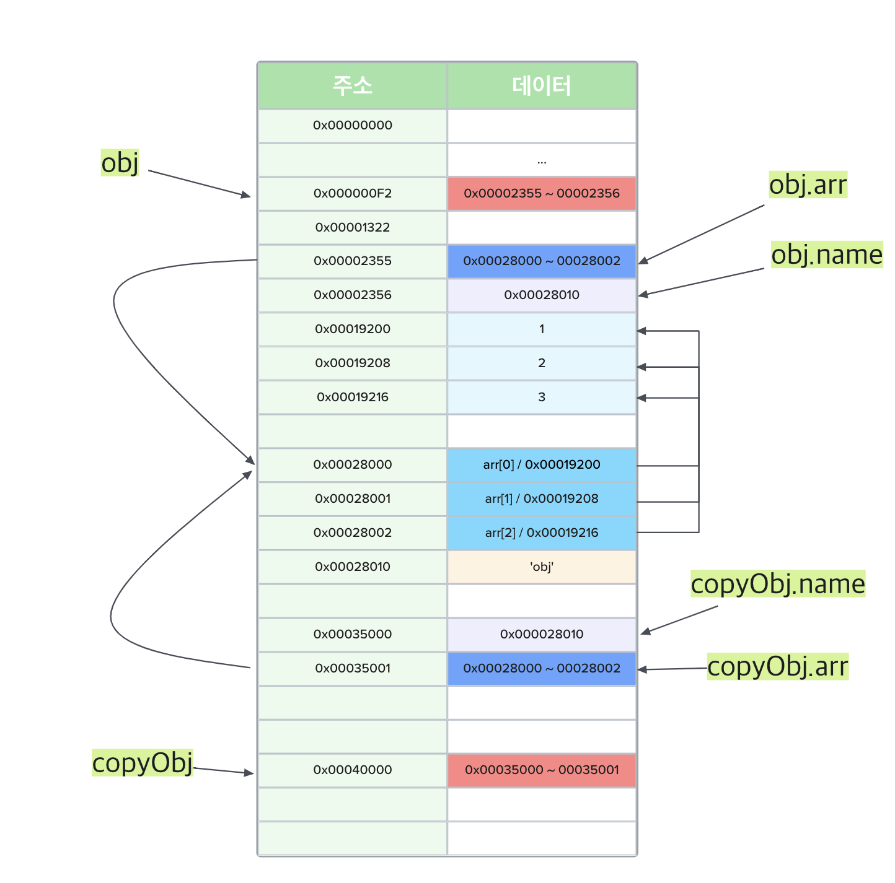
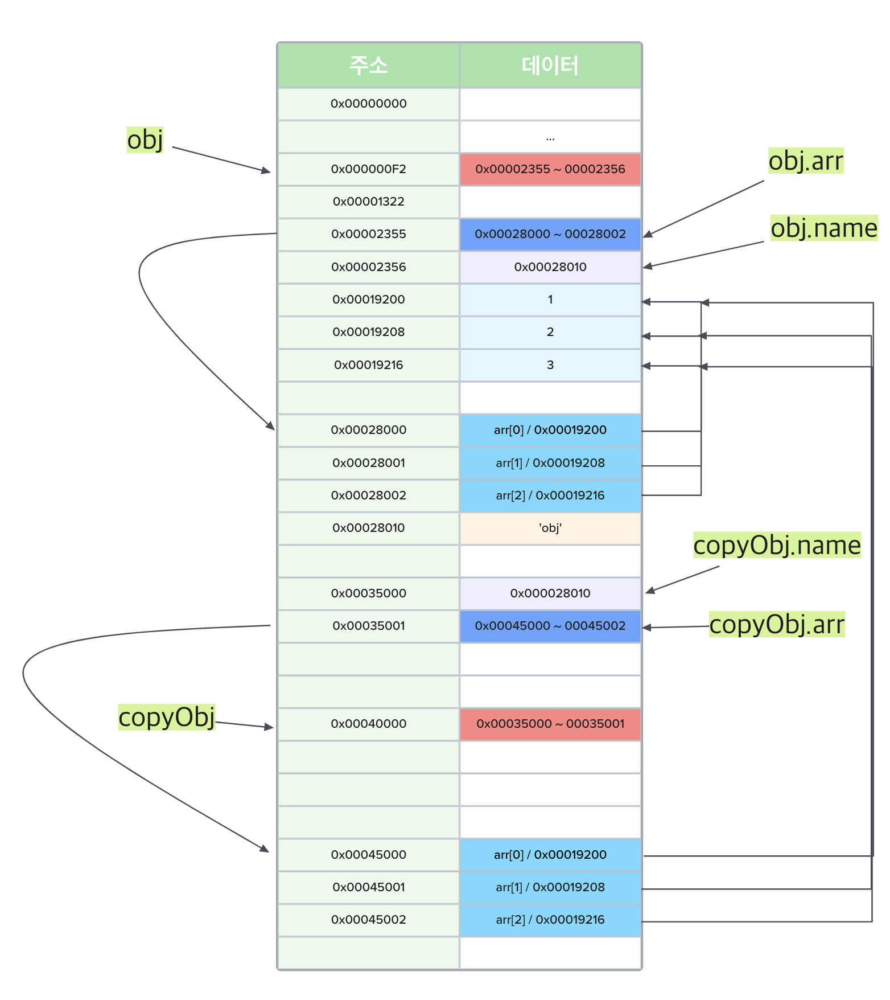

# Shallow copy vs Deep copy

## 얕은 복사(Shallow copy)

얕은 복사는 바로 아래 단계의 값만 복사하는 방법을 의미한다. 원시 값의 경우 해당 방법만으로도 불변성이 유지된다. 그러나 중첩된 객체에서는 참조형 데이터가 저장된 프로퍼티를 복사할 때 그 주솟값만 복사하기 때문에 해당 프로퍼티에 대해 원본과 사본이 모두 동일한 참조형 데이터의 주소를 가리키게 된다. 따라서 사본이나 원본에서의 변경이 반대에도 영향을 미치게 된다.

```javascript
const copyObject = target => {
  const result = {};
  for (const prop in target) {
    result[prop] = target[prop];
  }
  return result;
};
```

```javascript
const obj = {
  name: 'obj',
  arr: [1, 2, 3]
};
const copyObj = Object.assign({}, obj);
```



## 깊은 복사(Deep copy)

어떤 객체를 복사할 때 객체 내부의 모든 프로퍼티를 복사해 완전히 새로운 데이터를 만드려 한다면, 객체의 프로퍼티 값 중에서 원시 값의 경우에는 그대로 복사하면 되지만, 객체 타입의 값을 갖는 경우에는 다시 그 내부의 프로퍼티들을 복사해야 한다. 이러한 과정을 객체 타입의 값에 대해서는 재귀적으로 수행해야만 비로소 깊은 복사가 되는 것이다.

```javascript
const copyObjectDeep = target => {
  const result = {};
  if (typeof target === 'object' && target !== null) {
    for (const prop in target) {
      reseult[prop] = copyObjectDeep(target[prop]);
    }
  } else {
    result = target;
  }
  return result;
};
```

```javascript
const obj = {
  name: 'obj',
  arr: [1, 2, 3]
};
const copyObj = copyObjectDeep(obj);
```


