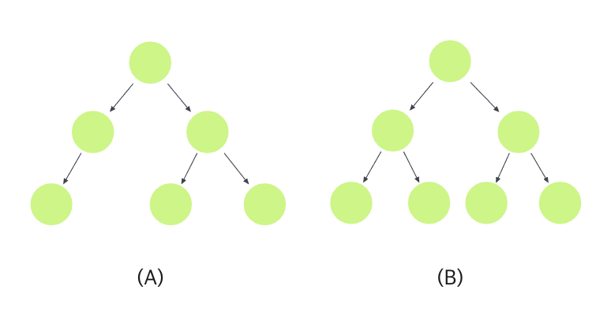

# 우선순위 큐(Priority Queue)

프로그래머스 문제 풀이 도중 우선순위 큐가 필요한 문제를 마주하게 되었을 때, 자바에서는 `PriorityQueue`가 제공되어 쉽게 사용 가능했지만, 자바스크립트에는 별도의 자료구조가 제공되지 않아 직접 구현해야 하는 상황에 맞닥뜨리게 되었다.

일단 우선순위 큐를 구현하기 위해서 우선 힙(Heap)에 대한 개념이 필요하다.

## 힙(Heap)

힙은 기본적으로 **완전 이진 트리**(Complete Binary Tree)를 기본으로 한 자료 구조이며, 부모 노드와 자식 노드 간의 대소관계가 성립하는 자료 구조이다. 따라서 힙의 루트 노드는 힙 내의 데이터들 중 **가장 큰 값**(Max Heap)이거나 **가장 작은 값**(Min Heap)이 된다.

<center>
  
</center>

> [!NOTE] **완전 이진 트리**(Complete Binary Tree)
>
> 
> 완전 이진 트리란 마지막 레벨을 제외한 모든 레벨의 node가 완전히 채워져 있으며 마지막 레벨의 node들은 가능한 왼쪽부터 채워져 있는 구조를 의미한다.
> 따라서 `(A)`의 경우 완전 이진트리가 아니고, `(B)`의 경우는 완전 이진트리이다.

힙의 장점은 가장 큰 값 혹은 작은 값에 접근하고 싶을 때 비교 연산을 진행하지 않고 한 번에 접근할 수 있다는 점으로, 여러 개의 데이터 중에서 가장 크거나 작은 값을 빠르게 찾아야 하는 경우 유용하다.

물론 링크드 리스트(Linked List) 혹은 배열(Array)을 정렬해서 사용하는 방식에서도 한번 정렬만 해놓으면 최대 혹은 최소 값을 추출하는 것에는 아무런 문제가 없다.

단, 정렬되어 있는 데이터에서 새로운 데이터를 **추가**할 때 전체 데이터 중에서 최대,최소 값을 찾고 다시 정렬해야 하는 과정을 필요로 하게 된다.

선형 자료 구조에서는 데이터가 추가되었을 때 `O(n)`의 시간 복잡도가 필요한 반면, 부모가 자식보다 크거나 작게 정렬되어 있는 이진 트리의 경우 새로 추가된 노드의 부모 노드들과만 비교해도 정렬 상태를 유지할 수 있기 때문에 `O(log n)`의 시간 복잡도면 충분하다.

<center>
  
</center>

트리는 보통 링크드 리스트(Linked List)나 배열(Array)과 같은 선형 자료 구조를 이용하여 구현하는데, 완전 이진 트리의 경우에는 배열로 구현하는 것이 더 효율적이다.

이는 배열의 최대 장점인 인덱스를 통해 해당 원소에 바로 접근이 가능하다는 점을 이용하는 것인데, 이진 트리의 경우 각 레벨에 들어설 수 있는 노드의 최대 개수가 정해져 있기 때문에 간단한 수식을 이용하여 특정 노드의 인덱스를 알아낼 수 있다.

> [!TIP] [루트 노드] → 0, [현재 노드] → `i`
>
> [부모 노드] → `(i - 1) / 2`
>
> [왼쪽 자식 노드] → `2i + 1`
>
> [오른쪽 자식 노드] → `2i + 2`

또한 이진 트리의 경우, 자식 노드를 최대 2개까지만 가질 수 있기 때문에 트리의 최대 노드 개수는 2<sup>h</sup> - 1개이다. 따라서 해당 크기만큼만 배열을 메모리에 할당하면 중간에 노드를 새로 삽입하기 위해 배열의 원소를 뒤로 미는 경우가 발생하지 않는다.

거기에 완전 이진 트리는 노드를 왼쪽부터 채워나가고, 한 레벨의 노드가 다 채워지기 전까지는 다음 레벨에 노드를 채울 수 없기 때문에 트리가 기울어지지도 않는다.

## 구현

```javascript
class Heap {
  constructor() {
    this.nodes = [];
  }
}
```

### 새로운 값이 삽입되었을 때

힙에 새로운 값을 삽입할 때는 완전 이진 트리의 규칙대로 무조건 트리의 왼쪽부터 채워나가기 때문에 `push`를 이용하여 배열의 맨 마지막에 요소를 추가해주면 된다.

```javascript
insert(value) {
  this.nodes.push(value);
}
```

다만 최대 힙의 경우를 예로 들면 부모가 자식보다 큰 값을 가져야한다는 제약이 있으므로, 만약 새로 삽입한 노드가 부모 노드보다 큰 값을 가지고 있다면 두 노드의 위치를 바꿔줘야 한다.

이 과정을 **현재 삽입한 노드가 루트의 위치에 도달하거나, 부모보다 작은 값인 경우가 될때까지** 반복하게 된다.

```javascript
insert (value) {
  this.nodes.push(value);
  this.bubbleUp();
}

bubbleUp(index= this.nodes.length - 1) {
  if (index < 1) return;
  const currentNode = this.nodes[index];
  const parentIndex = Math.floor((index - 1) / 2);
  const parentNode = this.nodes[parentIndex];
  if (parentNode >= currentNode) return;

  this.nodes[index] = parentNode;
  this.nodes[parentIndex] = currentNode;
  index = parentIndex;
  this.bubbleUp(index);
}
```

위의 코드는 최대 힙의 경우만 가능한 코드이므로, 외부에서 함수를 주입받아 부모 노드와 자식 노드 간의 대소 비교를 할 수 있게끔 수정하면 우선순위 큐의 형태로 만들 수 있을 것이다.

```javascript
compareTwoNodes (n1, n2) {
  return n1 - n2;
}
insert (value) {
  this.nodes.push(value);
  this.bubbleUp(this.compareTwoNodes);
}
bubbleUp(compareFunction, index = this.nodes.length - 1) {
  if (index < 1) return;
  const currentNode = this.nodes[index];
  const parentIndex = Math.floor((index - 1) / 2);
  const parentNode = this.nodes[parentIndex];
  if (compareFunction(currentNode, parentNode) <= 0) return;
  this.nodes[index] = parentNode;
  this.nodes[parentIndex] = currentNode;
  index = parentIndex;
  this.bubbleUp(index);
}
```

### 루트에서 값이 빠졌을 때

삭제 연산 시 기존 루트 노드의 자식 노드들을 루트 노드로 올리는 것이 아니라 트리의 가장 마지막에 위치한 노드를 가져와서 루트 노드로 삽입하게 되는데, 이는 수정될 힙에서 빈 공간이 생기지 않게 함으로써 연산량을 줄이기 위함이다.

```javascript
extract() {
  if (this.nodes.length <= 1) return this.nodes.pop();
  const extracted = this.nodes[0];
  this.nodes[0] = this.nodes.pop();
  this.trickleDown(this.compareTwoNodes);

  return extracted;
}

trickleDown (compareFunction, index = 0) {
  const leftChildIndex = 2 * index + 1;
  const rightChildIndex = 2 * index + 2;
  const length = this.nodes.length;

  let largest = index;

  if (leftChildIndex < length && compareFunction(this.nodes[leftChildIndex], this.nodes[largest]) > 0) {
    largest = leftChildIndex;
  }
  if (rightChildIndex < length && compareFunction(this.nodes[rightChildIndex], this.nodes[largest]) > 0) {
    largest = rightChildIndex;
  }
  if (largest !== index) {
    [this.nodes[largest], this.nodes[index]] = [this.nodes[index], this.nodes[largest]];
    this.trickleDown(compareFunction, largest);
  }
}
```

핵심은 루트 노드에서 시작하여 본인을 포함한 양쪽 자식 노드의 값을 비교한 후, 가장 큰 값을 갖는 노드를 부모 노드의 위치에 배치하는 것이다. 이 과정에서 부모 노드와 자식 노드의 위치가 변경되었다면 변경된 부모 노드의 인덱스를 다시 `trickleDown` 메소드의 인자로 넘겨서 과정을 반복하게 된다.

그렇다면 이제 처음에 구현하고자 했던 `PriorityQueue`를 만들어보자.

```javascript
class PriorityQueue {
  constructor() {
    this.nodes = [];
  }
  compareTwoNodes(n1, n2) {
    return n1 - n2;
  }
  insert(value) {
    this.nodes.push(value);
    this.bubbleUp(this.compareTwoNodes);
  }
  bubbleUp(compareFunction, index = this.nodes.length - 1) {
    if (index < 1) return;
    const currentNode = this.nodes[index];
    const parentIndex = Math.floor((index - 1) / 2);
    const parentNode = this.nodes[parentIndex];
    if (compareFunction(currentNode, parentNode) <= 0) return;
    this.nodes[index] = parentNode;
    this.nodes[parentIndex] = currentNode;
    index = parentIndex;
    this.bubbleUp(compareFunction, index);
  }
  extract() {
    if (this.nodes.length <= 1) return this.nodes.pop();
    const extracted = this.nodes[0];
    this.nodes[0] = this.nodes.pop();
    this.trickleDown(this.compareTwoNodes);

    return extracted;
  }

  trickleDown(compareFunction, index = 0) {
    const leftChildIndex = 2 * index + 1;
    const rightChildIndex = 2 * index + 2;
    const { length } = this.nodes;

    let largest = index;

    if (
      leftChildIndex < length &&
      compareFunction(this.nodes[leftChildIndex], this.nodes[largest]) > 0
    ) {
      largest = leftChildIndex;
    }
    if (
      rightChildIndex < length &&
      compareFunction(this.nodes[rightChildIndex], this.nodes[largest]) > 0
    ) {
      largest = rightChildIndex;
    }
    if (largest !== index) {
      [this.nodes[largest], this.nodes[index]] = [
        this.nodes[index],
        this.nodes[largest]
      ];
      this.trickleDown(compareFunction, largest);
    }
  }
}
```

### 문제 풀이

프로그래머스 [디스크 컨트롤러](https://programmers.co.kr/learn/courses/30/lessons/42627) 문제의 요구 조건 중에 `[[0,7],[2,3],[3,2]]`와 같은 배열이 있다 할때 각 요소는 요청 시간과 작업 시간을 의미한다. 따라서 작업 시간이 짧은 순으로 우선순위 큐가 동작할 수 있도록 비교 함수를 재정의하였다.

```javascript
compareTwoNodes(n1, n2) {
  const [n1Request, n1Complete] = n1;
  const [n2Request, n2Complete] = n2;
  return n2Complete - n1Complete;
}
```

## Reference

- [최소 값과 최대 값을 빠르게 찾을 수 있게 도와주는 힙(Heap)](https://evan-moon.github.io/2019/10/12/introduction-data-structure-heap/)
