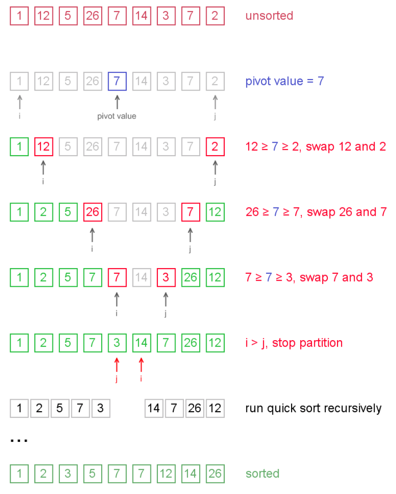

# Quick Sort

퀵 정렬, 병합 정렬은 평균적으로 `O(nlogn)`의 성능을 보여주므로 자주 비교되곤 한다. 두 정렬 방식 모두 분할-정복 알고리즘에 속하며, 탐색을 진행할 배열의 크기를 줄여가며 재귀적으로 호출하기 때문이다.

inplace 방식의 퀵 정렬의 경우 별도의 메모리 공간을 사용하지 않는 반면, 병합 정렬은 매 번 새로운 배열을 만들어 내야 하기 때문에 공간 복잡도가 더 크다. 다만 병합 정렬은 stable한 반면, 퀵 정렬은 unstable하다는 차이가 있다.

## 피벗(Pivot)

피벗을 선택하는 방법에는 첫번째 요소, 마지막 요소, 임의의 위치에 있는 요소, 중간에 있는 요소를 선택하는 다양한 방법이 존재하지만 기본적으로 피벗보다 **작거나 같은 요소들**과 **크거나 같은 요소들**로 분할한다는 점이 핵심이다.

```
[pivot]
[  9  ][  8  ][  7  ][  6  ][  5  ][  4  ][  3  ][  2  ][  1  ]
 [ l ] ->                                             <- [ r ]

[pivot]
[  9  ][  8  ][  7  ][  6  ][  5  ][  4  ][  3  ][  2  ][  1  ][     ]
                                                         [ r ]  [ l ]

[pivot]
[  1  ][  8  ][  7  ][  6  ][  5  ][  4  ][  3  ][  2  ] | [  9  ]
 [ l ]                                            [ r ]

       [pivot]
[     ][  1  ][  8  ][  7  ][  6  ][  5  ][  4  ][  3  ][  2  ] | [  9  ]
 [ r ]  [ l ]

          [pivot]
[  1  ] | [  8  ][  7  ][  6  ][  5  ][  4  ][  3  ][  2  ] | [  9  ]
           [ l ]                                     [ r ]
```

기본적으로 `l`은 `pivot`보다 크거나 같은 요소를 찾는 포인터이고, `r`은 작거나 같은 요소를 찾는 포인터이다. 이러한 과정은 `l`과 `r`이 교차하여 두 인덱스의 대소 관계가 뒤바뀔 때까지 계속된다. 교차 이전에 `l`과 `r` 모두 찾고자 하는 값을 찾는다면 요소들을 swap하게 되고, 교차하는 시점에는 `pivot`과 교차 지점의 요소를 swap하게 되는 방식으로 진행된다.

하지만 위에서처럼 배열이 이미 내림차순으로 정렬되어 있는 상태에서 첫 번째 요소를 피벗으로 사용했다면, 순회하는 배열의 크기가 N이고 이를 N번 순회하게 되므로 `O(N^2)`의 시간 복잡도를 갖게 된다.

따라서 기본적으로 첫 번째 요소나 마지막 요소를 피벗 요소로 선택하는 방식보다는 랜덤 요소 혹은 가운데에 위치한 요소를 피벗 값으로 사용하게 된다.

## Quick Sort with Hoare's partition

!> `pivot`으로 선정한 값의 위치가 고정되어 있는 방식과는 다르게 `left`,`right`가 교차할 때까지 swap을 진행한다는 차이가 있다. 따라서 교차하는 시점에 `pivot`과 교차되는 위치의 요소를 swap하는 과정을 진행하지 않는다.



```javascript
const partition = (array, left, right) => {
  const pivot = array[Math.floor((left + right) / 2)];
  while (left <= right) {
    while (array[left] < pivot) left += 1;
    while (array[right] > pivot) right -= 1;
    if (left <= right) {
      [array[left], array[right]] = [array[right], array[left]];
      left += 1;
      right -= 1;
    }
  }
  return left;
};

const quickSort = (array, left = 0, right = array.length - 1) => {
  if (left >= right) return;
  const borderIdx = partition(array, left, right);
  quickSort(array, left, borderIdx - 1);
  quickSort(array, borderIdx, right);
  return array;
};

const arr = [1, 12, 5, 26, 7, 14, 3, 7, 2];
quickSort(arr);
// [1, 2, 3, 5, 7, 7, 12, 14, 26]
```

## Reference

- [퀵소트 알고리즘::마이구미](<https://mygumi.tistory.com/308#:~:text=%ED%80%B5%EC%86%8C%ED%8A%B8%EB%8A%94%20%EB%B6%84%ED%95%A0%20%EC%A0%95%EB%B3%B5%20%EB%B0%A9%EB%B2%95,O(nlogn)%20%EC%9D%84%20%EA%B0%80%EC%A7%84%EB%8B%A4.>)
- [JavaScript로 Quick Sort(퀵 정렬) 구현하기](https://jun-choi-4928.medium.com/javascript%EB%A1%9C-quick-sort-%ED%80%B5-%EC%A0%95%EB%A0%AC-%EA%B5%AC%ED%98%84%ED%95%98%EA%B8%B0-76bf539abc0d)
- http://www.algolist.net/Algorithms/Sorting/Quicksort
