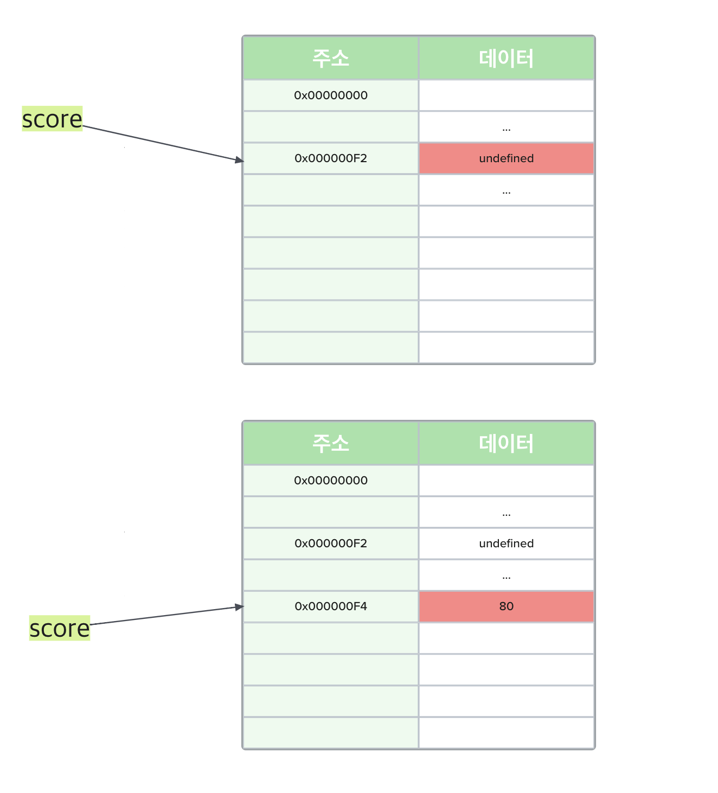
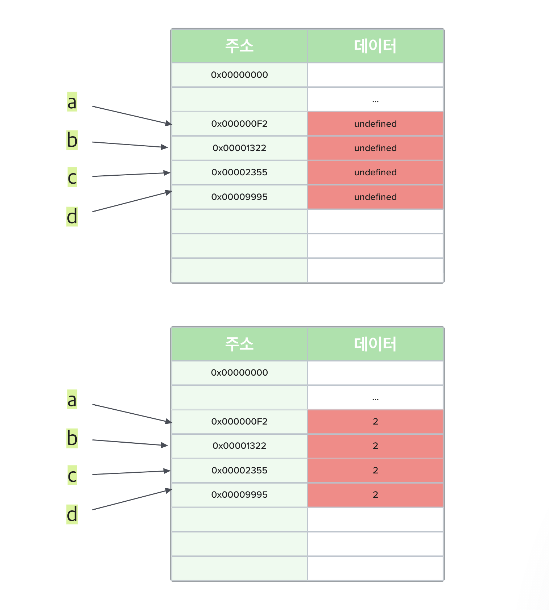
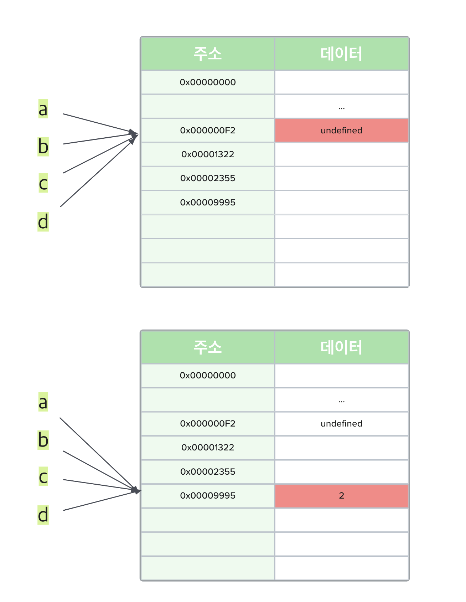
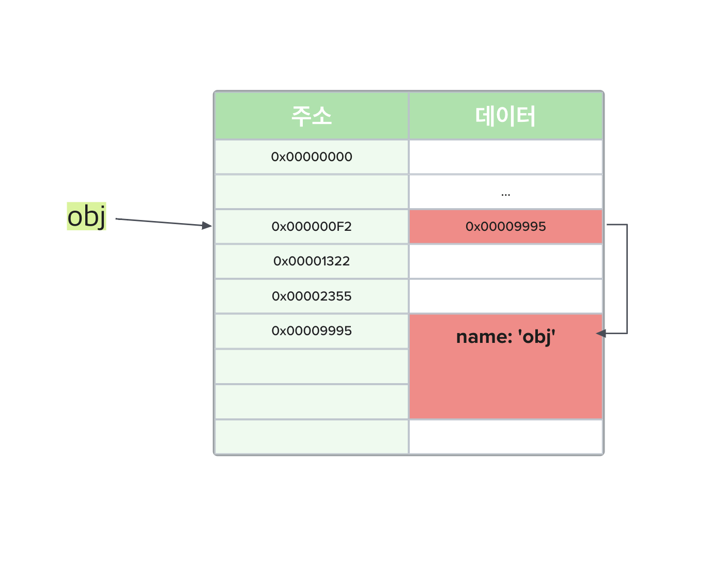
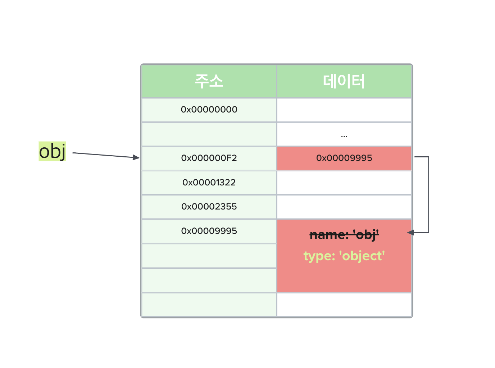

# Immutable vs Mutable

## 원시 값은 왜 불변 값일까?

실제 자바스크립트 엔진이 내부적으로 어떻게 동작하는 지는 ECMAScript 사양에도 명시되어 있지 않아 정확하게 알 수는 없지만 개인적인 생각으로는 파이썬과 유사하게 동작하는 방법이 중복 값을 처리하는 데 있어서는 효율적일 것이라 생각한다.

```javascript
console.log(score); // undefined

var score = 80;

console.log(score); // 80
```

위와 같은 코드에서 변수 선언문이 자바스크립트 엔진에 의해 먼저 실행된다는 점은 자명하다(Hoisting). 그렇다면 `score`가 가리키는 메모리 공간의 값에 `80`을 할당했을 때 왜 새로운 `80`이라는 값을 만들고 해당 메모리 공간의 주소를 `score`와 매핑시켜주는 것일까?



!> 실제 메모리 구조와는 다르지만 이해 하기 쉽게 표현한 방식이다.

단순히 `undefined`를 `80`으로 변경해주면 될 것 같은데, 굳이 `80`을 새로 만들어 해당 주소를 변수와 매핑시키는 이유는 메모리 공간 효율 때문이다.

원시 값이 가변값이라 가정하고 변수 4개를 선언하고 `2`로 초기화해보자.

```javascript
var a, b, c, d;
a = b = c = d = 2;
```



원시 값이 가변값이었다면 동일한 `2`라는 값을 갖고 있는 메모리 공간이 4개(8 × 4 byte)를 필요로 하게 된다.



그러나 원시 값이 가변 값이 아닌 불변 값이기 때문에 새로운 값을 필요로 할때마다 값을 생성하여 메모리 공간에 할당하는 방식으로 동작하게 된다면 4개의 변수가 동일한 값을 가질 때는 해당 값을 가지고 있는 변수가 참조하고 있는 메모리 주소만 변경시켜주면 된다. 따라서 `undefined`가 차지하는 byte 크기는 알 수 없기 때문에 숫자 값 `2`만 고려해본다면 8 byte만으로 4개의 변수가 가지고 있는 값을 필요로 할때 참조할 수 있게 되는 것이다.

물론 위의 예시에서는 변수가 많지 않아 크게 체감되지 않을 수 있지만 실제 프로그램은 동작하면서 무수히 많은 변수를 사용하기 때문에 원시 값을 불변 값으로 처리하게 되면서 특히 **중복된 값을 처리하는 데 있어서** 효율을 높일 수 있게 되는 것이다.

## 그렇다면 객체 타입의 값은 왜 가변 값인가?

기본적으로 자바스크립트에서는 값 자체를 전달하는 것이 아니라 값을 보유하고 있는 메모리 공간의 주소를 전달하기 때문에 Pass By Address가 정확한 표현이라고 생각한다.

원시 값과 달리 객체는 가변 값(Mutable value)라고 하는데, 그렇다면 왜 일관성 없이 다르게 취급하는 걸까?

먼저 객체의 특성에 대해 알아보자. 객체는 동적으로 프로퍼티가 추가되고 삭제될 수 있으므로, 프로퍼티의 개수가 정해져 있다고 할 수 없다. 또한 프로퍼티의 값에도 자바스크립트에서 값으로 평가되는 모든 것이 할당될 수 있기 때문에 원시 값과 다르게 확보해야 할 메모리 공간의 크기를 사전에 설정할 수 없다.

?> 객체는 원시값에 비해 복합적인 자료구조인데다가 원시 값과 비교해서 크기가 매우 비대해질 가능성이 존재한다. 또한 객체를 생성하고 프로퍼티에 접근하는 것 역시 비용이 많이 드는 일이다.

객체 타입의 값의 경우 원시 값과 동일하게 변수에는 메모리 공간의 주소가 할당되지만, 원시 값의 경우 해당 메모리 공간을 참조하면 **값이 들어있는 반면**, 객체 타입의 값은 메모리 공간에 들어있는 내용이 또 다시 **다른 메모리 공간의 주소**로 구성된다.

```javascript
var obj = {
  name: 'obj'
};
```



따라서 `obj`라는 변수에 할당되어 있는 메모리 공간의 주소를 참조하게 되면 객체 자체를 참조하게 되는 것이고, 객체의 프로퍼티를 참조하기 위해서는 한 번 더 다른 메모리 공간을 참조해야 하게 되는 것이다.

**원시 값은 원시 값을 갖는 변수의 값을 변경하기 위해서는 재할당 외에는 다른 방법이 존재하지 않는다. 반면 객체는 객체의 내용이 변경되더라도 참조 값은 계속 유지하고 있기 때문에 재할당 없이도 프로퍼티를 변경하는 것이 가능하다.**

```javascript
var obj = {
  name: 'obj'
};

obj.type = 'object';
delete obj.name;
```



위의 예시에서는 프로퍼티 수가 많지 않아 크게 체감되지 않을 수 있지만, 만약 `n`개의 프로퍼티를 가진 객체 중 단 한 개의 프로퍼티 값이 수정(또는 추가, 삭제)되었다 하더라도 불변성을 유지하기 위해 새로운 객체를 생성하여 반환하는 방식으로 구현되었더라면 메모리 공간의 낭비가 무척 심했을 것이다. 따라서 객체 타입의 값을 가변 값으로 설계된 이유는 메모리 절약 및 성능적인 면을 고려했다고 할 수 있다.
