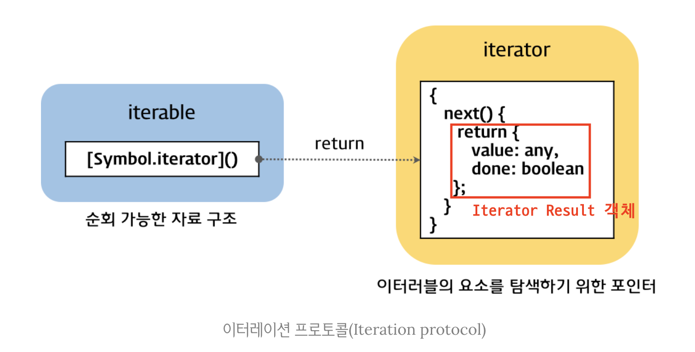
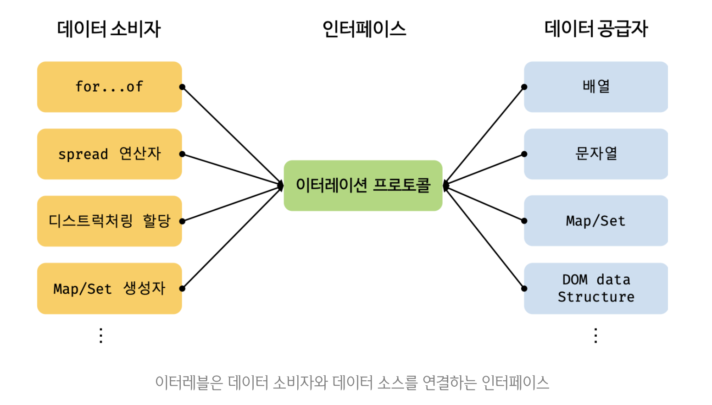

# 이터러블

## 이터레이션 프로토콜

ES6에서 도입된 이터레이션 프로토콜(Iteration Protocol)은 순회 가능한(Iterable) Data Collection(자료구조)을 만들기 위해 ECMAScript Specification에 정의된 규칙이다.

ES6 이전의 배열, 문자열, 유사 배열 객체, DOM Collection 등은 통일된 규칙 없이 `for`,`for...in` 문, `forEach` 메서드 등 다양한 방법으로 순회 가능하였다. 그러나 ES6부터는 이터레이션 프로토콜을 준수하는 이터러블로 통일하여 `for...of` 문, spread 문법, 배열 비구조화 할당의 대상으로 사용할 수 있도록 만들었다.

이터레이션 프로토콜에는 이터러블 프로토콜과 이터레이터 프로토콜이 있다.

> **이터러블 프로토콜(Iterable Protocol)**

Well-known Symbol인 `Symbol.iterator`를 프로퍼티 키로 사용한 메서드를 직접 구현하거나 프로토타입 체인을 통해 상속받은 `Symbol.iterator` 메서드를 호출하면 이터레이터 프로토콜을 준수하는 이터레이터를 반환한다. 이러한 규칙을 이터러블 프로토콜이라 하며, **이터러블 프로토콜을 준수한 객체를 이터러블이라 한다. 이터러블은 `for...of` 문을 통해 순회 가능하며 spread 문법과 배열 비구조화 할당의 대상으로 사용이 가능하다.**

> **이터레이터 프로토콜(Iterator Protocol)**

이터러블의 `Symbol.iterator` 메서드를 호출하면 이터레이터 프로토콜을 준수한 **이터레이터**를 반환한다. 이터레이터는 `next` 메서드를 보유하고 있으며 `next` 메서드를 호출하면 이터러블을 순회하며 `value`와 `done`을 프로퍼티 키로 갖는 `Iterator Result` 객체를 반환한다. 이러한 규칙을 이터레이터 프로토콜이라 하며, **이터레이터 프로토콜을 준수한 객체를 이터레이터라 한다.** 이터레이터는 이터러블의 요소를 탐색하기 위한 포인터 역할을 한다.



## 이터러블

이터러블은 `Symbol.iterator`를 프로퍼티 키로 사용한 메서드를 직접 구현하거나 프로토타입 체인을 통해 상속받은 객체를 말한다.

```javascript
const isIterable = v => v !== null && typeof v[Symbol.iterator] === 'function';

isIterable([]); // true
isIterable(''); // true
isIterable(new Map()); // true
isIterable(new Set()); // true
isIterable({}); // false
```

배열은 `Array.prototype`의 `Symbolr.iterator` 메서드를 상속받는 이터러블이다. 이터러블은 `for...of` 문으로 순회 가능하며, spread 문법과 배열 비구조화 할당의 대상으로 사용 가능하다.

```javascript
const array = [1, 2, 3];

// 배열은 Array.prototype의 Symbol.iterator 메서드를 상속받는 이터러블이다.
console.log(Symbol.iterator in array); // true

for (const item of array) {
  console.log(item);
}
console.log([...array]); // [1,2,3]
const [first, ...rest] = array;
console.log(first, rest); // 1, [2,3]
```

`Symbol.iterator` 메서드를 직접 구현하지 않거나 상속받지 않은 일반 객체는 이터러블 프로토콜을 준수하지 않으므로 이터러블이 아니다.

```javascript
const obj = { a: 1, b: 2 };

console.log(Symbol.iterator in obj); // false
for (const item of obj) {
  // TypeError: obj is not iterable
  console.log(item);
}
const [a, b] = obj; // TypeError: obj is not iterable
```

## 이터레이터

이터러블의 `Symbol.iterator` 메서드를 호출하면 이터레이터 프로토콜을 준수한 이터레이터를 반환한다. 이때 **이터러블의 `Symbol.iterator` 메서드가 반환한 이터레이터는 `next` 메서드를 갖는다.**

```javascript
const array = [1, 2, 3];

// Symbol.iterator 메서드는 이터레이터를 반환한다.
const iterator = array[Symbol.iterator]();

// Symbol.iterator 메서드가 반환한 이터레이터는 next 메서드를 갖는다.
console.log('next' in iterator); // true
```

이터레이터의 `next` 메서드는 이터러블의 각 요소를 순회하기 위한 포인터의 역할을 하며, 호출될 때마다 이터러블을 순차적으로 한 단계씩 순회한 결과를 나타내는 Iterator Result 객체를 반환한다.

```javascript
const array = [1, 2, 3];

const iterator = array[Symbolr.iterator]();

console.log(iterator.next()); // { value: 1, done: false }
console.log(iterator.next()); // { value: 2, done: false }
console.log(iterator.next()); // { value: 3, done: false }
console.log(iterator.next()); // { value: undefined, done: true }
```

## Built-In 이터러블

자바스크립트는 이터레이션 프로토콜을 준수하는 객체인 Built-In 이터러블을 제공한다.

| Built-In 이터러블 | `Symbol.iterator` 메서드                                                               |
| ----------------- | -------------------------------------------------------------------------------------- |
| `Array`           | `Array.prototype[Symbol.iterator]`                                                     |
| `String`          | `String.prototype[Symbol.iterator]`                                                    |
| `Map`             | `Map.prototype[Symbol.iterator]`                                                       |
| `Set`             | `Set.prototype[Symbol.iterator]`                                                       |
| `TypedArray`      | `TypedArray.prototype[Symbol.iterator]`                                                |
| `arguments`       | `arguments[Symbol.iterator]`                                                           |
| `DOM Collection`  | `NodeList.prototype[Symbol.iterator]` <br> `HTMLCollection.prototype[Symbol.iterator]` |

## for...in vs for...of

`for...in` 문은 객체의 프로토타입 체인 상에 존재하는 모든 프로토타입의 프로퍼티 중에서 프로퍼티 어트리뷰트 `[[Enumerable]]`의 값이 `true`인 프로퍼티를 순회하며 열거(Enumeration)한다. 이때 프로퍼티 키가 symbol인 프로퍼티는 열거하지 않는다.

`for...of` 문은 내부적으로 이터레이터의 `next` 메서드를 호출하여 이터러블을 순회하며 `next` 메서드가 반환한 Iterator Result 객체의 `value` 프로퍼티 값을 `for...of` 문의 변수에 할당한다. 그때 `done` 프로퍼티 값이 `false`이면 이터러블의 순회를 계속하고 `true`가 되면 순회를 중단한다.

```javascript
const iterable = [1, 2, 3];

const iterator = iterable[Symbol.iterator]();

for (;;) {
  const res = iterator.next();
  if (res.done) break;
  const item = res.value;
  console.log(item);
}
```

## 유사 배열 객체

유사 배열 객체는 마치 배열처럼 index를 통해 프로퍼티 값에 접근 가능하고, `length` 프로퍼티를 갖는 객체를 말한다. 유사 배열 객체는 `length` 프로퍼티를 갖기 때문에 `for` 문으로 순회가능하고, index를 나타내는 숫자 형식의 문자열을 프로퍼티 키로 가지므로 배열처럼 인덱스를 이용하여 프로퍼티 값에 접근이 가능하다.

```javascript
const arrayLike = {
  0: 1,
  1: 2,
  2: 3,
  length: 3
};

for (let i = 0; i < arrayLike.length; i++) {
  console.log(arrayLike[i]);
}
```

그러나 유사 배열 객체는 이터러블이 아니므로 `for...of` 문은 사용할 수 없다.

```javascript
for (const item of arrayLike) {
  console.log(item);
}
// TypeError: arrayLike is not iterable
```

단, `arguments`, `NodeList`, `HTMLCollection`은 유사 배열 객체이면서 이터러블이다. ES6에서 이터러블이 도입되면서 유사 배열 객체인 앞의 세 객체에 `Symbol.iterator` 메서드를 구현하여 이터러블이 된 것이다. 하지만 이터러블이 된 이후에도 `length` 프로퍼티를 가지며 index를 이용하여 접근 가능하므로 유사 배열 객체이면서 이터러블인 것이다.  
배열 역시 ES6에서 이터러블이 도입되면서 `Symbol.iterator` 메서드를 구현하여 이터러블이 되었다.  
하지만 모든 유사 배열 객체가 이터러블인 것은 아니며 그러한 경우 ES6에서 도입된 `Array.from` 메서드를 사용하여 배열로 간단하게 변환할 수 있다. `Array.from` 메서드는 유사 배열 객체 또는 이터러블을 인수로 전달받아 배열로 변환한 뒤 반환한다.

```javascript
const arrayLike = {
  0: 1,
  1: 2,
  2: 3,
  length: 3
};

const arr = Array.from(arrayLike);
console.log(arr); // [1,2,3]
```

## 이터레이션 프로토콜의 필요성

이터러블은 `for...of` 문, spread 문법, 배열 비구조화 할당과 같은 Consumer에 의해 사용되므로 Provider의 역할을 한다고 할 수 있다.

만약 Provider가 각각의 순회 방식을 갖게 된다면 Consumer는 각각의 Provider에 대한 순회 방식을 모두 고려해야 한다. 그러나 Provider가 일관된 규칙을 갖는 것이 보장(이터레이션 프로토콜)된다면 Consumer는 해당 규칙에 대응할 수 있도록만 구현하면 된다.

이처럼 이터레이션 프로토콜은 다양한 Provider가 하나의 순회 방식을 갖도록 강제하여 Consumer가 효율적으로 다양한 Provider에 대응할 수 있도록 **Consumer와 Provider를 연결하는 인터페이스의 역할을 하게 되는 것이다.**



## 사용자 정의 이터러블

이터레이션 프로토콜을 준수하지 않는 일반 객체도 사용자 정의 이터러블로 만들 수 있다. 예를 들어 피보나치 수열을 구현하는 객체를 이터러블로 만들어 보자.

```javascript
const fibonacci = {
  [Symbol.iterator]() {
    let [pre, cur] = [0, 1];
    const max = 10;

    return {
      next() {
        [pre, cur] = [cur + pre + cur];
        return { value: cur, done: cur >= max };
      }
    };
  }
};

for (const num of fibonacci) {
  console.log(num); // 1 2 3 5 8
}
const arr = [...fibonacci];
console.log(arr); // [1,2,3,5,8]

const [first, second, ...rest] = fibonacci;
console.log(first, second, rest); // 1 2 [3 5 8]
```

## 이터러블을 생성하는 함수

앞선 예제에서는 내부에 수열의 최대값인 `max`를 이용하기 때문에 외부에서 전달된 값을 이용하여 활용할 수 없다는 한계가 존재한다. 따라서 수열의 최대값을 인수로 전달받아 이터러블을 반환하는 함수로 만들어보자.

```javascript
const fibonacciFunc = function (max) {
  let [pre, cur] = [0, 1];

  return {
    [Symbol.iterator]() {
      return {
        next() {
          [pre, cur] = [cur, pre + cur];
          return { value: cur, done: cur >= max };
        }
      };
    }
  };
};

for (const num of fibonacciFunc(10)) {
  console.log(num); // 1 2 3 5 8
}
```

## 이터러블이면서 이터레이터인 객체를 생성하는 함수

```javascript
// fibonacciFunc 함수는 이터러블을 반환한다.
const iterable = fibonacciFunc(5);
// Symbol.iterator 메서드는 이터레이터를 반환한다.
const iterator = iterable[Symbol.iterator]();

console.log(iterator.next()); // { value: 1, done: false }
console.log(iterator.next()); // { value: 2, done: false }
console.log(iterator.next()); // { value: 3, done: false }
console.log(iterator.next()); // { value: 5, done: true }
```

만약 이터러블이면서 이터레이터인 객체를 생성하면 `Symbol.iterator` 메서드를 호출하지 않아도 된다. 다음 객체는 `Symbol.iterator` 메서드와 `next` 메서드를 보유한 이터러블이면서 이터레이터이다. `Symbol.iterator` 메서드는 `this`를 반환하므로 `next` 메서드를 갖는 이터레이터를 반환하는 것이다.

```javascript
const fibonacciFunc = function (max) {
  let [pre, cur] = [0, 1];
  return {
    [Symbol.iterator]() {
      return this;
    }
    next() {
      [pre, cur] = [cur, pre + cur];
      return {value: cur, done: cur >= max};
    }
  };
};

let iter = fibonacciFunc(10);

for (const num of iter) {
  console.log(num); // 1 2 3 5 8
}

iter = fibonacciFunc(10);

console.log(iter.next()); // { value: 1, done: false}
console.log(iter.next()); // { value: 2, done: false}
console.log(iter.next()); // { value: 3, done: false}
console.log(iter.next()); // { value: 5, done: false}
console.log(iter.next()); // { value: 8, done: false}
console.log(iter.next()); // { value: 13, done: true}
```

## 무한 이터러블과 지연 평가

```javascript
const fibonacciFunc = function () {
  let [pre, cur] = [0,1];
  return {
    [Symbol.iterator]() {
      return this;
    }
    next() {
      [pre, cur] = [cur, pre + cur];
      // 무한 수열을 구현해야 하므로 done 프로퍼티를 생략한다.
      return {value : cur};
    }
  };
};

for (const num of fibonacciFunc()) {
  if (num > 10000) break;
  console.log(num); // 1 2 3 5 8 ... 4181 6765
}

const [f1, f2, f3] = fibonacciFunc();
console.log(f1, f2, f3); // 1 2 3
```

배열이나 문자열 등은 모든 데이터를 메모리에 미리 확보한 다음 데이터를 공급한다. 하지만 위 예제의 이터러블은 **지연 평가**(Lazy evaluation)을 통해 데이터를 생성한다. 지연 평가는 데이터가 필요한 시점이 되면 그때 데이터를 생성하는 기법이다. 즉, 평과 결과가 필요할 때까지 평가를 늦추는 기법이다.

위 예제에서 `fibonacciFunc` 함수는 무한 이터러블을 생성하지만 Consumer인 `for...of` 문이나 배열 비구조화 할당 등이 실행되기 이전까지는 데이터를 생성하지 않는다. `for...of` 문의 경우 이터러블을 순회할 때 내부에서 이터레이터의 `next` 메서드를 호출하는 데 바로 이때 데이터가 생성된다.

이처럶 지연 평가를 사용하면 불필요한 데이터를 미리 생성하지 않고 필요한 데이터를 필요한 순간에 생성하므로 빠른 수행 속도와 불필요한 메모리 낭비를 막을 수 있다는 장점이 있다.

## Reference

- [모던 자바스크립트 Deep Dive 34장 - 이터러블](http://www.yes24.com/Product/Goods/92742567)
- [Poiemaweb - ECMAScript6 - 6.10 Iteration & for...of](https://poiemaweb.com/es6-iteration-for-of)
