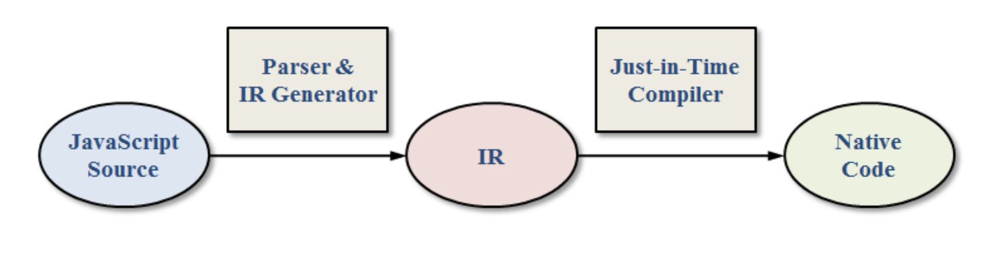
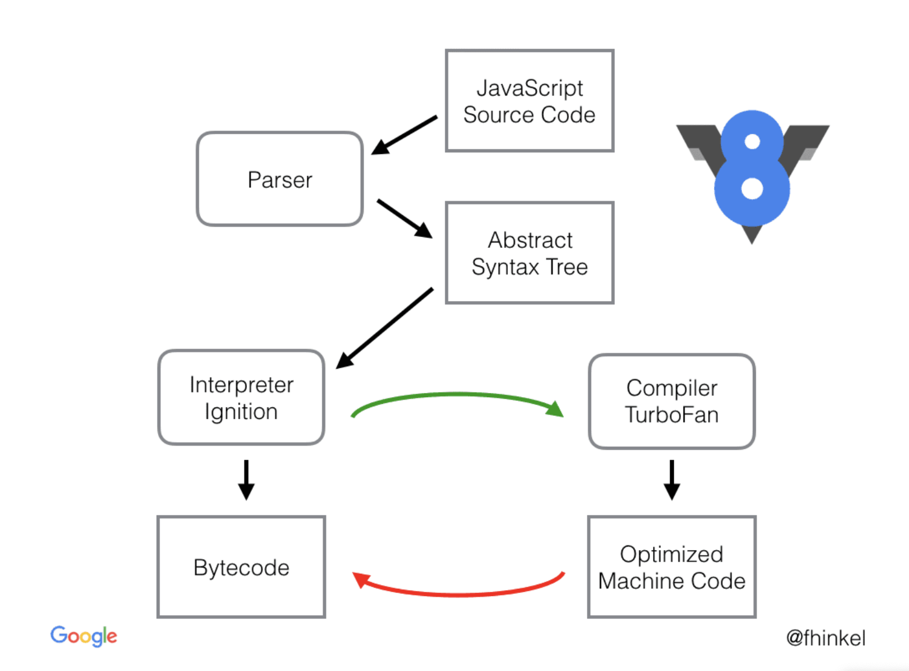

# 자바스크립트 엔진 최적화 기법

## 컴파일러 언어

- 코드가 실행되기 전 단계인 컴파일 타임에 소스코드 전체를 한번에 머신 코드(CPU에서 바로 구동 가능한 기계어)로 변환한 후 실행한다.
- 만약 프로그램이 다른 CPU 아키텍처에서 실행되도록 하려면 다른 컴파일러(혹은 또 다른 옵션)로 프로그램을 컴파일해야 한다.
- 컴파일이 완료되면 실행 파일이 생성되며, 컴파일이 완료된 상태에서의 실행 속도는 인터프리터 언어에 비해 빠르다.
- C의 경우 컴파일러에 의해 소스파일(`*.c`)이 목적파일(`*.obj`)로 변환될 때 바이너리 파일(0과 1로 이루어진 코드)로 변환된다.
- 그러나 목적파일은 기본적으로 컴퓨터가 이해할 수 있는 바이너리 코드의 형태이지만 실행될 수는 없다. 그 이유는 완전한 기계어(CPU에서 사용하는 명령어 집합)가 아니기 때문이다.
- 변환된 목적파일은 링커에 의해 실행 가능한 실행파일(`*.exe`)로 변환될 때 함수나 헤더 파일 등의 실제 메모리 주소를 코드에 반영하는 과정에서 일부 주소값이 변경되는데, 이러한 과정을 거쳐야 비로소 컴퓨터가 실행할 수 있는 완전한 기계어가 되는 것이다.
- 기계어란 특정한 언어가 아니며 CPU 제조사에서 CPU를 만들 때 해당 CPU에서 사용하는 명령어 집합을 공개하는데, 이를 기계어라 하는 것이다. 따라서 CPU가 변경되면 기계어가 변경되어 같은 동작을 하는 명령어라 하더라도 완전히 다른 0과 1의 나열이 될 수 있는 것이다. 따라서 기계어가 이진코드로 이루어졌을 뿐 모든 이진코드가 기계어인 것은 아니게 된다.

## 인터프리터 언어

- 별도의 컴파일 타임없이 런타임에 문 단위로 한 줄씩 중간 코드(intermeidate code)인 바이트코드(특정한 하드웨어가 아닌 가상 머신에서 실행하도록 만든 바이너리 코드, 따라서 CPU가 아닌 가상 머신이 이해할 수 있는 이진코드를 의미함)로 변환 후 실행한다.
- 인터프리트 단계와 실행 단계가 분리되어 있지 않기 때문에 바이트코드로 변환된 후 즉시 실행된다.
- 컴파일러 언어의 경우 소스 코드의 변경이 없다면 한 번 컴파일 된 실행 파일만 실행하면 되지만, 인터프리터 언어의 경우 코드가 실행될 때마다 인터프리트 과정을 반복해야 한다.

## 자바스크립트 엔진

자바스크립트 엔진은 가상머신(Virtual Machine)이라 불린다. 앞서 언급한 것과 같이 인터프리터 언어는 문 단위로 바이트코드를 생성하는데, 이를 해석하고 실행할 수 있는 가상머신이 필요하기 때문에 자바스크립트의 경우는 자바스크립트 엔진이 그 역할을 하는 것이다. 물론 가상 머신 중에서도 Parallels같은 맥에서 윈도우를 구동할 수 있게 해주는 시스템 같은 '시스템 가상 머신'이 아닌 완전한 기능을 제공하지는 않지만 하나의 프로그램이나 프로세스를 구동할 수 있게끔 해주는 '프로세스 가상 머신'으로써 말이다. 대표적인 예로는 Wine을 생각하면 편하다. 리눅스 머신에서 윈도우 애플리케이션을 실행할 수 있도록 해주지만, 윈도우 운영체제 전체를 제공하지 않는 것과 같다.

> 자바스크립트 엔진은 자바스크립트 코드를 해석하고 실행하기 위해 만들어진 일종의 프로세스 가상 머신이다!

## JITC(Just-in-Time Compilation)

코드의 실제 실행 전에 컴파일이 사전에 수행되는 C와 같은 compiled language와는 달리 JavaScript에서는 실행 도중에 컴파일이 진행된다.

현재 많이 사용되고 있는 Javascript 엔진(Safari, Chrome)은 모두 JITC 방식을 사용한다. 이때 일반적으로 JavaScript 엔진이 interperter 방식으로 동작한다고 인식하고 있는 경우가 많은데, 초기 버전의 JavaScriptCore (Safari 브라우저에 포함된 WebKit의 JS 엔진)나 V8는 수행되는 모든 JavaScript 코드를 바로(Just-in-time) native code로 컴파일하는 방식이었다.

JavaScript JITC은 보통 다음 그림과 같은 방식으로 수행된다.



JavaScript는 기본적으로 텍스트 형태로 배포되기 때문에 처음에 소스 코드를 파싱하여 중간 언어(IR, intermediate representation)인 bytecode 형태로 먼저 변환하게 된다.

- interpreter 모드인 경우
  - bytecoe를 하나씩 읽어가며 동작을 수행
- JIT 모드인 경우
  - 생성된 bytecode를 기반으로 native code로 컴파일하여 실행

이때 JITC의 경우 JVM에서 많이 사용되던 방식인데 자바는 보통 bytecode 형태인 `.class` 파일 단위로 배포되기 때문에 JavaScript와는 달리 파싱 과정이 생략된다.

당연히 interpreter 방식보다 native code를 실행하는 것이 빠르겠지만, JITC의 경우에는 그렇지는 않다. GCC와 같은 static compiler의 경우에는 native code를 생성하면서 많은 최적화 알고리즘들을 적용하기 때문에 성능이 좋지만, JITC는 **컴파일 과정 자체가 코드 실행 도중에 발생하기 때문에 컴파일 자체가 overhead가 되게 되므로 컴파일에 많은 시간을 쓸 수가 없다.**

따라서 코드 전체를 탐색하며 최적화하는 방식은 무리이며, 보통 최소한의 최적화만 적용한 native code를 생성하게 된다.

그럼에도 불구하고 native code의 실행 성능이 interpreter보다는 월등하기 때문에 JITC에서 실행 중간에 컴파일하는 overhead가 포함되더라도 JVM에서는 JITC를 많이 사용한다.

## JITC vs Interpreter in JS

우선은 JavaScript JITC가 최적화를 최소한으로 적용한다는 점 이외에도 다른 문제 역시 존재한다.

JavaScript는 변수의 타입이 실행 시간에 바뀔 수 있고, `class` 대신 `object`로 상속되는 prototype-based 언어인 점 등 매우 동적인 언어이기 때문에 모든 예외적인 케이스를 모두 고려하여 코드를 생성해야 한다는 문제가 존재한다. 단순히 변수 두 개를 더하는 덧셈의 경우에도 예외 케이스를 모두 고려한다면 많은 양의 native code가 필요하게 된다.

만약 덧셈의 대상이 되는 operand가 모두 `integer` 타입이라면 덧셈을 진행한 후 변수에 저장하면 되지만, operand 중 하나가 `integer` 타입이 아니거나 덧셈의 결과가 `integer` 타입으로 표현할 수 있는 범위를 벗어나는 등의 예외 케이스가 발생하게 된다면 **slow case**로 건너뛰게 된다.

여기서 slow case란 native code로 생성하면 코드의 분량이 많아지는 동작들을 native code로 만드는 대신 엔진 내부에 C를 이용하여 구현되어 있는 helper function을 호출하여 동작을 수행하는 경우를 의미한다. 만약 단순한 덧셈에서 `integer + integer`, `string + string` 같은 케이스를 모두 native code로 생성하게 된다면 엄청 많은 분량의 native code를 필요로 하게 되므로 helper function을 이용하게 된다.

그러나 이렇게 helper function을 이용하는 것은 interpreter 모드로 코드를 실행할 때와 동일한 코드를 사용하게 된다. 이러한 경우에는 JITC로 native code를 실행하는 것과 interpreter 방식으로 실행하는 것에 차이가 없게 되는 것이다. 거기에 심지어 compilation overhead까지 고려한다면 JavaScript JITC는 자바에서의 JITC보다는 훨씬 비효율적이다.

또 다른 문제는 JavaScript로 구현된 프로그램들의 특성이 자바와는 많이 다르다는 점이다. Java의 경우 연산이 많이 필요한(compute-intensive) 프로그램이 많은 반면, JavaScript의 경우는 사용자의 입력에 반응하는 방식의 프로그램인 경우가 많다. 두 가지 방식의 가장 큰 차이점은 **자주 반복되어 수행되는 구간**(hotspot)이 얼마나 많은가?에 대한 것인데 JavaScript는 상대적으로 hotspot이 매우 적은 특성을 갖는다. 이는 loop가 적고 한 두 번만 수행되는 코드가 대부분이라는 것을 의미한다. 물론 HTML5가 되면서 compute-intensive한 프로그램도 많아졌지만 hotspot이 적다는 것은 native code를 실행하는 시간에 비해서 해당 native code를 만드는 compile overhead가 상대적으로 커지게 되는 문제가 발생한다. 결과적으로는 compilation overhead + native code 실행 시간이 interpreter의 실행 시간보다 짧을 것이라는 가정 자체가 깨져버리는 문제가 발생하는 것이다.

결국 hotspot이 별로 없는 경우에는 interpreter로 수행하는 것이 낫다는 결론에 다다르게 되는데, 최근에는 JavaScript가 이벤트 처리 용도만이 아닌 비즈니스 로직에도 관여를 할만큼 compute-intensive한 프로그램 구현에도 이용된다는 점에서 JITC 방식을 완전히 포기할 수는 없는 상황에 봉착하게 된 것이다.

## Adaptive JIT Compilation

따라서 위와 같은 상황들을 해결하기 위해 최근의 JavaScript 엔진들은 대부분 adaptive compilation 방식을 채택하고 있다. 이는 모든 코드에 대해 일괄적으로 같은 수준의 최적화를 적용하는 것이 아니라 반복되어 수행되는 정도에 따라 유동적으로(adaptive) 서로 다른 최적화 수준을 적용하는 방식을 의미한다.

기본적으로 모든 코드는 처음에 interpreter 방식으로 수행되다가 자주 반복되는 부분(hotspot)이 식별되면, 그 부분에 대해서만 JITC를 적용하여 native code로 컴파일 한 후 실행하게 된다. 거기에 최근의 엔진들은 JITC 자체도 여러 단계로 나누어 적용한다. 처음에는 최소한의 최적화만 적용하는 JITC(baseline-JITC)로 컴파일하여 실행하다가, 더 빈번하게 수행되는 코드를 식별하면 더 많은 최적화를 적용하는 JITC(Optimizing-JITC)로 컴파일하여 code quality를 높이기 위해 노력한다.

### V8 Structure



일단은 `V8`이 자바스크립트 소스 코드를 어떻게 해석하고 실행하는 지 확인해보자.

`V8`은 소스 코드를 `Parser`에게 넘긴다. `Parser`는 소스 코드를 분석한 후 `AST`로 변환하게 된다. 그 다음에 `AST`를 `Ignition`에게 넘기게 되는데 `Ignition`은 자바스크립트 코드를 `Bytecode`로 변환하는 인터프리터이다. 자바스크립트 코드보다 컴퓨터가 해석하기 쉬운 바이트코드로 변환함으로써 원본 코드를 다시 `Parsing`해야 하는 수고를 덜고 코드량을 줄이면서 코드 실행 시 차지하는 메모리 공간을 아끼기 위함이다.

그 이후 바이트 코드를 실행하면서 자주 사용되는 코드는 `TurborFan`으로 보내져 `Optimized Machine Code`로 다시 컴파일된다. 그러다가 사용 빈도가 줄어들면 `Deoptimizing`되기도 한다.

### Parsing

`Parsing`이란 소스 코드를 `AST`로 변환하는 과정을 의미한다. 여기서 `AST`는 컴파일러에서 주로 사용되는 자료 구조인데, 일반적으로 작성한 소스 코드를 컴퓨터가 이해하기 쉽도록 `구조화`하는 작업이라 생각하면 된다.

```javascript
function hello(name) {
  return 'Hello,' + name;
}

// 위의 코드는 대략 이렇게 구조화 할 수 있다.
{
  type: 'FunctionDeclaration',
  name: 'hello',
  arguments: [
    {
      type: 'Variable',
      name: 'name'
    }
  ]
  // ...
}
```

위의 코드는 자바스크립트 코드를 자바스크립트를 이용하여 `AST`를 구성하는 예를 보인 것이고, 실제로 `V8`은 `C++`을 사용하여 `AST`를 만들게 된다.

### Ignition

`Bytecode`는 고급 언어로 작성된 소스 코드를 가상머신이 쉽게 이해할 수 있도록 한 번 컴파일한 것을 의미한다. `V8`에서는 `Ignition`이 그 역할을 담당하고 있다.

`Ignition`은 기존의 `Full-codegen`을 대체하는 인터프리터로 `Full-codege`의 경우 전체 소스 코드를 한 번에 컴파일하면서 메모리 점유율이 굉장히 높아지는 문제가 있었다.

또한 자바스크립트는 `C++`과 달리 `동적 타이핑` 언어이기 때문에 소스 코드가 실제로 실행되기 전에는 알 수없는 값들이 너무 많아 전체 소스 코드를 한 번에 컴파일하는 방식으로는 최적화를 진행하기 어려운 점이 많았다.

따라서 `Ignition`에서는 코드 한줄씩 실행될 때마다 해석하는 인터프리트 방식을 채택하여 다음과 같은 이점을 얻고자 하였다.

> 1. **메모리 사용량 감소** : 자바스크립트 코드에서 기계어로 컴파일하는 것보다는 바이트코드로 컴파일하는 것이 더 편하다.
> 2. **파싱 시 오버헤드 감소** : 바이트코드는 자바스크립트 코드에 비해 간결하기 때문에 다시 파싱하는 것이 용이하다.
> 3. **컴파일 파이프 라인의 복잡성 감소** : `Optimizing`과 `Deoptimizing` 과정에서 오직 바이트코드만 고려하면 되므로 편하다.

`Bytecode`는 직접 CPU 내의 레지스터와 누산기를 어떤 식으로 사용하라고 명령하는 명령문과 같기 때문에 사람에게는 어렵지만 컴퓨터에게는 훨씬 이해하기 편한 방식이다.

`V8` 엔진은 우리가 작성한 자바스크립트 코드를 내부적으로 `Bytecode`로 전부 변환해놓기 때문에 코드 라인이 처음 실행될 때는 조금 시간이 걸릴 수 있지만 그 이후부터는 거의 컴파일 언어에 가까운 성능을 보일 수 있게 되는 것이다.

### TurboFan

`TurboFan`은 기존에 사용하던 `Crankshaft` 컴파일러를 대체한 최적화 담당 컴파일러이다. `V8`은 런타임 중에 `Profiler`라는 존재에게 함수나 변수들의 호출 빈도와 같은 데이터를 수집하도록 요청한다. 이렇게 모인 데이터를 `TurboFan`에게 넘기면 `TurboFan`은 자신의 기준에 맞는 코드를 가져와서 최적화를 진행하는 것이다.

이때 사용되는 최적화 기법으로는 히든 클래스나 인라인 캐싱이 있는데, 이 사항은 추후에 따로 정리하도록 한다.

## Reference

- [The JIT in JavaScript: Just In Time Compiler](https://blog.bitsrc.io/the-jit-in-javascript-just-in-time-compiler-798b66e44143)
- [자바스크립트 엔진의 최적화 기법 (1) - JITC, Adaptive Compilation](https://meetup.toast.com/posts/77)
- [V8 엔진은 어떻게 내 코드를 실행하는 걸까?](https://evan-moon.github.io/2019/06/28/v8-analysis/)
