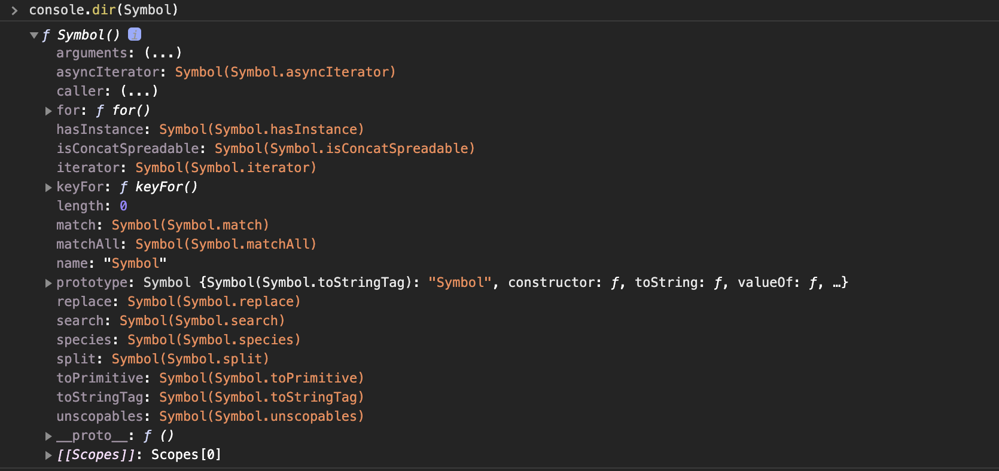

# Symbol

심벌(symbol)은 ES6에서 도입된 7번째 데이터 타입으로 변경 불가능한 **원시 타입**의 값이다. symbol은 다른 값과 중복되지 않는 유일한 값이다. 따라서 주로 이름의 충돌 위험이 없는 유일한 프로퍼티 키를 만들기 위해 사용한다.

## Symbol 함수

symbol은 `Symbol` 함수를 호출하여 생성한다. 다른 원시값(`string`,`number`,`boolean`,`undefined`,`null`)은 리터럴 표기법을 통해 값을 생성할 수 있지만 symbol은 `Symbol` 함수를 호출하여야만 생성할 수 있다. 이때 생성된 symbol 값은 외부로 노출되지 않아 확인이 불가능하며, **다른 값과 절대 중복되지 않는 유일한 값**이다.

```javascript
// Symbol 함수를 호출하여 유일한 symbol 값을 생성한다.
const newSymbol = Symbol();
console.log(typeof newSymbol); // symbol

// symbol 값은 외부로 노출되지 않기 때문에 확인이 불가능하다.
console.log(newSymbol); // Symbol()
```

`Symbol` 함수는 `String`,`Number`,`Boolean` 생성자 함수와는 다르게 `new` 연산자와 함께 호출하지 않는다. `new` 연산자와 함께 생성자 함수 또는 클래스를 호출하면 객체(인스턴스)가 생성되지만 symbol 값은 변경 불가능한 유일한 원시 값이기 때문에 `new` 연산자를 사용하는 것이 오히려 부자연스럽다고 할 수 있다.

```javascript
new Symbol(); // TypeError: Symbol is not a constructor
```

`Symbol` 함수에는 선택적으로 문자열을 인수로 전달할 수 있다. 이 문자열은 생성된 symbol 값에 대한 설명(description)으로 디버깅 용도로만 사용되고, symbol 값을 생성하는 데에는 어떠한 영향도 주지 않는다. 따라서 symbol 값에 대한 description이 동일하게 제공되어 생성되더라도 각각의 symbol 값은 유일한 값이다.

```javascript
// symbol 값에 대한 description이 동일하더라도 유일한 symbol 값을 생성한다.
const newSymbol1 = Symbol('newSymbol');
const newSymbol2 = Symbol('newSymbol');

console.log(newSymbol1 === newSymbol2); // false
```

symbol 값도 문자열,숫자,불리언과 같이 객체처럼 접근하면 암묵적으로 Wrapper 객체를 생성한다. 다음 예제의 `description` 프로퍼티와 `toString` 메서드는 `Symbol.prototype`의 프로퍼티이다.

```javascript
const newSymbol = Symbol('newSymbol');

console.log(newSymbol.description); // newSymbol
console.log(newSymbol.toString()); // Symbol(newSymbol)
```

symbol 값은 암묵적으로 문자열이나 숫자 타입으로 변환되지는 않지만, 불리언 타입으로는 암묵적인 타입 변환이 가능하다. 이를 이용하여 `if` 문 등에서 식별 가능하다.

```javascript
const newSymbol = Symbol();

console.log(newSymbol + ''); // TypeError: Cannot convert a Symbol value to a string
console.log(+newSymbol); // TypeError: Cannot convert a Symbol value to a string
console.log(!!newSymbol); // true
if (newSymbol) console.log('newSymbol is exist');
```

## Symbol.for / Symbol.keyFor

`Symbol.for` 메서드는 인수로 전달받은 문자열을 key로 사용하여 key와 symbol 값의 쌍이 저장되어 있는 전역 symbol 레지스트리(Global Symbol Registry)에서 해당 key와 일치하는 symbol 값을 검색한다.

- [**검색 성공**] → 검색된 symbol 값을 반환한다.
- [**검색 실패**] → 새로운 symbol 값을 생성하여 전달된 인수를 key로 설정하여 전역 symbol 레지스트리에 저장한 후, 생성된 symbol 값을 반환한다.

```javascript
// 전역 symbol 레지스트리에서 검색 실패 → 새로운 symbol 값 생성
const s1 = Symbol.for('newSymbol');
// 전역 symbol 레지스트리에서 검색 성공 → 검색된 symbol 값을 반환
const s2 = Symbol.for('newSymbol');

console.log(s1 === s2); // true
```

`Symbol` 함수는 호출될 때마다 유일한 symbol 값을 생성한다. 이때 자바스크립트 엔진이 관리하는 symbol 값 저장소인 전역 symbol 레지스트리에서 symbol 값을 식별할 수 있는 key를 지정하지 않았으므로 전역 symbol 레지스트리에 등록되어 관리되지 않는다. 그러나 `Symbol.for` 메서드를 사용하면 애플리케이션 전역에서 중복되지 않는 유일한 상수인 symbol 값을 생성하여 전역 symbol 레지스트리를 통해 공유하는 것이 가능하다.

`Symbol.keyFor` 메서드를 사용하면 전역 symbol 레지스트리에서 저장된 symbol 값의 키를 추출하는 것이 가능하다.

```javascript
const s1 = Symbol.for('newSymbol');
Symbol.keyFor(s1); // → newSymbol

const s2 = Symbol('newSymbol');
Symbol.keyFor(s2); // → undefined
```

## symbol vs 상수

예를 들어 위,아래,왼쪽,오른쪽을 표현하는 상수를 정의한다고 가정해보자.

```javascript
const Direction = {
  UP: 1,
  DOWN: 2,
  LEFT: 3,
  RIGHT: 4
};

const myDirection = Direction.UP;
if (myDirection === Direction.UP) {
  console.log('UP!');
}
```

위 예제처럼 값에는 특별한 의미가 없고 상수 이름 자체에 의미가 있는 경우가 있다. 이때 저장되어 있는 값이 변경될 수 있으며, 다른 변수 값과 중복될 가능성이 존재한다는 것이다. 이러한 경우 변경되거나 중복될 가능성이 있는 무의미한 상수 대신 중복될 가능성이 없는 symbol 값을 사용하는 것이 가능하다.

```javascript
const Direction = {
  UP: Symbol('up'),
  DOWN: Symbol('down'),
  LEFT: Symbol('left'),
  RIGHT: Symbol('right')
};

const myDirection = Direction.UP;
if (myDirection === Direction.UP) {
  console.log('UP!');
}
```

> **enum**  
> enum은 열거형(Enumerated type)이라고 부른다. 자바스크립트에서는 enum을 지원하지 않지만 타입스크립트에서는 enum을 지원한다.  
> 자바스크립트에서 enum을 모방하여 사용하기 위해서는 객체의 변경을 방지하기 위해 `Object.freeze` 메서드와 symbol 값을 사용한다.
>
> ```javascript
> const Direction = Object.freeze({
>   UP: Symbol('up'),
>   DOWN: Symbol('down'),
>   LEFT: Symbol('left'),
>   RIGHT: Symbol('right')
> });
> ```

## 프로퍼티 키로써의 symbol

객체의 프로퍼티 키는 빈 문자열을 포함하는 모든 문자열 또는 symbol 값으로 생성하는 것이 가능하며, 동적으로 생성하는 것도 가능하다.

아래의 예제에서 프로퍼티 키로 사용할 표현식을 대괄호([...])로 묶어 사용하는데 이는 배열을 표현하는 것이 아니라 계산된 프로퍼티 이름(computed property name)을 의미한다.

```javascript
const obj = {
  [Symbol.for('newSymbol')]: 1
};
obj[Symbol.for('newSymbol')]; // → 1
```

**symbol 값은 유일한 값이므로 이를 이용하여 프로퍼티 키를 생성하면 다른 프로퍼티 키와 절대 충돌하지 않으며 기존에 존재하던 프로퍼티 키는 물론 추후에 추가될 어떠한 프로퍼티 키와도 충돌할 위험이 없다.**

## 프로퍼티 은닉

symbol 값을 프로퍼티 키로 사용하여 생성한 프로퍼티는 `for...in` 문이나 `Object.keys`, `Object.getOwnPropertyNames` 메서드로는 찾을 수 없다. 이러한 특성을 이용하여 외부에 노출할 필요가 없는 프로퍼티를 은닉할 수 있다.  
하지만 ES6에서 도입된 `Object.getOwnPropertySymbols` 메서드를 사용하면 symbol 값을 프로퍼티 키로 사용하여 생성된 프로퍼티를 찾을 수 있다.

```javascript
const obj = {
  [Symbol('newSymbol')]: 1
};
for (const key in obj) {
  console.log(key); // 아무것도 출력되지 않는다.
}
console.log(Object.keys(obj)); // []
console.log(Object.getOwnPropertyNames(obj)); // []

console.log(Object.getOwnPropertySymbols(obj)); // [Symbol(newSymbol)]
const symbolKey = Object.getOwnPropertySymbols(obj)[0];
console.log(obj[symbolKey]); // 1
```

## Well-known Symbol

자바스크립트가 기본적으로 제공하는 Built-In symbol 값이 있다. Built-In symbol 값은 `Symbol` 함수의 프로퍼티에 할당되어 있다.



ECMAScript Specification에서는 이러한 Built-IN symbol 값을 **Well-Known Symbol**이라 부르며, 이는 자바스크립트 엔진의 내부 알고리즘에 사용된다.

예를 들어, `Array`,`String`,`Map`,`Set`,`TypedArray`,`arguments`,`NodeList`,`HTMLCollection`과 같이 `for...of` 문으로 순회 가능한 Built-In 이터러블(Iterable)은 Well-known Symbol인 `Symbol.iterator`를 키로 갖는 메서드를 갖게 되며, `Symbol.iterator` 메서드를 호출하면 이터레이터(Iterator)를 반환하도록 ECMAScript Spectification에 규정되어 있다. 정리하면 Built-In 이터러블은 이터레이션 프로토콜(Iteration Protocol)을 준수한다.

만약 Built-In 이터러블이 아닌 일반 객체를 이터러블처럼 동작하도록 구현하고 싶다면 이터레이션 프로토콜을 준수하도록 만들면 된다. Well-known Symbol인 `Symbol.iterator`를 키로 갖는 메서드를 객체에 추가하고 이터레이터를 반환하도록 구현하면 해당 객체는 이터러블이 된다.

```javascript
const iterable = {
  // Symbol.iterator 메서드를 구현하여 이러레이션 프로토콜을 따르도록 만든다.
  [Symbol.iterator]() {
    let cur = 1;
    const max = 5;
    // Symbol.iterator 메서드는 next 메서드를 보유하고 있는 이터레이터를 반환한다.
    return {
      next() {
        return { value: cur++, done: cur > max + 1 };
      }
    };
  }
};

for (const num of iterable) {
  console.log(num); // 1 2 3 4 5
}
```

이때 이터레이션 프로토콜을 준수하기 위해 일반 객체에 추가해야 하는 메서드의 키인 `Symbol.iterator`는 기존에 존재하던 프로퍼티 키 또는 추후에 추가될 프로퍼티 키와 절대 중복되는 일은 없을 것이다.

이처럼 symbol은 중복되지 않는 상수 값을 생성하는 것과 기존에 작성된 코드에 영향을 주지 않고 새로운 고유한 프로퍼티를 추가하기 위해, 즉 하위 호환성을 보장하기 위해서 도입된 개념이다.

## Reference

- [모던 자바스크립트 Deep Dive 33장 - 7번째 데이터 타입 Symbol](http://www.yes24.com/Product/Goods/92742567)
