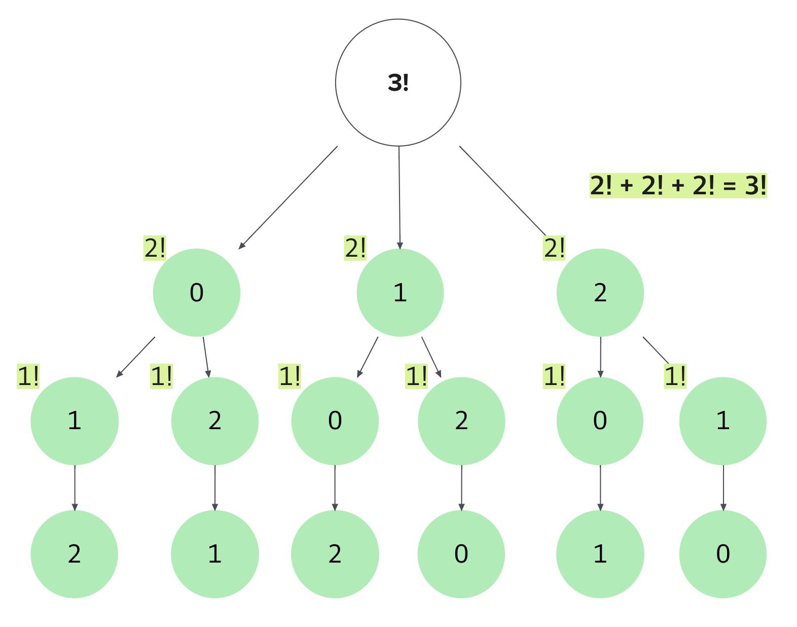

# N번째 순열 구하기

기존에 전체 순열·조합 구하는 방식은 다루어 보았지만, N번째 순열이 무엇인지 구하는 방법을 필요로 하는 [줄 서는 방법](https://programmers.co.kr/learn/courses/30/lessons/12936) 문제를 풀이하면서 공부한 내용이다.

## 순열의 순서

먼저 순열의 사전식 순서란 무엇인지 알아보자.

```
[0,1,2]라는 세 가지의 숫자를 나열하는 방법

① [0,1,2]
② [0,2,1]
③ [1,0,2]
④ [1,2,0]
⓹ [2,0,1]
⓺ [2,1,0]
```

위의 예시에서 `[1,0,2]`는 `[1,2,0]`보다 사전식 순서에서 앞선다고 볼 수 있다. `1`까지는 동일하지만 그 뒤의 숫자들인 `0`과 `2` 중에서 `0`이 더 앞서기 때문이다.

보다 명확하게 확인하기 위해 순열을 구하는 방법을 트리로 표현해보자.



전체 순열을 구하는 방법의 수는 3!로 총 6가지이다. `[0,1,2]` 중에서 어떤 숫자를 고르더라도 중복순열을 구하는 경우가 아니기 때문에 다음에 고를 수 있는 경우의 수는 `[1,2], [0,2], [0,1]`로 줄어들게 된다. 따라서 구해야 하는 N에 대해서 `(골라야 하는 숫자의 개수 - 1)!`로 계속 나누고, 나눈 나머지는 다시 N에 할당하고, 나눈 몫을 이용하면 배열의 요소 중에 몇 번째 index에 위치한 숫자를 고른 경우인지 알 수 있게 된다.

만약에 `[0,1,2]` 세 개의 숫자를 나열하는 순열 중 5번째를 구한다고 생각해보자.

```javascript
N = 5;
answer = [];
numbers = [0,1,2];

idx = Math.floor(N / (numbers.length - 1)!); // idx = 5 / 2! = 2 → [0,1,2]에서 2번째 숫자를 고른다.
N = (N % (numbers.length - 1)!) // N = 5 % 2! = 1
answer = [2], numbers = [0,1]

idx = Math.floor(N / (numbers.length - 1)!); // idx = 1 / 1! = 1 → [0,1]에서 1번째 숫자를 고른다.

N = (N % (numbers.length - 1)!) // N = 1 % 1! = 0
answer = [2,1], numbers = [0]

idx = Math.floor(N / (numbers.length - 1)!) // idx = 0 / 0! = 0 / 1 = 0 → [0]에서 0번째 숫자를 고른다.
answer = [2,1,0], numbers = []
```

위의 의사 코드에서는 N을 zero-based 기준으로 출력하게끔 되어 있으므로 one-based 기준으로는 6번째, 즉 마지막 순열을 반환하게 된다.

실제 프로그래밍 언어를 이용하여 구현한다면, 선택된 요소를 제거한 배열을 반환하는 함수와 `factorial` 함수를 구현하여 적용하면 된다.
