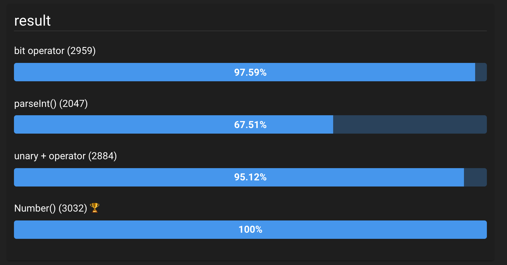
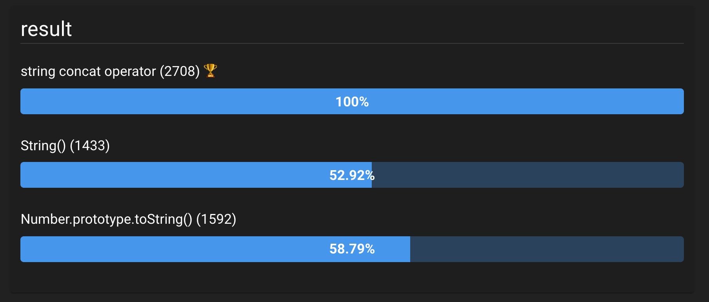

# number ↔ string 타입 변환

일반적으로 알고리즘 문제를 풀때나, 프로그램을 구현할 때 `number` ↔ `string` 간의 타입 변환이 필요한 경우가 많았다. 그때마다 명시적으로 타입 변환을 해주는 것이 좋은지, 암묵적으로 타입 변환을 해주는 것이 좋은지에 대한 고민을 하게 되었었는데, [jsben.ch](https://jsben.ch/)라는 사이트를 이용하여 다양한 타입 변환 방법 중 어떤 방법이 효율적인지 확인해았다.

## string → number

`'100000'`이라는 문자열 타입의 값을 `100000`이라는 숫자 타입의 값으로 변환하는 작업을 10만번 수행했다고 하였을 때의 결과를 비교해보자.

### 1. 엔진에 의한 암묵적 타입 변환을 활용하기

```javascript
var arr = [];
for (var i = 0; i < 100000; i++) {
  arr[i] = '100000' >> 0;
  // or
  arr[i] = +'100000';
}
```

비트 연산자 혹은 단항 산술 연산자 `+`를 사용하는 문맥에는 숫자 타입의 값이 위치해야 하므로 문자열 타입의 값 `'100000'`은 숫자 타입의 값 `100000`으로 암묵적 타입 변환될 것이다.

### 2. `parseInt()`

```javascript
var arr = [];
for (var i = 0; i < 100000; i++) {
  arr[i] = parseInt('100000');
}
```

### 3. `Number()`

```javascript
var arr = [];
for (var i = 0; i < 100000; i++) {
  arr[i] = Number('100000');
}
```

### 실행 결과



[jsben.ch](https://jsben.ch/TR6q8)라는 사이트에서 각각의 방법을 벤치마킹 해본 결과 `Number()` 함수를 이용하는 방법이 가장 우수하다는 결론을 내리게 되었다. 비트 연산자나 단항 산술 연산자 `+`를 이용하는 방식과는 월등한 차이가 없었지만 `parseInt` 함수는 비용이 매우 크므로, **충분히 명시적이면서 성능까지 확보할 수 있는 `Number()` 함수를 사용하는 것이 최선의 선택이라고 판단된다.**

## number → string

### 1. 문자열 연결 연산자 활용한 방법

```javascript
var arr = [];
for (var i = 0; i < 100000; i++) {
  arr[i] = 100000 + '';
}
```

### 2. `String()`

```javascript
var arr = [];
for (var i = 0; i < 100000; i++) {
  arr[i] = String(100000);
}
```

### 3. `Number.prototype.toString()`

```javascript
var arr = [];
for (var i = 0; i < 100000; i++) {
  arr[i] = (100000).toString();
}
```

### 실행 결과



[jsben.ch](https://jsben.ch/KUoeU)에서 수행한 결과 문자열 연결 연산자 `+`를 사용한 타입 변환이 가장 성능이 좋았다. 따라서 가급적 `number` 타입의 값을 `string`으로 변경할 때에는 엔진에 의한 암묵적 변환 방법을 활용하는 것이 성능적인 면에서 우수할 것이라 판단되므로 가급적 문자열 연결 연산자를 활용하기로 결정하였다.
