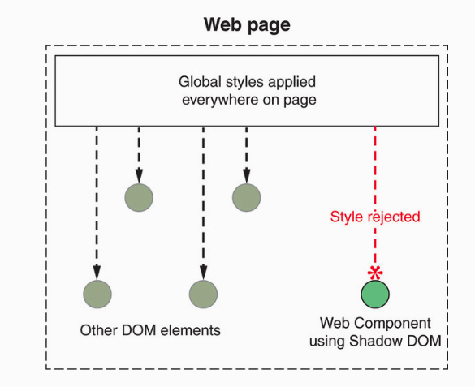

# Shadow DOM

## Protecting component's DOM

```html
<head>
  <script>
    class SampleComponent extends HTMLElement {
      connectedCallback() {
        this.innerHTML = `<div class="inside-component">My Component</div>`;
      }
    }
    if (!customElements.get('sample-component')) {
      customElements.define('sample-component', SampleComponent);
    }
  </script>
</head>
<body>
  <sample-component></sample-component>
</body>
```

위의 코드는 간단한 `<div>`를 만드는 커스텀 엘리먼트이다. 그렇다면 캡슐화의 관점에서 우리는 `<div>` 태그를 외부로부터 보호할 수 있을까? 일단 `<script>` 태그를 추가하고 다음과 같은 코드를 작성해보자.

```html
<script>
  document.querySelector('.inside-component').innerHTML += ' has been hijacked';
</script>
```

안타깝게도 `<div>` 태그는 외부에서 접근하여 내용을 수정하는 것이 가능하다. 물론 이러한 작업은 다분히 기능과 구조를 외부에서 파괴하는 의도를 가지고 접근한 것이다. 위의 예시에서 `<div>` 태그의 `class`가 `inside-component`라는 사실을 알고있기 때문에 해당 요소에 접근해서 조작하는 것이 가능했던 것이다.

```html
<body>
  <sample-component></sample-component>
  <button>Click Me</button>
</body>
```

또 만약에 `sample-component`가 `<button>` 요소를 포함하고 있다고 가정해보자. 그러한 상태에서 Click Me가 적혀있는 `<button>`에 이벤트 핸들러를 추가하려면 어떻게 해야할까?

```javascript
document.querySelector('button').addEventListener('click', e => {
  console.log(e);
});
```

안타깝게도 `querySelector`는 가장 먼저 찾은 요소를 반환하기 때문에 컴포넌트 내부에 있는 `<button>`이 선택될 것이다.

## Enter the Shadow DOM

Shadow DOM은 위에서 살펴 본 두 가지 문제를 해결하려 하지만 다분히 악의적인 의도를 가진 사용자에게는 여전히 아쉬운 점이 있다.

먼저 처음에 살펴본 외부에서 `<div>` 요소에 접근 가능했던 문제를 살펴보자. 이 문제는 간단하게 `connectedCallback`에 단 두 줄만 추가하면 해결할 수 있다.

```javascript
connectedCallback() {
  this.attachShadow({ mode: 'open' });
  this.shadowRoot.innerHTML = `<div class="inside-component">My Component</div>`;
}
```

위의 코드는 shadow root를 만들고, 만든 shadow root에 컴포넌트를 연결하는 작업을 수행한다. 그렇다면 shadow root란 무엇일까? document fragment를 떠올려보자. document fragment는 완벽하게 격리(분리)된 DOM을 구성하게 된다. 이처럼 shadow root도 사실 상 documnet fragment라 할 수 있다. 즉, 브라우저에 렌더링 되지만 실제 DOM과 완벽하게 격리된 DOM을 구성하는 것이다.

### the shadow root

- _Shadow root_ - 격리된 DOM(shadow tree)을 포함하고 있는 document fragment
- _Shadow tree_ - shadow root를 포함하고 있는 DOM
- _Shadow host_ - 웹 컴포넌트 자체를 의미하며, shadow tree/root의 부모 요소이다.


그렇다면 외부에서 컴포넌트 내부 요소에 대한 접근을 막을 수 있는지 이제 확인해보자.

```javascript
document.querySelector('.inside-component').innerHTML += ' has been hijacked';
```

```shell
Uncaught TypeError: Cannot read property 'innerHTML' of null
```

이번에는 타입 에러가 발생한 것을 확인할 수 있다. 애초에 `querySelector`로 `inside-component`라는 클래스를 찾을 수 없었기 때문에 발생한 현상이다.


### Closed mode

하지만 shadow host(`sample-component`)는 여전히 외부에 노출되어 있기 때문에 이를 이용하면 우회 접근이 가능하다는 문제가 남아있다.

```javascript
document
  .querySelector('sample-component')
  .querySelector('.inside-component').innerHTML += ' has been hijacked';
```

그렇다면 악의적인 사용자를 아예 차단할 방법은 존재하지 않는 것인가? 다행히도 `close` 모드가 존재한다.

```javascript
connectedCallback() {
  this.attachShadow({ mode: 'closed' });
  this.shadowRoot.innerHTML = `<div class="inside-component">My Component</div>`;
}
```

하지만 위의 코드는 잘 동작하지 않는다 shadow root가 `closed` 상태에서는 `shadowRoot`라는 속성이 존재하지 않으므로 이를 이용한 `innerHTML` 설정은 불가능하다. 그렇다면 `closed` 상태에서는 어떻게 구성 요소들과 상호작용할 수 있을까?

이때 활용하는 것이 바로 `attachShadow`이다. 이는 모드에 상관없이 언제나 shadow root에 대한 참조를 반환하게 된다.

```javascript
connectedCallback() {
  const root = this.attachShadow({ mode: 'closed' });
  root.innerHTML = `<div class="inside-component">My Component</div>`;
}
```

하지만 여전히 문제는 존재한다. 컴포넌트 클래스가 선언된 이후 `attachShadow`의 함수 정의를 변경할 수 있기 때문이다.

```javascript
SampleComponent.prototype.attachShadow = function (mode) {
  return this;
};
```

따라서 이는 `closed` 모드가 근본적인 해결책은 될 수 없음을 의미한다. 따라서 Google은 웹 컴포넌트에서 `closed` 모드를 사용하지 말아야 한다고 주장한다. 첫 번째로 `shadowRoot` 프로퍼티를 이용하여 접근하게끔 하여 규칙에 따라 클래스 또는 구성 요소를 보호하게끔 하는 것이 낫다는 주장이다. 두 번째로는 컴포넌트 내부에서 컴포넌트의 shadow DOM에 접근할 수 없게 만든다는 점이다. `shadowRoot` 프로퍼티는 `closed` 모드에서 사용할 수 없지만 쉽게 참조할 수 있다.

```javascript
connectedCallback() {
  this.root = this.attachShadow({ mode: 'closed' });
  this.root.innerHTML = `<div class="inside-component">My Component</div>`;
}
```

이처럼 인스턴스 프로퍼티로 등록하게 되면 어느 곳에서나 참조 가능하기 때문이다. 하지만 이렇게 구현하는 것은 본래의 의도를 크게 벗어나게 된다. 결과적으로 shadow DOM에 대한 참조가 공개되어 버린 것이기 때문이다.

?> 물론, `closed` 모드 상태의 shadow DOM이 대부분의 경우 문제가 되지 않는다는 사실은 분명하지만, 완벽하게 클래스 혹은 인스턴스를 보호할 방법이 될 수 없으므로 `open` 모드로 사용하되 다른 방식 혹은 규칙을 이용하여 보호하는 방법을 채택하는 것이 낫다.

### constructor vs connectedCallback

Lifecycle API에서 살펴보았듯이 `constructor`는 컴포넌트 초기화에 사용하기에는 완벽하지 않다는 점을 언급하였다. 이는 `constructor`가 실행되는 시점에는 DOM에 추가된 상태가 아니므로 DOM 관련 속성 및 `innerHTML`과 같은 메서드에 아직 액세스할 수 없기 때문이다.

앞서 작성한 코드에서는 `connectedCallback` 내부에서 `attachShadow`를 호출하였다. 중요한 점은 `attachShadow`가 호출되면 컴포넌트에 대한 별도의 DOM을 생성한다는 점이다. 이 별도의 DOM은 생성한 이후 바로 접근할 수 있다. 따라서 `connectedCallback` 대신 모든 초기화 작업을 `constructor`로 이동시켜도 아무 문제가 없는 것이다.

!> 단, 이 경우는 Shadow DOM을 사용할 때의 상황이고, Shadow DOM을 사용하지 않는다면 기존대로 `connectedCallback`에서 초기화 작업을 처리하는 것이 맞다.

```html
<html>
  <head>
    <script>
      class SampleComponent extends HTMLElement {
        constructor() {
          // HTMLElement의 constructor를 호출해야 this가 결정된다.
          super();
          this.attachShadow({ mode: 'open' });
          this.shadowRoot.innerHTML = `<div class="inside-component">My Component</div>`;
        }
      }
      if (!customElements.get('sample-component')) {
        customElements.define('sample-component', SampleComponent);
      }
    </script>
  </head>
</html>
```

## Shadow CSS

Shadow DOM을 이용한 DOM 캡슐화만큼이나 CSS 캡슐화 역시 훌륭한 선택지이다. 웹 개발에서 Style creep을 완화할 수 있는 방안은 계속 고안되어 왔지만 항상 발목을 잡아왔기 때문이다.

### STYLE CREEP

style creep은 CSS 규칙이 의도치 않은 요소에게 영향을 미치는 것을 말한다. 특히 CSS 선택자가 일치하는 경우 페이지의 다른 요소에 대해서도 영향을 미치기 때문에 웹 개발에 있어서 의도치 않은 CSS 선택자의 중복을 막는 것은 필수적이었다.


기본적으로 웹 컴포넌트 내부에서 웹 컴포넌트 이름을 선택자로 강제하고 사용하게 된다면 내부 구성 요소의 CSS가 외부 요소에 대해서도 적용되는 것은 막을 수 있을 것이다. 컴포넌트 내부의 CSS 규칙이 전역 CSS의 일부가 되기 때문이다.

하지만 전역 스타일 공간에 혹은 웹 컴포넌트의 상위 요소에 동일한 선택자를 가진 CSS가 존재했다면, 컴포넌트 내부의 요소가 영향을 받는 것은 막을 수 없다. 따라서 선택자가 아무리 구체적이라 하더라도 style creep에 직면하게 되는 것은 불가피하며 이를 디버깅할 때는 일반적으로는 웹 컴포넌트 자체가 완벽하게 캡슐화되어 있다고 생각하기 때문에 더욱 어려워진다.

### STYLE CREEP Solved with the Shadow DOM

기본적으로 컴포넌트에 shadow root를 생성하면 별도의 DOM이 생성된다는 것은 확인하였다. 따라서 외부에서 해당 DOM에 대한 접근이 제한되고, js를 이용하여 내부의 요소를 조작하는 것이 불가능하였다.

```javascript
class SampleComponent extends HTMLElement {
  connectedCallback() {
    const root = this.attachShadow({ mode: 'open' });
    root.innerHTML = `
      <button class="big-button">-</button>
      <span class="increment-number">5</span>
      <button class="big-button">+</button>
      <style>
        sample-component {
          background-color: blue;
        }
        button {
          border: none;
        }
        button:active {
          background-color: #960000;
        }
        button:focus {
          background-color: #ffffff;
        }
      </style>
      `;
  }
}
```

위의 코드를 잘 살펴보면 CSS 선택자가 태그에 대해 적용하더라도 외부에 CSS 유출되지 않으므로, 컴포넌트 내부의 요소에만 적용되는 것을 확인할 수 있다.

!> 핵심은 별도의 DOM으로 분리되어 각각의 스타일을 적용할 수 있다는 점이며, 외부의 스타일이 컴포넌트 내부에 침투하지 못한다는 점이다.



하지면 여전히 문제는 존재한다. `<sample-component>` 태그에 적용한 스타일이 반영되지 않는 것이다.

```css
sample-component {
  background-color: blue;
}
```

그 이유는 `<sample-component>` 태그가 Shadow DOM 외부에 존재하기 때문이다. 보다 자세히 말하면 컴포넌트 자체는 shadow host로 shadow boundary에는 포함되지 않는다. 즉, shadow DOM의 내부에서 적용한 스타일이 shadow DOM 외부 요소에 적용되면 안되므로 어찌 보면 당연하다 할 수 있다.

대신 shadow DOM 스타일링에는 새로운 CSS 선택자가 제공된다. 첫 번째로는 `:host`이다. 이는 shadow host 내부의 스타일을 지정하는 축약 형태이다.

```css
:host {
  background-color: blue;
}
```


### Perfect protection?

지금까지 살펴본 바로는 shadow DOM은 외부에서 침투하려는 CSS를 잘 막아주는 것처럼 보인다. 단, 이때의 조건은 선택자로 정의된 CSS만을 의미한다.

```html
<html>
  <head>
    <style>
      .text {
        font-size: 24px;
        font-weight: bold;
        color: green;
      }
    </style>
  </head>
  <body class="text">
    <sample-component></sample-component>
    <script>
      class SampleComponent extends HTMLElement {
        connectedCallback() {
          const root = this.attachShadow({ mode: 'open' });
          root.innerHTML = `<span>Some Text</span>`;
        }
      }
      if (!customElements.get('sample-component')) {
        customElements.define('sample-component', SampleComponent);
      }
    </script>
  </body>
</html>
```


컴포넌트 내부에서 `<span>` 태그를 사용하기는 하지만, 클래스를 준 적도 없는데 결과는 위와 같이 나온다. 즉, shadow DOM이 막아주는 것은 외부의 CSS 선택자가 침투하는 것만을 막아주는 것이지 컴포넌트의 부모 요소에 클래스로 선택하지 않아도 스타일이 적용되는 요소에 대한 스타일이 정의되어 있다면 컴포넌트 내부의 요소 역시 영향을 받을 수 있다는 점에 주의해야 한다.

그렇다면 이번에는 `<body>`에서 클래스를 제거하고 컴포넌트 내부에서 `text` 클래스를 추가해보자.

```html
<body>
  ...
</body>
```

```javascript
root.innerHTML = `<span class="text">Some Text</span>`;
```


이제 `text` 클래스 선택자는 shadow DOM을 통과할 수 없지만, 상속받은 스타일은 shadow DOM 내부로 침투할 수 있다는 점에 주목하자. 만약 전체 페이지의 모든 텍스트에 특정 스타일이 적용되거나 페이지에 특정 배경 색이 있는 경우 컴포넌트가 이러한 기본 스타일에서 벗어나는 것을 원하지 않는다면 이러한 점을 활용할 수도 있을 것이다.

하지만 기본 스타일 조차 원하지 않는 경우라면 `:host` 선택자를 이용하여 약간의 트릭을 활용할 수 있다.

```css
:host {
  all: initial;
}
```

물론 각각의 스타일 규칙을 `initial`로 설정하여 모두 초기화할 수는 있지만 새로운 `:host` 선택자를 사용하여 shadow root의 모든 항목을 재설정하는 것이 더 효율적으로 보인다.

## Reference

- [Web Components in Action](https://www.amazon.com/Web-Components-Action-Ben-Farrell/dp/1617295779)
