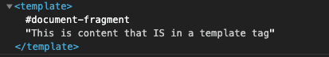
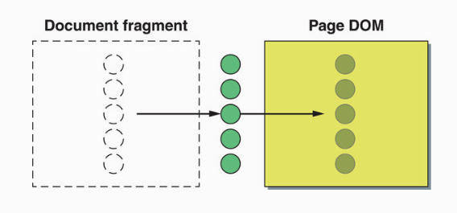

# `<template>` 태그

`<template>` 태그 자체는 매우 간단하지만 약간의 설명이 필요하다.

```html
<p>This is content that's not in a template tag.</p>
```

위의 코드는 실제로 렌더링이 이루어진다. 이번에는 `<template>` 태그를 적용해보자.

```html
<template>This is content that IS in a template tag</template>
```

`<template>` 태그 내부의 요소는 렌더링되지 않는 것을 확인할 수 있다. 그렇다면 실제로 존재하지 않는 것인지 확인해보기 위해 크롬에서 요소를 검사해보자.



요소 내부에서 Document Fragment를 확인할 수 있다. 그리고 실제 텍스트를 가지고 있는 것을 확인할 수 있다.

## Using template content

`<template>`은 실제로 페이지에 렌더링되지 않은 컨텐츠를 보관하는 일종의 영역이라고 짐작할 수 있을 것이다. HTML 페이지는 다양한 `<template>` 태그를 보유하고 있으며 각 태그에는 나중에 사용할 HTML/CSS snippet을 복사하고 실제 DOM에 추가하게 된다.

```html
<html>
  <body>
    <template id="button">
      <button>Click Me</button>
      <p>This is a template with a button</p>
    </template>

    <template id="textfield">
      <label>Enter</label>
      <input type="text" />
      <p>This is a template with a text input</p>
    </template>

    <template id="list">
      <ul>
        <li>Item 1</li>
        <li>Item 2</li>
        <li>Item 3</li>
        <li>Item 4</li>
      </ul>
    </template>
    <script>
      const template = document.getElementById('button');
      const clone = template.content.cloneNode(true);
      document.body.appendChild(clone);
    </script>
  </body>
</html>
```

물론 스크립트 태그 없이 브라우저에서 해당 HTML 페이지를 실행하면 아무 것도 표시되지 않는다. 하지만 템플릿은 사용할 준비는 마친 상태이다. 따라서 스크립트 태그에서 템플릿 중 하나를 가져와 DOM에 추가하게 되면 실제로 화면에 렌더링이 이루어지게 된다.

`<template>` 요소가 식별자에 할당되면 `content` 프로퍼티를 통해 내부에 있는 Document Fragment를 가져올 수 있게 된다. 템플릿을 사용하기 위해서는 먼저 복제를 해야하는 데 이때 `cloneNode(true)`로 복제하여 깊은 복제(요소와 하위 요소 모두 복제)를 진행하게 된다.

만약 `document.body.appendChild(template.content)`를 사용하여 DOM에 반영하게 되면 기본적으로 Document Fragment 동작 방식과 마찬가지로 한 번만 추가되고 이후에는 빈 Document Fragment를 계속 추가하게 되는 것이다.



따라서 `<template>` 내부의 Document Fragment를 직접 DOM에 추가하는 대신 복제한 요소를 추가하면 원본 요소는 변경시키지 않고, 계속해서 추가가 가능하다.

!> 동일한 요소를 여러 번 추가하고 싶다면 매번 복제해야 한다.

## Reference

- [Web Components in Action](https://www.amazon.com/Web-Components-Action-Ben-Farrell/dp/1617295779)
