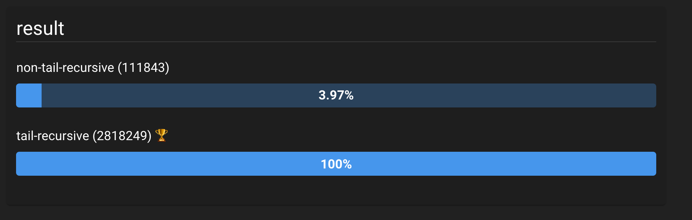

# 꼬래재귀 최적화

## 연산식의 스택

일반적인 프로그래밍 언어는 대부분 좌에서 우로 순차적인 실행을 수행한다. 따라서 연산자 우선 순위가 동일하다면 좌에서 우로 순차적인 실행을 한다고 여길 수 있을 것이다.

```javascript
let a;
a = [[[1 + 2] + 3] + 4];

let a;
a = 1 + 2;
a = a + 3;
a = a + 4;
```

여기서 중요한 점은 연산식에 연산자가 여러 개 있는 경우 암묵적으로 스택이 형성된다는 점이다.

```javascript
let a;
a = 1 + (2 + 3);
...
```

위의 식에서 최종 결과인 값으로 평가되려면 우선 괄호 안의 표현식이 해소되어야 한다. 따라서 (2 + 3)의 결과로 생성된 5를 메모리에 새롭게 생성해 반환하고, 기존의 수식을 (1 + 5)의 형태로 만든 다음 최종 값인 6을 메모리에 새롭게 생성한 뒤 반환하게 될 것이다.

1. `1 + (괄호)`이라는 최초의 식을 기억하고 있는 상태에서 괄호의 내용은 아직 평가되지 않았다.
2. 따라서 별도의 메모리에서 `(2 + 3)`을 처리한 후, 기존의 식에 위치한 괄호에 결과를 넣어준다.

```
[stack 1][    ( 2 + 3 ) ]
[stack 0][  1 + ( p1 )  ]

            ↓

[stack 1][      (  5 )  ]
[stack 0][  1 + ( p1 )  ]

            ↓

[stack 0][  1 + (  5 )  ]
```

?> 간단히 말하면 연산식은 **스택을 형성**하게 되는 것이며, 연산식의 모양에 따라 얼마만큼의 스택이 유지되어야 하는지 알 수 있게 된다.

## 연산식 스택의 깊이와 반환지점

```javascript
a = 5 + (3 + (1 + 2));
```

```
[stack 2][   p2 =    (1 + 2) ]
[stack 1][   p1 = 3 + ( p2 ) ]
[stack 0][        5 + ( p1 ) ]
```

위의 식은 총 3개의 스택이 있어야 전체 연산식을 평가하는 것이 가능하다. 즉, 중첩된 괄호의 수가 결국 스택의 깊이가 되는 것이다.

반면 병렬 관계의 괄호는 스택의 깊이는 더해지지 않는다.

```javascript
a = 1 + 2 + (3 + 4);
```

```
[stack 1][   p1 = ( 1 + 2 )]
[stack 0][ ( p1 ) + ( p2 ) ]

            ↓

[stack 1][   p1 = (    3  )]
----------------------------
[stack 0][ (  3 ) + ( p2 ) ]

            ↓

[stack 1][   p2 = ( 3 + 4 )]
[stack 0][ (  3 ) + ( p2 ) ]

            ↓

[stack 1][   p2 = (    7  )]
----------------------------
[stack 0][ (  3 ) + (  7 ) ]

            ↓

[stack 0][ ( 10 ) ]
```

이처럼 병렬 관계의 연산식은 순차적으로 부모 스택에 반환되고 본인 스택은 해제하므로 스택의 깊이가 깊어지는 것을 방지할 수 있다.

!> 언어의 구현 방법에 따라 다르겠지만, 예시를 위한 설명이다.

이처럼 연산식의 각 단계가 해소되고 원래의 수식으로 치환되는 원리를 생각해보면 결국엔

?> **각 스택에서 해소된 값은 기존의 스택으로 돌아갈 수 있는 포인트를 알고 있다.**

```javascript
a = (1 + 2) + (3 + 4); // [stack 0]
a = [stack1(1 + 2)이 해소되고 돌아올 포인트] + [stack1(3 + 4)이 해소되고 돌아올 포인트];
```

또한 연산식에서 스택이 중첩될 때 중첩된 스택에서 해소된 결과가 돌아올 기존의 스택의 포인트 역시 같이 정해준다는 점이 중요하다.

기존 수식이 (1 + 2)라는 연산식 스택을 생성할 때 스택에서 해소된 3이라는 결과가 돌아올 지점도 미리 정해주게 되는 것이다. 따라서 (1 + 2)와 (3 + 4)라는 연산식의 결과는 본인이 알고 있는 복귀 지점으로 돌아와 최종 결과인 10을 도출해내는 것이다.

## 함수 호출과 연산식 스택

따라서 연산식은 스택을 생성하므로 함수 호출과 맞물리게 되면 연산식의 스택에 함수 호출(실행 컨텍스트 생성)의 스택마저 감당하는 형태가 되어버린다.

```javascript
a = 1 + sum(2, 3, 4);
```

```
 [ Execution Context(sum) ]
 --------------------------
[stack 1]      (    sum    )]
[stack 0][ 1 + sum(2, 3, 4) ]

            ↓

[stack 0][ 1 + 9 ]
```

연산식이 함수 호출로 생성된 실행 컨텍스트의 종료를 대기하는 형태가 되어버려 연산식 스택 자체는 한 개가 필요하지만, 사실 상 실행 컨텍스트의 해소까지 기다려야 하기 때문에 두 개의 스택을 사용하는 것과 마찬가지가 되어버린다.

따라서 연산식에 함수 호출이 포함되는 경우에는 연산식에 값만 있는 경우보다 더 복잡하게 된다.

그렇다면 함수 반환문에 연산식이 결합되어 있다면 어떻게 될까?

```javascript
const sum = (...args) => {
  switch (args.length) {
    case 0:
      return 0;
    case 1:
      return arg[0];
    case 2:
      return arg[0] + arg[1];
    default:
      const [firstArg, ...rest] = args;
      return firstArg + sum(...rest);
  }
};
```

`sum` 함수는 전형적인 재귀 함수의 형태로 인자의 수에 따라 다르게 처리한다. 인자가 2개가 넘어왔을 경우는 직접 처리하지만, 그 이상부터는 재귀를 통해 해결하는 방식이다.

이 중에서도 인자가 3개 이상일 때의 처리 방법을 보면 `firstArg + sum(...rest)` 사이에 덧셈 연산자가 포함되어 있는 것을 확인할 수 있다.

1. 덧셈 연산식 스택이 해소되려면 `sum` 함수의 실행 컨텍스트가 해소되어야 한다.
2. 덧셈 연산식 스택이 해소되기 전까지는 `sum` 함수를 최초 호출한 위치에 값을 반환받을 수 없다.

앞서 연산식 스택이 추가될 때 반환될 포인트 역시 같이 설정된다고 하였다.

```javascript
a = 1 + sum(2, 3, 4);

a = 1 + [sum의 결과가 반환될 위치];
```

다시 말하면 함수의 호출 결과가 돌아올 지점을 함수 호출 시에 넘겨주게 되는 것이므로, 함수는 호출 시에 자신이 반환한 값이 어디로 돌아가야 할지 아는 상태에서 호출되는 것이다.

## 꼬리 재귀

꼬리 재귀는 재귀 함수의 한 형태인데, 재귀 호출로 받은 결과 값을 추가로 계산하거나 처리하지 않고 그대로 반환하는 형태를 의미한다.

?> **`return` 문에 함수 호출이 포함된 연산식을 제거한다.**

그렇다면 기존의 `sum` 함수를 꼬리 재귀 형태로 변환해보자.

```javascript
const sum = (...args) => {
  switch (args.length) {
    case 0:
      return 0;
    case 1:
      return arg[0];
    case 2:
      return arg[0] + arg[1];
    // 연산식 없는 함수 호출로 변환!
    default:
      const [firstArg, secondArg, ...rest] = args;
      return sum(...[firstArg + secondArg, ...rest]);
  }
};
```

이렇게 수정하게 되면 연산식 때문에 생기는 스택은 제거가 되지만, 조금 이상한 점이 있다.

1. 기존 수식 `1 + sum(2,3,4)`에서 `sum` 함수의 결과는 `1 + (_here_)`에 반환될 것이다.
2. `sum(2,3,4)` 함수 내부에서 `sum(2+3, 4)`를 반환할 것이다.
3. 결국 `sum(2,3,4) → sum(5,4) → 9 → sum(5,4) → sum(2,3,4) → (1 + _here_(9))`의 형태가 될 것이다.

```
[stack 3][      9     ]
[stack 2][sum((2+3),4)]
[stack 1][ sum(2,3,4) ]
[stack 0][ 1 + _here_ ]

            ↓

[stack 3][      9     ]
-----------------------
[stack 1][ sum(2,3,4) ]
[stack 0][ 1 + _here_ ]

            ↓

[stack 3][      9     ]
-----------------------
[stack 0][ 1 + _here_ ]

            ↓

[stack 0][    1 + 9   ]
```

위와 같이 처리된다면 어차피 함수 호출에 따른 실행 컨텍스트 생성은 막을 수 없으므로 스택의 깊이가 깊어지는 것은 동일할 것이다.

하지만 `sum(2,3,4) → sum(5,4) → 9 → (1 + _here_(9))`와 같이 `sum(5,4)`의 결과는 `sum(2,3,4)`가 돌아가야 할 지점으로 곧바로 간다 하더라도 아무 문제 없이 결과를 만들어 낼 수 있을 것이다.

즉, `sum(2,3,4)`가 `sum(5,4)`를 호출하는 시점에서 곧바로 자신의 스택을 해제해버리고 병렬적으로 처리할 수 있게끔 하는 것이다. 이것이 바로 **꼬리 재귀 최적화**의 원리인데, 이는 반드시 언어 차원에서 지원되어야만 실현할 수 있게 된다.

```
[stack 2][sum((2+3),4)]
-----------------------
[stack 1][ sum(2,3,4) ]
[stack 0][ 1 + _here_ ]

            ↓

[stack 1][sum((2+3),4)]
[stack 0][ 1 + _here_ ]

            ↓

[stack 2][      9     ]
-----------------------
[stack 1][sum((2+3),4)]
[stack 0][ 1 + _here_ ]

            ↓

[stack 1][      9     ]
[stack 0][ 1 + _here_ ]

            ↓

[stack 0][    1 + 9   ]
```

## 제어문 치환

결국 꼬리 재귀 최적화를 이용하면 매 단계 마다 스택을 제거하고 새로운 함수 호출에 따른 스택 하나만 유지할 수 있게 된다. 이를 전문적인 용어로는 **스택 클리어**라 하는데, 언어의 구조 상 보통 두 가지 방법으로 구현된다. 앞서 살펴본 꼬리 재귀 최적화와 제어문(`for`,`while`)의 반복문을 이용하는 방법이다.

1. 재귀에서는 반환될 포인트를 자동으로 처리해주지만, 반복문에서는 직접 스택 구조를 작성해야 한다.
2. 재귀에서는 인자가 자동적으로 선언되므로 변수를 직접적으로 제어할 필요가 현저히 적어지지만, 반복문에서는 필요한 만큼의 변수를 선언하고 매 반복 마다 초기화해야 한다.

```javascript
const sum = (...args) => {
  const stack = [];
  let current = args,
    result = 0;
  do {
    // current를 이용하여 처리하는 로직
  } while ((current = stack.pop()));
  return result;
};
```

1. 재귀 함수가 처리해주던 스택 구조가 없으므로 직접 배열을 이용하여 스택 구조를 생성하고, 스택이 비게 되면 종료되는 형태이다.
2. 함수와 다르게 `return`이라는 개념이 존재하지 않으므로 결과를 수집할 `result`라는 변수가 필요하고 최종적으로는 `result`를 반환하게 된다.

```javascript
const sum = (...args) => {
  const stack = [];
  let current = args;
  let result = 0;
  do {
    switch (current.length) {
      case 0:
        result += 0;
        break;
      case 1:
        result += current[0];
        break;
      case 2:
        result += current[0] + current[1];
        break;
      default:
        const [firstArg, secondArg, ...rest] = args;
        stack.push([firstArg + secondArg, ...rest]);
    }
  } while ((current = stack.pop()));
};
```

반복문으로 구현한 위의 함수는 기존에 재귀 함수로 구현했던 방법과 거의 동일한 것을 확인할 수 있다.

> 1. 재귀 호출을 반복문으로 고치기 위해서는 이미 재귀 함수가 **꼬리 재귀** 형태로 되어있어야 한다.
> 2. 꼬리 재귀 최적화가 적용된 함수는 `return`을 통해 결과를 취합하는 것
> 3. 반복문에서는 **재귀 호출을 스택에 넣어주는 것**이라고 생각하면 간단히 전환할 수 있다.

## 검증

대표적인 재귀 호출 문제인 피보나치 수를 구하는 방식을 꼬리 재귀 형태와 일반적인 재귀 형태로 구현하고, 성능 차이를 비교해보았다.

```javascript
// Non-tail-recursive
const fib = n => {
  if (n <= 1) return n;
  return fib(n - 2) + fib(n - 1);
};

// tail-recursive
const tailRecursiveFib = (n, prev = 1, cur = 0) => {
  if (n < 1) return cur;
  return tailRecursiveFib(n - 1, cur, prev + cur);
};
```

[jsben.ch](https://jsben.ch/OVC0K) 사이트에서 15번째 피보나치 수를 구할 때의 수행 속도를 비교한 결과 다음과 같은 차이가 있었다.



## 결론

ES6부터 자바스크립트는 꼬리 재귀 최적화를 지원하기 시작했지만, 가급적이면 반복문으로 함수를 구현하고 부득이하게 재귀 함수를 사용해야 한다면, 꼭 꼬리 재귀 형태로 구현하여 성능 상 이슈가 발생하지 않도록 하자!

## Reference

- [[js] 재귀호출을 반복문으로 바꾸기](https://www.bsidesoft.com/4314)
